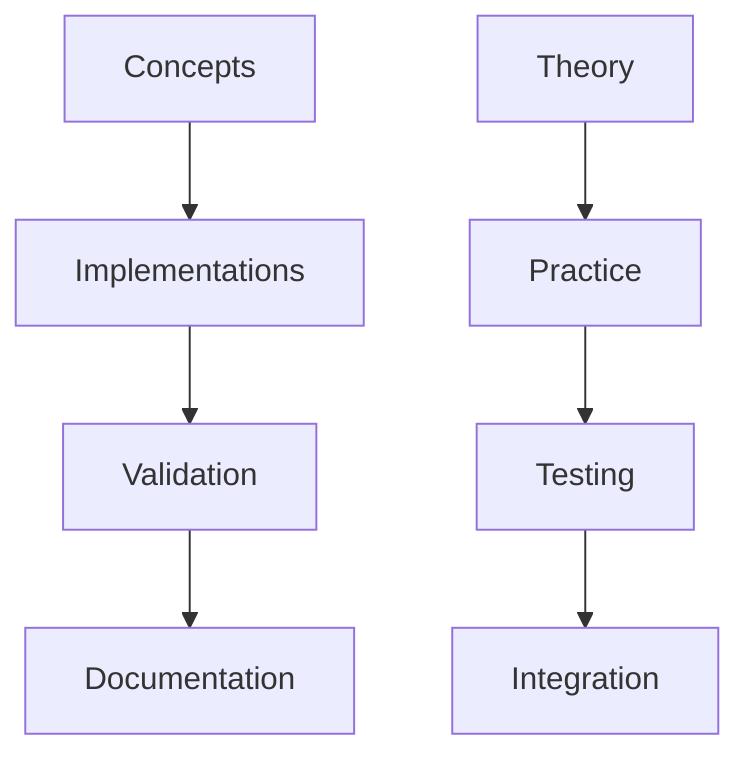
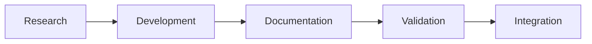

# Knowledge Organization Guide

---
title: Knowledge Organization Guide
type: concept
status: stable
created: 2024-02-06
tags:
  - organization
  - knowledge
  - structure
  - management
semantic_relations:
  - type: implements
    links: [[documentation_standards]]
  - type: relates
    links:
      - [[theoretical_foundations]]
      - [[machine_readability]]
      - [[linking_completeness]]
---

## Overview

This guide defines the principles and practices for organizing knowledge within our cognitive modeling framework, ensuring efficient information retrieval, maintenance, and evolution.

## Knowledge Structure

### 1. Hierarchical Organization
```python
# @knowledge_hierarchy
knowledge_tree = {
    "concepts": {
        "theoretical": ["[[theoretical_foundations]]", "[[cognitive_phenomena]]"],
        "computational": ["[[active_inference]]", "[[predictive_processing]]"],
        "implementation": ["[[implementation_patterns]]", "[[code_organization]]"]
    },
    "documentation": {
        "guides": ["[[documentation_standards]]", "[[api_documentation]]"],
        "references": ["[[api_reference]]", "[[package_documentation]]"],
        "examples": ["[[example_writing]]", "[[integration_examples]]"]
    },
    "validation": {
        "frameworks": ["[[validation_framework]]", "[[quality_metrics]]"],
        "tools": ["[[validation_tools]]", "[[analysis_tools]]"],
        "reports": ["[[validation_reports]]", "[[performance_metrics]]"]
    }
}
```

### 2. Network Structure
See [[linking_patterns]] for detailed linking guidelines.

#### Core Relationships


#### Knowledge Flow


## Documentation Components

### 1. Core Documentation
See [[documentation_standards]] for detailed guidelines.

```python
# @doc_components
documentation_structure = {
    "theoretical": {
        "concepts": "[[theoretical_foundations]]",
        "principles": "[[cognitive_phenomena]]",
        "architecture": "[[model_architecture]]"
    },
    "practical": {
        "implementation": "[[implementation_guide]]",
        "examples": "[[example_writing]]",
        "validation": "[[validation_framework]]"
    },
    "reference": {
        "api": "[[api_reference]]",
        "package": "[[package_documentation]]",
        "tools": "[[tool_documentation]]"
    }
}
```

### 2. Metadata Structure
See [[machine_readability]] for implementation details.

```yaml
# @metadata_structure
metadata:
  required:
    - title
    - type
    - status
    - created
    - tags
  optional:
    - complexity
    - dependencies
    - related_docs
  semantic:
    - relationships
    - implementations
    - validations
```

### 3. Link Types
See [[linking_completeness]] for comprehensive linking patterns.

```python
# @link_types
link_categories = {
    "hierarchical": {
        "parent_child": "Direct hierarchy",
        "dependency": "Required knowledge",
        "implementation": "Concrete realization"
    },
    "semantic": {
        "related": "Conceptual relationship",
        "similar": "Similar concepts",
        "contrasts": "Contrasting concepts"
    },
    "temporal": {
        "precedes": "Temporal ordering",
        "evolves_to": "Evolution path",
        "replaces": "Replacement relationship"
    }
}
```

## Organization Principles

### 1. Information Architecture
```python
# @info_architecture
class InformationArchitecture:
    """
    Core information architecture.
    See [[ai_documentation_style]] for guidelines.
    """
    def __init__(self):
        self.structure = KnowledgeStructure()
        self.indexer = ContentIndexer()
        self.validator = StructureValidator()
    
    def organize_content(self, content: Content) -> OrganizedContent:
        """
        Organize content according to guidelines.
        See [[documentation_standards]] for rules.
        """
        # Implementation
        pass
```

### 2. Content Management
```python
# @content_management
class ContentManager:
    """
    Content management system.
    See [[content_management]] for details.
    """
    def __init__(self):
        self.repository = ContentRepository()
        self.validator = ContentValidator()
        self.indexer = SearchIndexer()
    
    def process_content(self, content: Content) -> ProcessedContent:
        """
        Process and validate content.
        See [[validation_framework]] for rules.
        """
        # Implementation
        pass
```

## Implementation Guidelines

### 1. File Organization
```python
# @file_organization
directory_structure = {
    "docs": {
        "concepts": "Theoretical concepts",
        "guides": "Implementation guides",
        "api": "API documentation",
        "examples": "Usage examples"
    },
    "src": {
        "models": "Core implementations",
        "utils": "Utility functions",
        "tools": "Development tools"
    },
    "tests": {
        "unit": "Unit tests",
        "integration": "Integration tests",
        "validation": "Validation tests"
    }
}
```

### 2. Naming Conventions
See [[naming_conventions]] for detailed rules.

```python
# @naming_rules
naming_patterns = {
    "files": "{category}_{name}_{type}.md",
    "sections": "## {Category} {Name}",
    "links": "[[{category}/{name}]]",
    "code": "{category}_{name}_{version}"
}
```

## Quality Assurance

### 1. Structure Validation
See [[validation_framework]] for implementation.

```python
# @structure_validation
validation_criteria = {
    "organization": {
        "hierarchy_depth": (2, 5),  # Min/max depth
        "file_structure": 0.95,     # Structure compliance
        "naming_compliance": 1.0     # Naming compliance
    },
    "relationships": {
        "link_coverage": 0.9,       # Link coverage
        "bidirectional": 1.0,       # Bidirectional compliance
        "semantic_validity": 0.95    # Semantic compliance
    }
}
```

### 2. Content Quality
See [[quality_metrics]] for detailed metrics.

```python
# @quality_checks
quality_requirements = {
    "completeness": {
        "required_sections": 1.0,    # All required sections
        "optional_sections": 0.8,    # 80% optional sections
        "metadata_fields": 1.0       # All required metadata
    },
    "consistency": {
        "style_compliance": 0.95,    # Style guide compliance
        "terminology": 1.0,          # Terminology consistency
        "formatting": 1.0            # Format compliance
    }
}
```

## Maintenance Guidelines

### 1. Regular Updates
- Review content periodically
- Update outdated information
- Maintain link integrity
- Validate structure

### 2. Version Control
- Follow [[git_workflow]]
- Maintain [[changelog]]
- Update [[version_tags]]
- Document migrations

### 3. Quality Control
- Run [[validation_tools]]
- Check [[quality_metrics]]
- Review [[linking_validation]]
- Monitor [[performance_metrics]]

## Best Practices

### 1. Documentation
- Follow [[documentation_standards]]
- Use [[ai_documentation_style]]
- Implement [[linking_patterns]]
- Maintain [[linking_completeness]]

### 2. Organization
- Use clear hierarchy
- Maintain relationships
- Follow naming conventions
- Ensure accessibility

### 3. Validation
- Regular validation
- Quality checks
- Link verification
- Structure assessment

## Related Documentation
- [[documentation_standards]]
- [[ai_documentation_style]]
- [[linking_completeness]]
- [[validation_framework]]

## References
- [[theoretical_foundations]]
- [[machine_readability]]
- [[implementation_patterns]]
- [[quality_metrics]] 