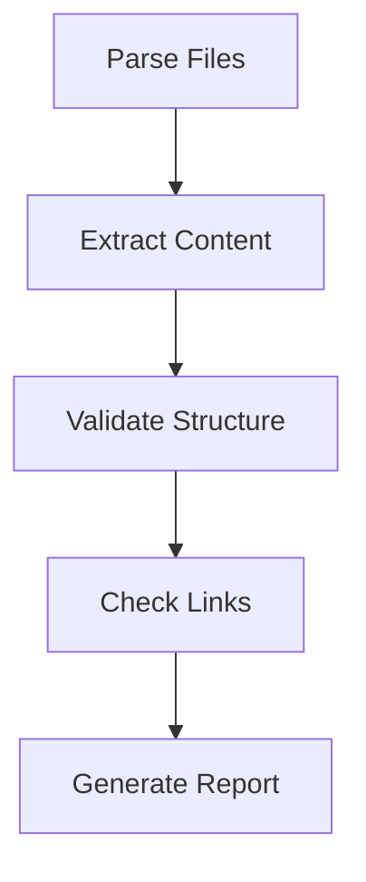
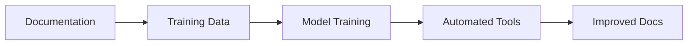

# Machine Readability and Automation

---
title: Machine Readability and Automation
type: concept
status: stable
created: 2024-02-06
tags:
  - automation
  - machine-learning
  - tooling
related:
  - [[plain_text_benefits]]
  - [[automation_tools]]
  - [[ci_cd_pipeline]]
---

## Overview
Machine readability is a core benefit of plain text formats, enabling automated processing, validation, and intelligence augmentation. This document explores how our plain text ecosystem facilitates automation and machine learning integration.

## Text Processing Benefits

### 1. Structured Data Extraction
```python
# Example of extracting model parameters
def extract_parameters(markdown_file):
    """Extract model parameters from markdown documentation.
    See [[parameter_extraction]] for details."""
    parameters = {}
    # Parse YAML frontmatter
    # Extract code blocks
    # Parse parameter definitions
    return parameters
```

### 2. Knowledge Graph Construction
- **Automated Link Analysis**
  - [[link_extraction]]
  - [[graph_construction]]
  - [[relationship_inference]]

### 3. Semantic Analysis
- **Natural Language Processing**
  - [[text_embedding]]
  - [[semantic_search]]
  - [[concept_clustering]]

## Automation Capabilities

### 1. Documentation Processing
```python
# Automated documentation validation
def validate_docs():
    """
    Validates documentation structure and links.
    See [[documentation_validation]] for rules.
    """
    check_broken_links()
    validate_frontmatter()
    check_code_examples()
```

### 2. Code Generation
- **Template-Based Generation**
  - [[code_templates]]
  - [[boilerplate_generation]]
  - [[test_generation]]

### 3. Quality Checks
- **Automated Validation**
  - [[style_checking]]
  - [[link_validation]]
  - [[consistency_checking]]

## Machine Learning Integration

### 1. Training Data Preparation
```python
# Convert documentation to training data
def prepare_training_data():
    """
    Extracts training examples from documentation.
    See [[training_data_preparation]].
    """
    examples = []
    # Parse markdown files
    # Extract code examples
    # Generate labels
    return examples
```

### 2. Model Training
- **Documentation-Based Training**
  - [[code_completion]]
  - [[documentation_generation]]
  - [[error_prediction]]

### 3. Automated Improvement
- **Continuous Learning**
  - [[feedback_loops]]
  - [[model_refinement]]
  - [[performance_optimization]]

## Tooling Integration

### 1. CI/CD Pipeline
```yaml
# Example GitHub Actions workflow
name: Documentation CI
on: [push]
jobs:
  validate:
    runs-on: ubuntu-latest
    steps:
      - uses: actions/checkout@v2
      - name: Check Links
        run: python tools/validate_links.py
      - name: Generate Docs
        run: python tools/generate_docs.py
```

### 2. Development Tools
- **Editor Integration**
  - [[ide_plugins]]
  - [[linting_tools]]
  - [[autocomplete]]

### 3. Analysis Tools
- **Automated Analysis**
  - [[complexity_analysis]]
  - [[coverage_reporting]]
  - [[dependency_tracking]]

## Knowledge Extraction

### 1. Concept Mining
```python
# Extract concepts from documentation
def mine_concepts():
    """
    Identifies key concepts and relationships.
    See [[concept_mining]].
    """
    concepts = {}
    # Parse documentation
    # Extract concepts
    # Build relationships
    return concepts
```

### 2. Pattern Recognition
- **Automated Pattern Detection**
  - [[code_patterns]]
  - [[documentation_patterns]]
  - [[usage_patterns]]

### 3. Knowledge Base Construction
- **Automated Organization**
  - [[knowledge_extraction]]
  - [[taxonomy_building]]
  - [[ontology_construction]]

## Automation Examples

### 1. Documentation Generation
```python
# Generate API documentation
def generate_api_docs():
    """
    Generates API documentation from source code.
    See [[api_documentation]].
    """
    parse_source_code()
    extract_docstrings()
    generate_markdown()
```

### 2. Validation Workflows


### 3. Learning Systems


## Best Practices

### 1. Structure Guidelines
- **Machine-Friendly Format**
  - [[consistent_formatting]]
  - [[clear_structure]]
  - [[metadata_standards]]

### 2. Automation Rules
- **Tool Configuration**
  - [[tool_settings]]
  - [[automation_rules]]
  - [[validation_criteria]]

### 3. Integration Patterns
- **Tool Integration**
  - [[workflow_integration]]
  - [[tool_chaining]]
  - [[feedback_systems]]

## Related Tools
- [[documentation_generators]]
- [[static_analyzers]]
- [[validation_tools]]
- [[automation_frameworks]]

## References
- [[automation_patterns]]
- [[machine_learning_integration]]
- [[tooling_ecosystem]]
- [[ci_cd_practices]] 