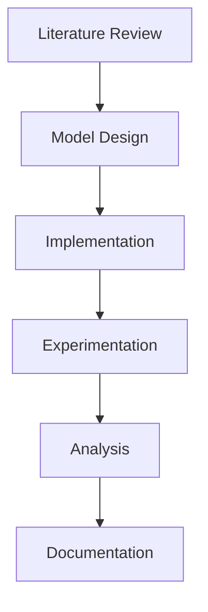
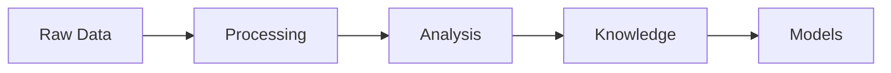

# Plain Text Benefits in Cognitive Modeling

---
title: Plain Text Benefits
type: concept
status: stable
created: 2024-02-06
tags:
  - methodology
  - tools
  - best-practices
related:
  - [[git_workflow]]
  - [[obsidian_usage]]
  - [[knowledge_organization]]
  - [[model_generalization]]
---

## Overview
Plain text formats serve as the foundation for our cognitive modeling ecosystem, enabling seamless integration between version control, knowledge management, and model development. This document explores the comprehensive benefits of this approach.

## Core Benefits

### 1. Version Control Integration
- **Git-Friendly Format**
  - Line-by-line [[diff_tracking]]
  - Meaningful change history
  - Conflict resolution
  - Branch-based development
  - See [[git_workflow]] for details

### 2. Knowledge Management
- **Obsidian Integration**
  - [[bidirectional_linking]]
  - [[graph_visualization]]
  - Dynamic knowledge networks
  - Emergent relationships
  - See [[obsidian_linking]] for usage

### 3. Machine Readability
- **Automated Processing**
  - [[automated_validation]]
  - [[documentation_generation]]
  - [[model_extraction]]
  - [[dependency_analysis]]

### 4. Research Benefits
- **Reproducibility**
  - [[experiment_tracking]]
  - [[version_control]]
  - [[parameter_logging]]
- **Collaboration**
  - [[code_review]]
  - [[knowledge_sharing]]
  - [[distributed_development]]

## Applications

### 1. Model Development
```python
# Model specification in plain text
model = {
    "architecture": "active_inference",
    "components": ["perception", "action"],
    "parameters": {
        "learning_rate": 0.01
    }
}
```
See [[model_specification]] for details.

### 2. Knowledge Representation
```markdown
## Cognitive Architecture
- [[belief_updating]]
  - [[prediction_error]]
  - [[precision_weighting]]
```
See [[knowledge_representation]] for more.

### 3. Educational Resources
- Interactive tutorials
- Self-documenting code
- Linked learning paths
See [[educational_resources]] for examples.

## Intelligence Augmentation

### 1. Machine Learning Integration
- **Training Data Generation**
  - Structured text for [[dataset_creation]]
  - Annotated examples for [[model_training]]
  - Version-controlled datasets

### 2. Knowledge Discovery
- **Pattern Recognition**
  - [[graph_analysis]]
  - [[concept_clustering]]
  - [[relationship_mining]]

### 3. Model Generalization
- **Transfer Learning**
  - [[cross_domain_mapping]]
  - [[abstraction_layers]]
  - [[parameter_sharing]]

## Research Workflow

### 1. Literature Integration
- **Citation Management**
  - [[reference_linking]]
  - [[citation_networks]]
  - [[knowledge_graphs]]

### 2. Experiment Documentation
```yaml
---
experiment:
  id: exp001
  hypothesis: "[[active_inference_hypothesis]]"
  methods: "[[experimental_design]]"
  results: "[[data_analysis]]"
---
```

### 3. Result Analysis
- **Data Processing**
  - [[statistical_analysis]]
  - [[visualization_tools]]
  - [[result_interpretation]]

## Educational Applications

### 1. Learning Pathways
- **Structured Learning**
  - [[prerequisite_chains]]
  - [[concept_dependencies]]
  - [[learning_objectives]]

### 2. Interactive Examples
```python
# Interactive code with documentation
def belief_update(observation):
    """See [[belief_update_theory]] for mathematical details"""
    pass
```

### 3. Knowledge Assessment
- **Progress Tracking**
  - [[concept_mastery]]
  - [[skill_development]]
  - [[understanding_gaps]]

## Model Generalization

### 1. Abstract Representations
- **Formal Specifications**
  - [[formal_methods]]
  - [[model_verification]]
  - [[property_checking]]

### 2. Cross-Domain Transfer
- **Knowledge Transfer**
  - [[domain_adaptation]]
  - [[transfer_learning]]
  - [[meta_learning]]

### 3. Scalability
- **System Growth**
  - [[modular_design]]
  - [[extensible_architecture]]
  - [[scaling_patterns]]

## Best Practices

### 1. File Organization
```
project/
├── models/          # Implementation
├── docs/           # Documentation
├── tests/          # Validation
└── experiments/    # Research
```
See [[project_structure]] for details.

### 2. Documentation Standards
- **Consistent Formatting**
  - [[markdown_style]]
  - [[docstring_format]]
  - [[comment_guidelines]]

### 3. Version Control
- **Meaningful History**
  - [[commit_messages]]
  - [[branch_strategy]]
  - [[release_management]]

## Integration Examples

### 1. Research Pipeline


### 2. Knowledge Flow


## Related Concepts
- [[knowledge_management]]
- [[version_control]]
- [[documentation_systems]]
- [[research_methods]]

## References
- [[plain_text_manifesto]]
- [[git_best_practices]]
- [[obsidian_methodology]]
- [[research_workflow]] 