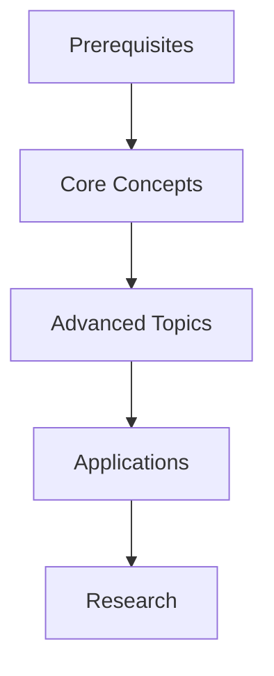
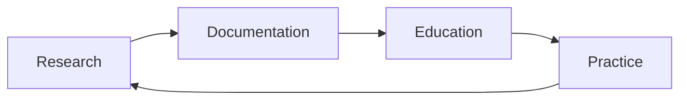

# Research and Educational Applications

---
title: Research and Educational Applications
type: concept
status: stable
created: 2024-02-06
tags:
  - research
  - education
  - knowledge-management
related:
  - [[plain_text_benefits]]
  - [[machine_readability]]
  - [[knowledge_organization]]
---

## Overview
Plain text documentation serves as a powerful foundation for research and education in cognitive modeling. This document explores how our text-based approach enhances scientific research, knowledge transfer, and educational outcomes.

## Research Applications

### 1. Literature Management
```yaml
---
paper:
  title: "Active Inference: A Process Theory"
  authors: ["Friston", "FitzGerald", "Rigoli"]
  year: 2017
  key_concepts:
    - [[free_energy_principle]]
    - [[active_inference]]
    - [[predictive_processing]]
  implementations:
    - [[basic_active_inference]]
    - [[advanced_models]]
---
```

### 2. Experiment Documentation
- **Structured Recording**
  - [[experiment_design]]
  - [[data_collection]]
  - [[result_analysis]]
  - [[replication_protocols]]

### 3. Knowledge Synthesis
- **Integration Patterns**
  - [[literature_review]]
  - [[concept_mapping]]
  - [[theory_development]]

## Educational Framework

### 1. Learning Pathways


### 2. Concept Dependencies
- **Structured Learning**
  - [[foundational_concepts]]
  - [[intermediate_topics]]
  - [[advanced_applications]]

### 3. Interactive Learning
```python
# Interactive example with documentation
class ActiveInferenceAgent:
    """
    Learn about Active Inference:
    1. [[free_energy_principle]]
    2. [[belief_updating]]
    3. [[action_selection]]
    """
    def update_beliefs(self, observation):
        # Implementation details
        pass
```

## Knowledge Organization

### 1. Concept Mapping
- **Hierarchical Structure**
  - [[concept_hierarchy]]
  - [[relationship_mapping]]
  - [[knowledge_graphs]]

### 2. Learning Resources
```markdown
## Active Inference
- [[theoretical_foundation]]
  - Mathematical Framework
  - Key Principles
- [[practical_implementation]]
  - Code Examples
  - Case Studies
- [[exercises]]
  - Basic Problems
  - Advanced Challenges
```

### 3. Progress Tracking
- **Learning Assessment**
  - [[skill_progression]]
  - [[knowledge_gaps]]
  - [[mastery_criteria]]

## Research Tools

### 1. Literature Analysis
```python
def analyze_literature():
    """
    Analyze research papers and extract key concepts.
    See [[literature_analysis]] for methodology.
    """
    papers = collect_papers()
    concepts = extract_concepts()
    relationships = map_relationships()
    return knowledge_graph
```

### 2. Experiment Tools
- **Research Support**
  - [[data_collection_tools]]
  - [[analysis_scripts]]
  - [[visualization_tools]]

### 3. Collaboration Features
- **Team Science**
  - [[version_control]]
  - [[peer_review]]
  - [[knowledge_sharing]]

## Educational Tools

### 1. Tutorial Generation
```python
def generate_tutorial():
    """
    Generate interactive tutorials from documentation.
    See [[tutorial_generation]] for details.
    """
    concepts = extract_concepts()
    examples = get_examples()
    exercises = create_exercises()
    return tutorial
```

### 2. Assessment Tools
- **Learning Evaluation**
  - [[quiz_generation]]
  - [[progress_tracking]]
  - [[feedback_systems]]

### 3. Interactive Examples
- **Hands-on Learning**
  - [[code_playgrounds]]
  - [[interactive_notebooks]]
  - [[simulation_environments]]

## Integration Benefits

### 1. Research-Education Bridge


### 2. Knowledge Flow
- **Bidirectional Transfer**
  - [[research_to_education]]
  - [[education_to_research]]
  - [[practice_to_theory]]

### 3. Continuous Improvement
- **Iterative Development**
  - [[feedback_incorporation]]
  - [[content_refinement]]
  - [[system_evolution]]

## Best Practices

### 1. Research Documentation
- **Scientific Rigor**
  - [[methodology_documentation]]
  - [[result_reproduction]]
  - [[peer_review_process]]

### 2. Educational Content
- **Pedagogical Design**
  - [[learning_objectives]]
  - [[content_structure]]
  - [[assessment_design]]

### 3. Integration Methods
- **Unified Approach**
  - [[workflow_integration]]
  - [[tool_compatibility]]
  - [[system_coherence]]

## Implementation Examples

### 1. Research Projects
```yaml
project:
  title: "Active Inference Study"
  components:
    - [[literature_review]]
    - [[experiment_design]]
    - [[data_analysis]]
    - [[publication]]
```

### 2. Educational Modules
```yaml
module:
  title: "Introduction to Active Inference"
  sections:
    - [[theoretical_background]]
    - [[practical_exercises]]
    - [[assessments]]
```

## Related Concepts
- [[knowledge_management]]
- [[learning_systems]]
- [[research_methods]]
- [[educational_design]]

## References
- [[research_methodology]]
- [[educational_theory]]
- [[knowledge_organization]]
- [[learning_science]] 