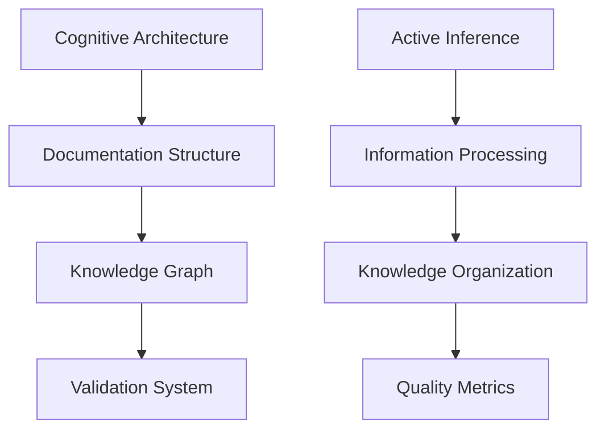

# Theoretical Foundations

---
title: Theoretical Foundations
type: concept
status: stable
created: 2024-02-06
tags:
  - theory
  - foundations
  - concepts
  - architecture
semantic_relations:
  - type: implements
    links: [[documentation_standards]]
  - type: relates
    links:
      - [[knowledge_base/cognitive/active_inference|Active Inference Theory]]
      - [[knowledge_base/cognitive/cognitive_phenomena|Cognitive Phenomena]]
      - [[machine_readability]]
---

## Overview

This document outlines the theoretical foundations that underpin our cognitive modeling framework's documentation system, integrating principles from cognitive science, knowledge representation, and machine learning. For comprehensive cognitive science theory, see the [[knowledge_base/cognitive/cognitive_science|Cognitive Science Knowledge Base]].

## Core Principles

### 1. Knowledge Representation
```python
# @knowledge_structure
knowledge_model = {
    "hierarchical": {
        "concepts": ["[[knowledge_base/cognitive/cognitive_phenomena|Cognitive Phenomena]]", "[[theoretical_foundations]]"],
        "implementations": ["[[knowledge_base/cognitive/active_inference|Active Inference]]", "[[belief_updating]]"],
        "validations": ["[[validation_framework]]", "[[testing_guide]]"]
    },
    "relational": {
        "bidirectional": ["[[linking_completeness]]", "[[linking_patterns]]"],
        "semantic": ["[[ai_semantic_processing]]", "[[machine_readability]]"],
        "temporal": ["[[version_control]]", "[[changelog]]"]
    }
}
```

### 2. Cognitive Architecture
See [[knowledge_base/cognitive/cognitive_phenomena|Cognitive Phenomena]] for detailed theory.

#### Active Inference Framework
- [[knowledge_base/cognitive/active_inference|Active Inference]] - Core computational theory
- [[knowledge_base/cognitive/free_energy_principle|Free Energy Principle]] - Theoretical foundation
- [[knowledge_base/cognitive/predictive_processing|Predictive Processing]] - Information processing model

#### Belief Systems
- [[belief_updating]] - Dynamic belief updates
- [[belief_systems]] - Belief architecture
- [[probabilistic_modeling]] - Uncertainty handling

#### Action Selection
- [[action_selection]] - Decision making
- [[policy_selection]] - Strategy choice
- [[goal_hierarchies]] - Objective organization

## Documentation Integration

### 1. Machine Readability
See [[machine_readability]] for implementation details.

```python
# @documentation_structure
doc_structure = {
    "semantic_markup": {
        "concepts": "[[concept_template]]",
        "implementations": "[[implementation_template]]",
        "relationships": "[[relationship_template]]"
    },
    "validation_rules": {
        "completeness": "[[validation_framework]]",
        "consistency": "[[linking_validation]]",
        "quality": "[[quality_metrics]]"
    }
}
```

### 2. Knowledge Organization
See [[knowledge_organization]] for detailed patterns.

#### Hierarchical Structure
- Top-level concepts ([[theoretical_foundations]])
- Implementation details ([[implementation_patterns]])
- Validation frameworks ([[validation_framework]])

#### Network Structure
- Bidirectional links ([[linking_completeness]])
- Semantic relationships ([[ai_semantic_processing]])
- Graph analysis ([[network_analysis]])

### 3. Version Management
See [[version_control]] for implementation.

```python
# @version_management
version_structure = {
    "documentation": {
        "current": "[[api_reference]]",
        "history": "[[changelog]]",
        "migrations": "[[migration_guide]]"
    },
    "code": {
        "releases": "[[release_management]]",
        "branches": "[[branching_strategy]]",
        "tags": "[[version_tags]]"
    }
}
```

## Implementation Architecture

### 1. Documentation System
```python
# @doc_system
class DocumentationSystem:
    """
    Core documentation system architecture.
    See [[documentation_standards]] for guidelines.
    """
    def __init__(self):
        self.knowledge_base = KnowledgeGraph()
        self.validator = ValidationFramework()
        self.processor = SemanticProcessor()
    
    def process_document(self, doc: Document) -> ValidationResult:
        """
        Process and validate documentation.
        See [[ai_validation_framework]] for details.
        """
        # Implementation
        pass
```

### 2. Knowledge Graph
```python
# @knowledge_graph
class KnowledgeGraph:
    """
    Knowledge graph implementation.
    See [[knowledge_organization]] for structure.
    """
    def __init__(self):
        self.nodes = {}  # Concept nodes
        self.edges = {}  # Relationships
        self.metadata = {}  # Node metadata
    
    def add_relationship(self, source: Node, target: Node, type: str):
        """
        Add semantic relationship.
        See [[linking_patterns]] for valid types.
        """
        # Implementation
        pass
```

### 3. Validation System
```python
# @validation_system
class ValidationSystem:
    """
    Documentation validation system.
    See [[validation_framework]] for rules.
    """
    def __init__(self):
        self.rules = self.load_rules()
        self.metrics = QualityMetrics()
    
    def validate_document(self, doc: Document) -> ValidationResult:
        """
        Validate documentation against rules.
        See [[quality_metrics]] for criteria.
        """
        # Implementation
        pass
```

## Theoretical Integration

### 1. Cognitive-Documentation Mapping


### 2. Processing Pipeline


## Quality Framework

### 1. Documentation Quality
See [[quality_metrics]] for detailed criteria.

```python
# @quality_framework
quality_metrics = {
    "completeness": {
        "required_sections": 0.95,  # 95% coverage
        "optional_sections": 0.80,  # 80% coverage
        "link_coverage": 0.90      # 90% link coverage
    },
    "consistency": {
        "style_compliance": 0.95,  # 95% style compliance
        "link_validity": 1.0,      # 100% valid links
        "metadata_validity": 1.0   # 100% valid metadata
    }
}
```

### 2. Validation Rules
See [[validation_framework]] for implementation.

```python
# @validation_rules
validation_rules = {
    "structural": {
        "required_links": ["concept", "implementation"],
        "optional_links": ["example", "reference"]
    },
    "semantic": {
        "relationship_types": ["implements", "relates", "extends"],
        "metadata_fields": ["title", "type", "status"]
    }
}
```

## Best Practices

### 1. Documentation Development
- Follow [[documentation_standards]]
- Use [[ai_documentation_style]]
- Implement [[linking_patterns]]
- Validate with [[quality_metrics]]

### 2. Knowledge Management
- Maintain [[knowledge_organization]]
- Update [[linking_completeness]]
- Follow [[version_control]]
- Use [[semantic_processing]]

### 3. Quality Assurance
- Run [[validation_framework]]
- Check [[quality_metrics]]
- Review [[linking_validation]]
- Monitor [[performance_metrics]]

## Related Documentation
- [[documentation_standards]]
- [[knowledge_organization]]
- [[validation_framework]]
- [[quality_metrics]]

## References
- [[knowledge_base/cognitive/cognitive_phenomena|Cognitive Phenomena]]
- [[knowledge_base/cognitive/active_inference|Active Inference]]
- [[machine_readability]]
- [[implementation_patterns]] 