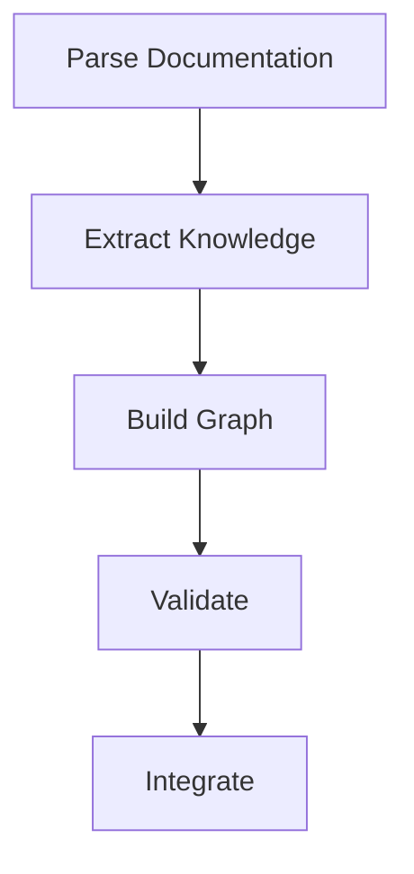
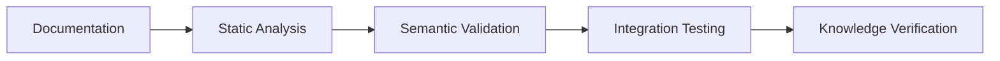

# AI Documentation Style Guide

---
title: AI Documentation Style Guide
type: guide
status: stable
created: 2024-02-06
tags:
  - style
  - ai
  - documentation
  - machine-readable
related:
  - [[machine_readability]]
  - [[knowledge_organization]]
  - [[documentation_standards]]
---

## Overview
This guide establishes documentation standards optimized for both human readability and machine processing, enabling hyper-intelligent agents to effectively navigate and utilize the knowledge base.

## Machine-Readable Structure

### Metadata Standards
```yaml
---
title: Document Title
type: [concept|guide|api|example|template]
status: [draft|stable|deprecated]
created: YYYY-MM-DD
updated: YYYY-MM-DD
complexity: [basic|intermediate|advanced]
processing_priority: [1-5]
semantic_relations:
  - type: prerequisite
    links: [[prerequisite_doc]]
  - type: implements
    links: [[implementation_doc]]
tags:
  - category
  - subcategory
  - specific_topic
---
```

### Semantic Markup
```markdown
<!-- Semantic section markers for machine parsing -->
#BEGIN_CONCEPT key_concept_name
Core concept definition and explanation
#END_CONCEPT

#BEGIN_IMPLEMENTATION
Implementation details
#END_IMPLEMENTATION

#BEGIN_VALIDATION
Validation criteria
#END_VALIDATION
```

## Knowledge Graph Structure

### Relationship Types
- **Hierarchical**
  - `is_a`: Inheritance relationships
  - `part_of`: Compositional relationships
  - `implements`: Implementation relationships

### Link Annotations
```markdown
- [[concept]] {type: prerequisite, weight: 0.8}
- [[implementation]] {type: implements, confidence: 0.9}
- [[related_concept]] {type: semantic_similarity, score: 0.85}
```

### Graph Metadata
```yaml
graph_properties:
  density: 0.7
  centrality: 0.8
  cluster_coefficient: 0.6
```

## Machine Learning Integration

### Training Data Markers
```python
# @training_example
def example_function():
    """
    This example demonstrates concept X.
    Training labels: [concept_x, implementation, basic]
    """
    pass
```

### Model References
```yaml
model_integration:
  embeddings: sentence-transformers/all-mpnet-base-v2
  classifier: cognitive_model_classifier_v1
  validation: validation_model_v1
```

### Performance Metrics
```python
# @performance_metrics
{
    "accuracy": 0.95,
    "latency": "10ms",
    "resource_usage": "150MB"
}
```

## Intelligent Processing Guidelines

### 1. Semantic Clarity
- Use precise, unambiguous terminology
- Maintain consistent concept references
- Provide explicit relationship definitions

### 2. Context Preservation
```markdown
#BEGIN_CONTEXT
- Execution environment: [[runtime_environment]]
- Required capabilities: [[capability_list]]
- Constraints: [[system_constraints]]
#END_CONTEXT
```

### 3. Validation Hooks
```python
# @validation_hook
def validate_implementation():
    """
    Validation criteria:
    1. [[requirement_1]]
    2. [[requirement_2]]
    """
    pass
```

## File Organization

### Directory Structure
```
documentation/
├── concepts/           # Foundational knowledge
│   ├── atomic/        # Indivisible concepts
│   └── composite/     # Combined concepts
├── implementations/   # Concrete implementations
│   ├── core/         # Core functionality
│   └── extensions/   # Extended features
└── validations/      # Validation criteria
```

### File Naming
```python
naming_pattern = {
    'concepts': 'concept_{category}_{name}.md',
    'implementations': 'impl_{system}_{component}.md',
    'validations': 'val_{type}_{target}.md'
}
```

## Processing Instructions

### 1. Priority Levels
```yaml
processing_priority:
  P1: "Critical path concepts"
  P2: "Core dependencies"
  P3: "Supporting information"
  P4: "Examples and extensions"
  P5: "Additional context"
```

### 2. Processing Directives
```markdown
#PROCESS_MODE: sequential|parallel
#DEPENDENCY_CHECK: strict|flexible
#VALIDATION_LEVEL: basic|complete
```

### 3. Resource Management
```yaml
resource_requirements:
  memory: "4GB"
  processing_time: "30s"
  api_calls: 10
```

## Validation Framework

### 1. Consistency Checks
```python
# @consistency_check
def verify_documentation():
    """
    Verify:
    1. Link integrity
    2. Semantic consistency
    3. Implementation alignment
    """
    pass
```

### 2. Completeness Metrics
```yaml
completeness_criteria:
  concepts: 0.95
  implementations: 0.90
  validations: 0.85
  cross_references: 0.80
```

### 3. Quality Assurance
```python
# @quality_metrics
{
    "clarity_score": 0.9,
    "completeness_score": 0.85,
    "consistency_score": 0.95
}
```

## Integration Examples

### 1. Knowledge Integration
```python
# Example of knowledge integration
from cognitive_system import KnowledgeGraph

graph = KnowledgeGraph()
graph.add_concept("[[concept_name]]", {
    "relationships": ["[[related_concept]]"],
    "implementations": ["[[implementation]]"],
    "validations": ["[[validation]]"]
})
```

### 2. Processing Pipeline


### 3. Validation Flow


## Related Documentation
- [[machine_readability]]
- [[knowledge_graph_structure]]
- [[validation_framework]]
- [[ai_processing_guidelines]]

## References
- [[documentation_standards]]
- [[machine_learning_integration]]
- [[knowledge_representation]]
- [[validation_methods]] 