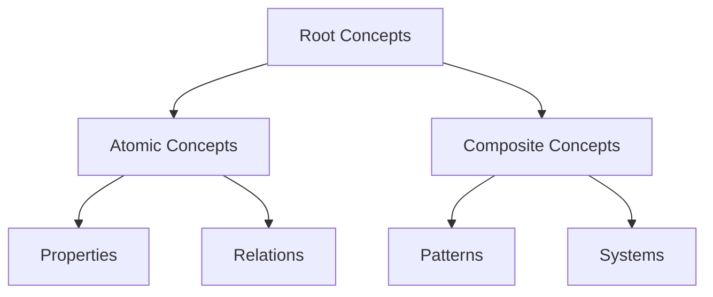
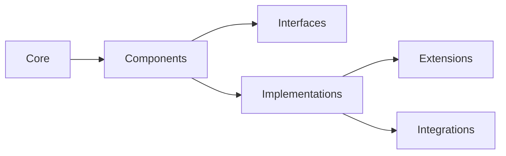

# AI-Oriented File Organization

---
title: AI File Organization Guide
type: guide
status: stable
created: 2024-02-06
tags:
  - organization
  - structure
  - ai
  - metadata
related:
  - [[ai_documentation_style]]
  - [[knowledge_organization]]
  - [[machine_readability]]
---

## Overview
This guide defines the file organization structure optimized for AI processing, knowledge graph construction, and intelligent navigation of the cognitive modeling system.

## Directory Structure

### Root Organization
```
cognitive_modeling/
├── docs/                    # Documentation root
│   ├── concepts/           # Core concepts
│   │   ├── atomic/        # Fundamental concepts
│   │   ├── composite/     # Combined concepts
│   │   └── meta/         # Meta-concepts
│   │
│   ├── implementations/   # Implementation details
│   │   ├── core/         # Core implementations
│   │   ├── extensions/   # Extended features
│   │   └── integrations/ # System integrations
│   │
│   ├── knowledge_base/   # Knowledge representation
│   │   ├── ontology/     # Domain ontologies
│   │   ├── graphs/       # Knowledge graphs
│   │   └── embeddings/   # Neural embeddings
│   │
│   ├── ml_artifacts/     # Machine learning artifacts
│   │   ├── models/       # Model specifications
│   │   ├── training/     # Training configurations
│   │   └── evaluation/   # Evaluation metrics
│   │
│   └── validation/       # Validation framework
│       ├── tests/        # Test specifications
│       ├── metrics/      # Quality metrics
│       └── reports/      # Validation reports
```

## File Naming Conventions

### Pattern Specifications
```python
file_patterns = {
    'concepts': {
        'pattern': '{category}_{name}_{version}.md',
        'example': 'belief_updating_v1.md'
    },
    'implementations': {
        'pattern': 'impl_{system}_{component}_{version}.md',
        'example': 'impl_inference_engine_v2.md'
    },
    'knowledge': {
        'pattern': 'kb_{domain}_{concept}_{type}.md',
        'example': 'kb_cognitive_belief_ontology.md'
    },
    'ml': {
        'pattern': 'ml_{task}_{model}_{version}.md',
        'example': 'ml_classification_transformer_v1.md'
    }
}
```

### Metadata Structure
```yaml
file_metadata:
  naming:
    prefix: string        # Category prefix
    body: string         # Main identifier
    version: string      # Version identifier
    extension: string    # File extension
  processing:
    priority: integer    # Processing priority
    dependencies: list   # File dependencies
    validation: string   # Validation requirements
```

## Directory Metadata

### Directory Configuration
```yaml
directory_config:
  concepts:
    index_required: true
    graph_required: true
    validation_required: true
  implementations:
    index_required: true
    tests_required: true
    documentation_required: true
  knowledge_base:
    ontology_required: true
    embeddings_required: true
    graph_required: true
```

### Processing Instructions
```yaml
processing_config:
  parallel_processing: boolean
  dependency_checking: string
  validation_level: string
  caching_strategy: string
```

## Knowledge Organization

### Concept Hierarchy


### Implementation Structure


## File Templates

### Concept File Template
```markdown
# Concept: {name}

#BEGIN_METADATA
version: string
category: string
complexity: string
#END_METADATA

#BEGIN_CONTENT
content: string
#END_CONTENT

#BEGIN_VALIDATION
validation: object
#END_VALIDATION
```

### Implementation File Template
```markdown
# Implementation: {name}

#BEGIN_METADATA
version: string
system: string
component: string
#END_METADATA

#BEGIN_SPECIFICATION
specification: object
#END_SPECIFICATION

#BEGIN_VALIDATION
validation: object
#END_VALIDATION
```

## Validation Rules

### Directory Validation
```python
# @directory_validation
{
    "required_files": ["index.md", "README.md"],
    "required_metadata": ["version", "status"],
    "required_structures": ["graph", "validation"]
}
```

### File Validation
```python
# @file_validation
{
    "naming_convention": bool,
    "metadata_complete": bool,
    "content_valid": bool,
    "links_valid": bool
}
```

## Integration Guidelines

### Knowledge Graph Integration
```python
# @graph_integration
def integrate_knowledge():
    """
    Integration steps:
    1. Parse directory structure
    2. Extract metadata
    3. Build relationships
    4. Validate graph
    """
    pass
```

### Machine Learning Pipeline
```python
# @ml_pipeline
def process_documentation():
    """
    Processing steps:
    1. Extract features
    2. Generate embeddings
    3. Train models
    4. Validate results
    """
    pass
```

## Best Practices

### Organization Principles
1. **Hierarchical Clarity**
   - Clear parent-child relationships
   - Logical grouping of related content
   - Consistent depth levels

2. **Metadata Management**
   - Complete metadata at all levels
   - Consistent metadata schema
   - Regular validation

3. **Processing Optimization**
   - Efficient file access patterns
   - Optimized for parallel processing
   - Caching-friendly structure

## Related Documentation
- [[ai_documentation_style]]
- [[knowledge_graph_structure]]
- [[validation_framework]]
- [[ml_integration_guide]]

## References
- [[file_organization_patterns]]
- [[metadata_standards]]
- [[processing_optimization]]
- [[validation_methods]] 