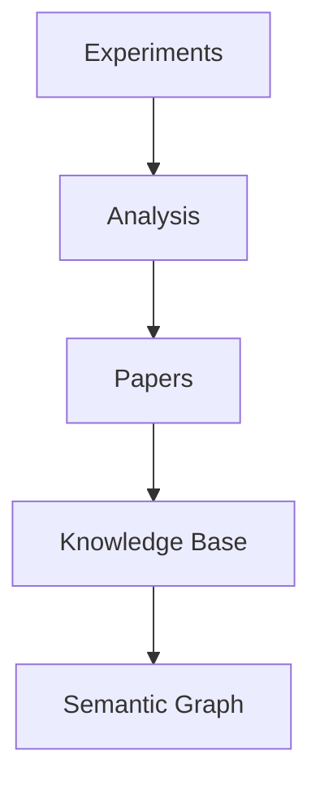
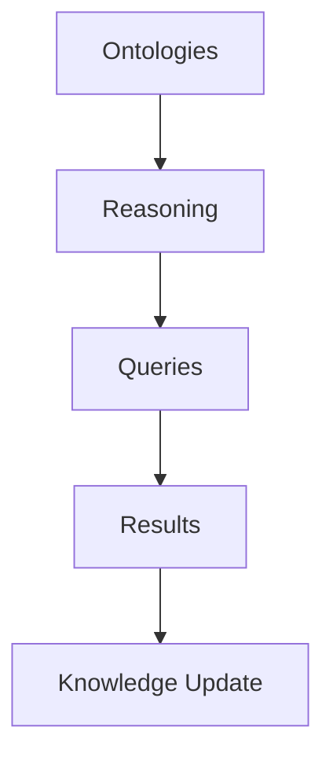

# AI-Oriented Additional Folders

---
title: AI Additional Folders Guide
type: guide
status: stable
created: 2024-02-06
tags:
  - organization
  - structure
  - ai
  - extensions
related:
  - [[ai_file_organization]]
  - [[ai_documentation_style]]
  - [[knowledge_organization]]
---

## Overview
This guide defines additional folder structures and organization patterns optimized for advanced AI processing and knowledge management.

## Extended Directory Structure

### Research Artifacts
```
research/
├── experiments/          # Experiment specifications
│   ├── designs/         # Experimental designs
│   ├── protocols/       # Experimental protocols
│   └── results/        # Results and analysis
│
├── papers/              # Research papers
│   ├── drafts/         # Work in progress
│   ├── published/      # Published papers
│   └── references/     # Reference materials
│
└── data/               # Research data
    ├── raw/           # Raw data
    ├── processed/     # Processed data
    └── analysis/      # Analysis results
```

### Knowledge Embeddings
```
embeddings/
├── vectors/             # Embedding vectors
│   ├── concepts/       # Concept embeddings
│   ├── documents/      # Document embeddings
│   └── relations/      # Relationship embeddings
│
├── models/             # Embedding models
│   ├── trained/       # Trained models
│   ├── checkpoints/   # Training checkpoints
│   └── configs/       # Model configurations
│
└── analysis/           # Embedding analysis
    ├── similarity/    # Similarity matrices
    ├── clusters/      # Cluster analysis
    └── visualization/ # Embedding visualizations
```

### Semantic Processing
```
semantic/
├── ontologies/          # Domain ontologies
│   ├── core/          # Core domain concepts
│   ├── relations/     # Relationship definitions
│   └── mappings/      # Cross-domain mappings
│
├── reasoning/          # Reasoning engines
│   ├── rules/         # Inference rules
│   ├── logic/         # Logical frameworks
│   └── constraints/   # Constraint definitions
│
└── queries/            # Semantic queries
    ├── templates/     # Query templates
    ├── patterns/      # Search patterns
    └── results/       # Query results
```

### Interactive Learning
```
interactive/
├── tutorials/           # Interactive tutorials
│   ├── basic/         # Basic concepts
│   ├── advanced/      # Advanced topics
│   └── specialized/   # Domain-specific
│
├── notebooks/          # Jupyter notebooks
│   ├── examples/      # Example notebooks
│   ├── exercises/     # Practice exercises
│   └── solutions/     # Exercise solutions
│
└── simulations/        # Interactive simulations
    ├── environments/  # Simulation environments
    ├── scenarios/     # Scenario definitions
    └── results/       # Simulation results
```

## Metadata Requirements

### Research Metadata
```yaml
research_metadata:
  experiment:
    id: string
    type: string
    status: string
    dependencies: list
    validation: object
  paper:
    title: string
    authors: list
    status: string
    related_experiments: list
  data:
    source: string
    format: string
    schema: object
    validation: object
```

### Embedding Metadata
```yaml
embedding_metadata:
  vector:
    model: string
    dimensions: integer
    timestamp: datetime
    source: string
  model:
    architecture: string
    parameters: object
    performance: object
  analysis:
    method: string
    parameters: object
    results: object
```

### Semantic Metadata
```yaml
semantic_metadata:
  ontology:
    domain: string
    version: string
    dependencies: list
    validation: object
  reasoning:
    engine: string
    rules: list
    constraints: object
  query:
    type: string
    pattern: string
    parameters: object
```

## Processing Instructions

### Research Processing
```python
# @research_processing
def process_research():
    """
    Processing steps:
    1. Extract experimental data
    2. Analyze results
    3. Generate visualizations
    4. Update knowledge base
    """
    pass
```

### Embedding Processing
```python
# @embedding_processing
def process_embeddings():
    """
    Processing steps:
    1. Generate embeddings
    2. Update vector store
    3. Analyze relationships
    4. Optimize representations
    """
    pass
```

### Semantic Processing
```python
# @semantic_processing
def process_semantics():
    """
    Processing steps:
    1. Parse ontologies
    2. Apply reasoning rules
    3. Execute queries
    4. Update knowledge graph
    """
    pass
```

## Integration Points

### Research Integration


### Embedding Integration


### Semantic Integration


## Related Documentation
- [[ai_file_organization]]
- [[research_management]]
- [[embedding_framework]]
- [[semantic_processing]]

## References
- [[research_workflows]]
- [[embedding_techniques]]
- [[semantic_frameworks]]
- [[integration_patterns]] 