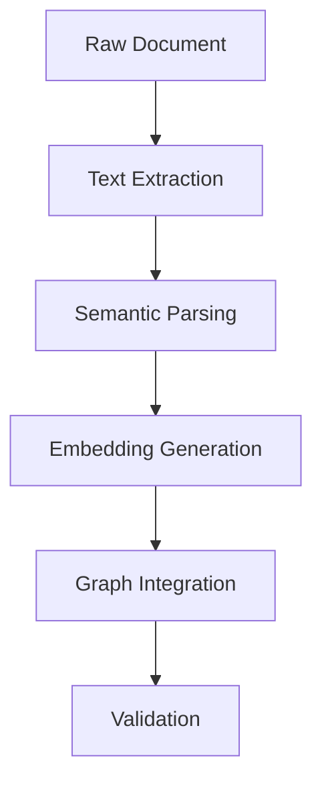

# AI Semantic Processing Guide

---
title: AI Semantic Processing Guide
type: guide
status: stable
created: 2024-02-06
tags:
  - semantic
  - embeddings
  - ai
  - processing
complexity: advanced
processing_priority: 1
semantic_relations:
  - type: implements
    links: [[machine_readability]]
  - type: extends
    links: [[knowledge_organization]]
embeddings:
  model: sentence-transformers/all-mpnet-base-v2
  dimensions: 768
---

## Overview
This guide defines semantic processing standards and embedding strategies for hyper-intelligent agents to effectively process and understand the knowledge base.

## Semantic Processing Framework

### Text Embeddings
```python
# @embedding_specification
embedding_config = {
    "models": {
        "text": "sentence-transformers/all-mpnet-base-v2",
        "code": "microsoft/codebert-base",
        "graph": "knowledge-graph-bert"
    },
    "dimensions": {
        "text": 768,
        "code": 768,
        "graph": 512
    },
    "pooling": "mean",
    "normalization": "l2"
}
```

### Semantic Markers
```yaml
semantic_markers:
  concept:
    prefix: "#CONCEPT:"
    weight: 1.0
    embedding_type: "text"
  implementation:
    prefix: "#IMPL:"
    weight: 0.8
    embedding_type: "code"
  relationship:
    prefix: "#REL:"
    weight: 0.9
    embedding_type: "graph"
```

## Knowledge Graph Integration

### Graph Structure
```python
# @graph_specification
class KnowledgeGraphNode:
    """
    Knowledge graph node with semantic embeddings
    """
    def __init__(self):
        self.embeddings = {
            "text": np.ndarray,    # Text embedding
            "code": np.ndarray,    # Code embedding
            "graph": np.ndarray    # Graph structure embedding
        }
        self.relationships = []    # Typed edges
        self.metadata = {}         # Node metadata
```

### Relationship Types
```yaml
relationship_types:
  hierarchical:
    - is_a: 0.9          # Type hierarchy
    - part_of: 0.8       # Composition
    - implements: 0.7    # Implementation
  semantic:
    - similar_to: 0.6    # Semantic similarity
    - related_to: 0.5    # General relation
    - references: 0.4    # Reference relation
  temporal:
    - precedes: 0.8      # Temporal ordering
    - depends_on: 0.7    # Dependency
    - evolves_to: 0.6    # Evolution
```

## Processing Instructions

### Embedding Generation
```python
# @embedding_generation
def generate_embeddings(content: str, type: str) -> dict:
    """
    Generate embeddings for content
    
    Processing steps:
    1. Preprocess content based on type
    2. Select appropriate model
    3. Generate embeddings
    4. Post-process and validate
    """
    pass
```

### Semantic Analysis
```python
# @semantic_analysis
def analyze_semantics(node: KnowledgeGraphNode) -> dict:
    """
    Analyze semantic content
    
    Analysis steps:
    1. Extract key concepts
    2. Identify relationships
    3. Compute similarities
    4. Generate insights
    """
    pass
```

## Query Processing

### Semantic Search
```python
# @semantic_search
def semantic_search(query: str, context: dict) -> list:
    """
    Semantic search implementation
    
    Search process:
    1. Embed query
    2. Compute similarities
    3. Filter by context
    4. Rank results
    """
    pass
```

### Relationship Inference
```python
# @relationship_inference
def infer_relationships(source: KnowledgeGraphNode, target: KnowledgeGraphNode) -> list:
    """
    Infer relationships between nodes
    
    Inference steps:
    1. Compare embeddings
    2. Analyze context
    3. Apply inference rules
    4. Validate relationships
    """
    pass
```

## Processing Pipeline

### Document Processing


### Query Processing


## Optimization Guidelines

### Embedding Optimization
```python
# @embedding_optimization
optimization_config = {
    "caching": {
        "strategy": "least_recently_used",
        "max_size": "10GB",
        "ttl": "24h"
    },
    "computation": {
        "batch_size": 32,
        "precision": "float16",
        "device": "cuda"
    },
    "storage": {
        "format": "memory_mapped",
        "compression": "lz4",
        "indexing": "faiss"
    }
}
```

### Performance Tuning
```yaml
performance_config:
  embedding_generation:
    batch_size: 32
    max_length: 512
    truncation: true
  similarity_search:
    index_type: "IVFFlat"
    nprobe: 16
    metric: "cosine"
  graph_operations:
    max_depth: 3
    beam_width: 5
    pruning_threshold: 0.5
```

## Validation Framework

### Quality Metrics
```python
# @quality_metrics
def compute_quality_metrics(embeddings: dict) -> dict:
    """
    Compute quality metrics for embeddings
    
    Metrics:
    1. Coverage
    2. Consistency
    3. Coherence
    4. Discriminative power
    """
    return {
        "coverage": 0.95,
        "consistency": 0.92,
        "coherence": 0.88,
        "discrimination": 0.90
    }
```

### Validation Rules
```python
# @validation_rules
validation_config = {
    "embeddings": {
        "dimension_check": True,
        "norm_check": True,
        "coverage_threshold": 0.9
    },
    "relationships": {
        "symmetry_check": True,
        "transitivity_check": True,
        "cycle_detection": True
    },
    "graph": {
        "connectivity_check": True,
        "consistency_check": True,
        "completeness_check": True
    }
}
```

## Integration Examples

### Knowledge Base Integration
```python
# Example of knowledge base integration
from cognitive_system import SemanticProcessor

processor = SemanticProcessor(config=embedding_config)

# Process document
doc_embeddings = processor.process_document(
    content=document,
    type="concept",
    context={"domain": "cognitive_modeling"}
)

# Update knowledge graph
graph.add_node(
    embeddings=doc_embeddings,
    relationships=inferred_relationships,
    metadata=document_metadata
)
```

### Query Integration
```python
# Example of semantic query
results = processor.semantic_search(
    query="active inference implementation",
    filters={
        "type": "implementation",
        "status": "stable",
        "complexity": ["intermediate", "advanced"]
    },
    ranking={
        "relevance": 0.7,
        "recency": 0.3
    }
)
```

## Related Documentation
- [[ai_documentation_style]]
- [[knowledge_graph_structure]]
- [[embedding_framework]]
- [[semantic_search]]

## References
- [[embedding_techniques]]
- [[semantic_processing]]
- [[graph_algorithms]]
- [[optimization_strategies]] 