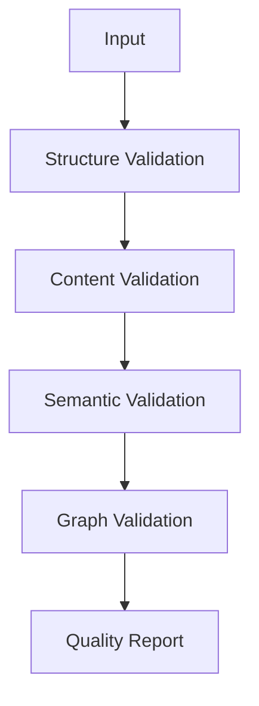
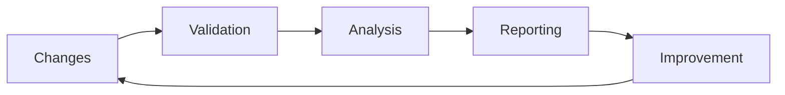

# AI Validation Framework

---
title: AI Validation Framework
type: guide
status: stable
created: 2024-02-06
tags:
  - validation
  - quality
  - ai
  - metrics
complexity: advanced
processing_priority: 1
semantic_relations:
  - type: implements
    links: [[machine_readability]]
  - type: extends
    links: [[validation_framework]]
---

## Overview
This guide defines comprehensive validation and quality assurance frameworks for AI-oriented documentation and knowledge management.

## Validation Framework

### Core Metrics
```python
# @core_metrics
validation_metrics = {
    "documentation": {
        "completeness": float,     # Coverage of required sections
        "consistency": float,      # Internal consistency
        "coherence": float,        # Logical flow
        "machine_readability": float  # AI processing score
    },
    "knowledge_graph": {
        "connectivity": float,     # Graph connectivity
        "coverage": float,         # Concept coverage
        "density": float,          # Relationship density
        "quality": float          # Overall quality score
    },
    "embeddings": {
        "coverage": float,         # Embedding coverage
        "discrimination": float,   # Discriminative power
        "clustering": float,       # Cluster quality
        "stability": float        # Embedding stability
    }
}
```

### Quality Thresholds
```yaml
quality_thresholds:
  critical:
    completeness: 1.0
    consistency: 1.0
    machine_readability: 1.0
  standard:
    completeness: 0.9
    consistency: 0.9
    machine_readability: 0.9
  minimal:
    completeness: 0.6
    consistency: 0.6
    machine_readability: 0.6
```

## Validation Rules

### Documentation Validation
```python
# @documentation_validation
def validate_documentation(doc: Document) -> ValidationResult:
    """
    Validate documentation quality
    
    Validation steps:
    1. Check structure completeness
    2. Verify metadata consistency
    3. Validate semantic markup
    4. Assess machine readability
    5. Verify link integrity
    """
    pass
```

### Knowledge Graph Validation
```python
# @graph_validation
def validate_knowledge_graph(graph: KnowledgeGraph) -> ValidationResult:
    """
    Validate knowledge graph quality
    
    Validation steps:
    1. Check graph connectivity
    2. Verify relationship consistency
    3. Validate node properties
    4. Assess coverage completeness
    """
    pass
```

### Embedding Validation
```python
# @embedding_validation
def validate_embeddings(embeddings: dict) -> ValidationResult:
    """
    Validate embedding quality
    
    Validation steps:
    1. Check dimensionality
    2. Verify normalization
    3. Assess discrimination
    4. Validate stability
    """
    pass
```

## Quality Assurance

### Automated Checks
```python
# @automated_qa
class QualityAssurance:
    def check_documentation(self):
        """Documentation quality checks"""
        pass
    
    def check_knowledge_graph(self):
        """Knowledge graph quality checks"""
        pass
    
    def check_embeddings(self):
        """Embedding quality checks"""
        pass
```

### Continuous Validation
```python
# @continuous_validation
def continuous_validation_pipeline():
    """
    Continuous validation pipeline
    
    Steps:
    1. Monitor changes
    2. Trigger validations
    3. Generate reports
    4. Update metrics
    """
    pass
```

## Processing Pipeline

### Validation Flow


### Quality Monitoring


## Integration Points

### Documentation Integration
```python
# @documentation_integration
class DocumentationValidator:
    def validate(self, doc: Document) -> ValidationResult:
        """
        Validate documentation
        
        Steps:
        1. Structure check
        2. Content check
        3. Link check
        4. Quality assessment
        """
        pass
```

### Knowledge Graph Integration
```python
# @graph_integration
class GraphValidator:
    def validate(self, graph: KnowledgeGraph) -> ValidationResult:
        """
        Validate knowledge graph
        
        Steps:
        1. Node validation
        2. Edge validation
        3. Property validation
        4. Consistency check
        """
        pass
```

## Reporting Framework

### Quality Reports
```python
# @quality_reporting
def generate_quality_report() -> Report:
    """
    Generate comprehensive quality report
    
    Sections:
    1. Overall metrics
    2. Detailed analysis
    3. Issue identification
    4. Improvement suggestions
    """
    pass
```

### Metric Tracking
```python
# @metric_tracking
def track_metrics(metrics: dict):
    """
    Track quality metrics over time
    
    Features:
    1. Trend analysis
    2. Regression detection
    3. Progress monitoring
    4. Alert generation
    """
    pass
```

## Improvement Framework

### Issue Resolution
```python
# @issue_resolution
def resolve_issues(issues: list) -> ResolutionPlan:
    """
    Generate issue resolution plan
    
    Steps:
    1. Prioritize issues
    2. Generate solutions
    3. Plan implementation
    4. Track resolution
    """
    pass
```

### Quality Enhancement
```python
# @quality_enhancement
def enhance_quality(target: str) -> EnhancementPlan:
    """
    Generate quality enhancement plan
    
    Steps:
    1. Identify opportunities
    2. Propose improvements
    3. Plan implementation
    4. Track progress
    """
    pass
```

## Best Practices

### Validation Guidelines
1. **Regular Validation**
   - Automated daily checks
   - Weekly comprehensive validation
   - Monthly quality reviews

2. **Quality Monitoring**
   - Real-time metric tracking
   - Trend analysis
   - Regression detection

3. **Continuous Improvement**
   - Issue tracking
   - Enhancement planning
   - Progress monitoring

## Related Documentation
- [[ai_documentation_style]]
- [[knowledge_graph_structure]]
- [[quality_metrics]]
- [[improvement_framework]]

## References
- [[validation_techniques]]
- [[quality_assurance]]
- [[metric_analysis]]
- [[improvement_strategies]] 