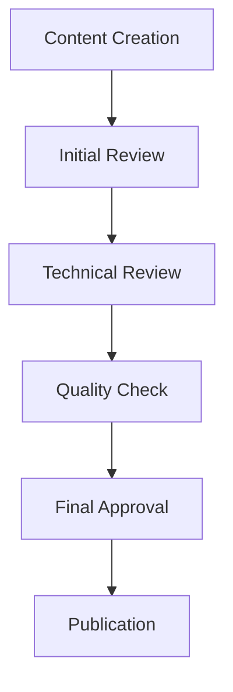

# Content Management Guide

---
title: Content Management Guide
type: guide
status: stable
created: 2024-02-06
tags:
  - content
  - management
  - maintenance
  - organization
semantic_relations:
  - type: implements
    links: [[documentation_standards]]
  - type: relates
    links:
      - [[knowledge_organization]]
      - [[version_control]]
---

## Overview

This guide establishes comprehensive content management practices for maintaining, updating, and evolving documentation in our cognitive modeling framework.

## Content Lifecycle

### 1. Content Creation
```python
# @content_creation
content_workflow = {
    "planning": {
        "needs_analysis": ["[[documentation_standards]]", "[[knowledge_organization]]"],
        "structure_design": ["[[ai_documentation_style]]", "[[linking_patterns]]"],
        "template_selection": ["[[ai_concept_template]]", "[[package_component]]"]
    },
    "development": {
        "content_writing": ["[[documentation_guide]]", "[[example_writing]]"],
        "review_process": ["[[validation_framework]]", "[[quality_metrics]]"],
        "integration": ["[[linking_completeness]]", "[[knowledge_organization]]"]
    },
    "publication": {
        "validation": ["[[validation_tools]]", "[[quality_metrics]]"],
        "deployment": ["[[git_workflow]]", "[[version_control]]"],
        "announcement": ["[[changelog]]", "[[release_management]]"]
    }
}
```

### 2. Content Maintenance
```python
# @maintenance_workflow
maintenance_process = {
    "regular_review": {
        "schedule": "Monthly",
        "tasks": [
            "Content accuracy check",
            "Link validation",
            "Quality assessment"
        ],
        "tools": ["[[validation_tools]]", "[[analysis_tools]]"]
    },
    "updates": {
        "schedule": "As needed",
        "triggers": [
            "New features",
            "Bug fixes",
            "User feedback"
        ],
        "process": ["[[version_control]]", "[[changelog]]"]
    },
    "archival": {
        "schedule": "Yearly",
        "tasks": [
            "Obsolete content review",
            "Version archiving",
            "Migration planning"
        ],
        "tools": ["[[archival_tools]]", "[[migration_guide]]"]
    }
}
```

## Content Organization

### 1. Repository Structure
See [[ai_folder_structure]] for detailed organization.

```python
# @repository_structure
content_structure = {
    "active_content": {
        "location": "docs/",
        "organization": "[[knowledge_organization]]",
        "management": "[[version_control]]"
    },
    "archived_content": {
        "location": "archive/",
        "organization": "[[archival_structure]]",
        "management": "[[archival_policy]]"
    },
    "temporary_content": {
        "location": "drafts/",
        "organization": "[[draft_management]]",
        "management": "[[review_process]]"
    }
}
```

### 2. Version Management
See [[version_control]] for implementation details.

```python
# @version_management
version_strategy = {
    "branching": {
        "main": "Stable documentation",
        "develop": "Work in progress",
        "feature": "New content development",
        "release": "Version preparation"
    },
    "tagging": {
        "pattern": "v{major}.{minor}.{patch}",
        "rules": "[[versioning_standards]]",
        "process": "[[release_management]]"
    }
}
```

## Content Processing

### 1. Content Pipeline
```python
# @content_pipeline
class ContentPipeline:
    """
    Content processing pipeline.
    See [[ai_semantic_processing]] for details.
    """
    def __init__(self):
        self.validator = ContentValidator()
        self.processor = ContentProcessor()
        self.indexer = ContentIndexer()
        self.graph = KnowledgeGraph()
    
    def process_content(self, content: Content) -> ProcessedContent:
        """
        Process content through pipeline.
        See [[validation_framework]] for rules.
        """
        # Pre-processing
        self._preprocess_content(content)
        
        # Validation
        validation_result = self.validator.validate(content)
        if not validation_result.is_valid:
            self._handle_validation_errors(validation_result.errors)
        
        # Semantic Processing
        processed_content = self.processor.process(content)
        self._extract_semantic_relations(processed_content)
        
        # Knowledge Graph Integration
        self.graph.integrate_content(processed_content)
        
        # Indexing
        self.indexer.index(processed_content)
        
        # Post-processing
        self._update_related_content(processed_content)
        self._verify_integration(processed_content)
        
        return processed_content
    
    def _preprocess_content(self, content: Content):
        """
        Prepare content for processing.
        See [[ai_documentation_style]] for formatting rules.
        """
        # Format validation
        self._validate_format(content)
        
        # Link extraction
        self._extract_links(content)
        
        # Metadata validation
        self._validate_metadata(content)
    
    def _extract_semantic_relations(self, content: ProcessedContent):
        """
        Extract and validate semantic relationships.
        See [[linking_patterns]] for relationship types.
        """
        # Extract relationships
        relationships = self._parse_relationships(content)
        
        # Validate against known patterns
        self._validate_relationships(relationships)
        
        # Update knowledge graph
        self._update_graph_relationships(relationships)
    
    def _update_related_content(self, content: ProcessedContent):
        """
        Update related content based on changes.
        See [[linking_completeness]] for bidirectional linking.
        """
        # Find affected documents
        affected_docs = self._find_affected_documents(content)
        
        # Update bidirectional links
        self._update_bidirectional_links(affected_docs)
        
        # Validate consistency
        self._validate_consistency(affected_docs)
```

### 2. Quality Control Implementation
```python
# @quality_control
class QualityControl:
    """
    Content quality control system.
    See [[quality_metrics]] for criteria.
    """
    def __init__(self):
        self.metrics = QualityMetrics()
        self.checker = StyleChecker()
        self.validator = LinkValidator()
        self.analyzer = ContentAnalyzer()
    
    def check_quality(self, content: Content) -> QualityReport:
        """
        Check content quality.
        See [[validation_framework]] for rules.
        """
        # Style Analysis
        style_report = self._analyze_style(content)
        
        # Link Validation
        link_report = self._validate_links(content)
        
        # Content Analysis
        content_report = self._analyze_content(content)
        
        # Integration Check
        integration_report = self._check_integration(content)
        
        # Generate Quality Report
        return self._generate_report(
            style_report,
            link_report,
            content_report,
            integration_report
        )
    
    def _analyze_style(self, content: Content) -> StyleReport:
        """
        Analyze content style.
        See [[ai_documentation_style]] for style rules.
        """
        return self.checker.check_style(content, {
            "formatting": self._check_formatting(content),
            "structure": self._check_structure(content),
            "consistency": self._check_consistency(content)
        })
    
    def _validate_links(self, content: Content) -> LinkReport:
        """
        Validate content links.
        See [[linking_validation]] for validation rules.
        """
        return self.validator.validate_links(content, {
            "existence": self._check_link_existence(content),
            "bidirectional": self._check_bidirectional_links(content),
            "semantic": self._check_semantic_validity(content)
        })
    
    def _analyze_content(self, content: Content) -> ContentReport:
        """
        Analyze content quality.
        See [[quality_metrics]] for quality criteria.
        """
        return self.analyzer.analyze_content(content, {
            "completeness": self._check_completeness(content),
            "accuracy": self._check_accuracy(content),
            "relevance": self._check_relevance(content)
        })
```

## Implementation Integration

### 1. Knowledge Graph Integration
```python
# @graph_integration
class KnowledgeGraphIntegrator:
    """
    Integrates content with knowledge graph.
    See [[knowledge_organization]] for structure.
    """
    def __init__(self):
        self.graph = KnowledgeGraph()
        self.validator = GraphValidator()
        self.indexer = GraphIndexer()
    
    def integrate_content(self, content: ProcessedContent):
        """
        Integrate content into knowledge graph.
        See [[linking_completeness]] for integration rules.
        """
        # Extract graph elements
        nodes = self._extract_nodes(content)
        edges = self._extract_edges(content)
        
        # Validate graph elements
        self._validate_graph_elements(nodes, edges)
        
        # Update graph
        self._update_graph(nodes, edges)
        
        # Verify integration
        self._verify_integration(content)
    
    def _extract_nodes(self, content: ProcessedContent) -> List[Node]:
        """Extract graph nodes from content."""
        return [
            self._create_node(concept)
            for concept in content.concepts
        ]
    
    def _extract_edges(self, content: ProcessedContent) -> List[Edge]:
        """Extract graph edges from content."""
        return [
            self._create_edge(relation)
            for relation in content.relations
        ]
```

### 2. Version Control Integration
```python
# @version_control
class VersionController:
    """
    Manages content versioning.
    See [[version_control]] for versioning rules.
    """
    def __init__(self):
        self.repo = Repository()
        self.validator = VersionValidator()
        self.migrator = ContentMigrator()
    
    def manage_version(self, content: Content, version: Version):
        """
        Manage content version.
        See [[versioning_standards]] for version rules.
        """
        # Validate version
        self._validate_version(version)
        
        # Create version branch
        branch = self._create_version_branch(version)
        
        # Update content
        self._update_content(content, version)
        
        # Validate changes
        self._validate_changes(content)
        
        # Merge changes
        self._merge_changes(branch)
    
    def _create_version_branch(self, version: Version) -> Branch:
        """Create version control branch."""
        return self.repo.create_branch(
            name=f"version/{version}",
            base="develop"
        )
```

## Review Process

### 1. Review Workflow


### 2. Review Criteria
```python
# @review_criteria
review_requirements = {
    "technical_accuracy": {
        "concept_correctness": True,
        "implementation_accuracy": True,
        "code_validity": True
    },
    "documentation_quality": {
        "clarity": 0.9,              # 90% clarity score
        "completeness": 0.95,        # 95% completeness
        "consistency": 1.0           # 100% consistency
    },
    "integration": {
        "link_validity": 1.0,        # All links valid
        "cross_references": True,    # Cross-refs present
        "knowledge_graph": True      # Graph integration
    }
}
```

## Maintenance Procedures

### 1. Regular Updates
```python
# @update_procedures
update_workflow = {
    "scheduled_review": {
        "frequency": "Monthly",
        "tasks": [
            "Content review",
            "Link validation",
            "Quality assessment"
        ]
    },
    "content_updates": {
        "triggers": [
            "New features",
            "Bug fixes",
            "User feedback"
        ],
        "process": "[[update_process]]"
    },
    "version_control": {
        "branching": "[[git_workflow]]",
        "releases": "[[release_management]]",
        "changelog": "[[changelog]]"
    }
}
```

### 2. Content Migration
```python
# @migration_procedures
migration_workflow = {
    "planning": {
        "impact_analysis": True,
        "timeline_planning": True,
        "communication_plan": True
    },
    "execution": {
        "content_update": True,
        "link_updates": True,
        "validation": True
    },
    "verification": {
        "quality_check": True,
        "integration_test": True,
        "user_acceptance": True
    }
}
```

## Archival Strategy

### 1. Content Archival
```python
# @archival_strategy
archival_rules = {
    "criteria": {
        "age": "> 2 years",
        "relevance": "Low",
        "usage": "< 10 views/month"
    },
    "process": {
        "review": "Manual review",
        "approval": "Team lead",
        "archival": "Automated"
    },
    "storage": {
        "location": "archive/",
        "format": "Markdown + metadata",
        "indexing": "Required"
    }
}
```

### 2. Version Archives
```python
# @version_archives
archive_management = {
    "major_versions": {
        "retention": "Permanent",
        "format": "Full snapshot",
        "accessibility": "Public"
    },
    "minor_versions": {
        "retention": "2 years",
        "format": "Differential",
        "accessibility": "Internal"
    },
    "patches": {
        "retention": "6 months",
        "format": "Changelog only",
        "accessibility": "Internal"
    }
}
```

## Best Practices

### 1. Content Creation
- Follow [[documentation_standards]]
- Use [[ai_documentation_style]]
- Implement [[linking_patterns]]
- Validate with [[quality_metrics]]

### 2. Content Maintenance
- Regular reviews
- Proactive updates
- Link validation
- Quality monitoring

### 3. Version Control
- Follow [[git_workflow]]
- Maintain [[changelog]]
- Use [[version_tags]]
- Document migrations

## Related Documentation
- [[documentation_standards]]
- [[knowledge_organization]]
- [[version_control]]
- [[quality_metrics]]

## References
- [[documentation_guide]]
- [[validation_framework]]
- [[archival_policy]]
- [[migration_guide]]

## Implementation Examples

### 1. Content Analysis Example
```python
# @content_analysis
class ContentAnalyzer:
    """
    Detailed content analysis implementation.
    See [[quality_metrics]] for analysis criteria.
    """
    def analyze_document(self, doc: Document) -> AnalysisResult:
        """
        Perform comprehensive document analysis.
        
        Example:
            >>> analyzer = ContentAnalyzer()
            >>> result = analyzer.analyze_document(doc)
            >>> print(f"Quality Score: {result.quality_score}")
            Quality Score: 0.95
        """
        # Structure Analysis
        structure_score = self._analyze_structure(doc)
        print(f"Structure Analysis: {structure_score:.2f}")
        
        # Content Quality
        quality_score = self._analyze_quality(doc)
        print(f"Quality Analysis: {quality_score:.2f}")
        
        # Link Analysis
        link_score = self._analyze_links(doc)
        print(f"Link Analysis: {link_score:.2f}")
        
        return AnalysisResult(
            structure=structure_score,
            quality=quality_score,
            links=link_score,
            overall=np.mean([structure_score, quality_score, link_score])
        )
    
    def _analyze_structure(self, doc: Document) -> float:
        """
        Analyze document structure.
        
        Example structure check:
        ```markdown
        # Title
        
        ## Overview
        Content...
        
        ## Implementation
        Code...
        ```
        """
        required_sections = {
            "overview": r"^## Overview",
            "implementation": r"^## Implementation",
            "examples": r"^## Examples",
            "references": r"^## References"
        }
        
        scores = []
        for section, pattern in required_sections.items():
            if re.search(pattern, doc.content, re.MULTILINE):
                scores.append(1.0)
            else:
                print(f"Missing section: {section}")
                scores.append(0.0)
        
        return np.mean(scores)
    
    def _analyze_quality(self, doc: Document) -> float:
        """
        Analyze content quality.
        
        Example quality metrics:
        - Completeness: All sections have content
        - Clarity: Clear explanations and examples
        - Consistency: Consistent terminology
        """
        metrics = {
            "completeness": self._check_completeness(doc),
            "clarity": self._check_clarity(doc),
            "consistency": self._check_consistency(doc)
        }
        
        for metric, score in metrics.items():
            print(f"{metric.title()}: {score:.2f}")
        
        return np.mean(list(metrics.values()))
    
    def _analyze_links(self, doc: Document) -> float:
        """
        Analyze document links.
        
        Example link analysis:
        - [[concept]] -> Valid concept link
        - [[implementation]] -> Valid implementation link
        - [[missing_doc]] -> Invalid link
        """
        links = re.findall(r"\[\[(.*?)\]\]", doc.content)
        valid_links = 0
        
        for link in links:
            if self._validate_link(link):
                valid_links += 1
            else:
                print(f"Invalid link: {link}")
        
        return valid_links / len(links) if links else 1.0

```

### 2. Content Processing Example
```python
# @content_processor
class ContentProcessor:
    """
    Detailed content processing implementation.
    See [[ai_semantic_processing]] for processing rules.
    """
    def process_document(self, doc: Document) -> ProcessedDocument:
        """
        Process document with detailed steps.
        
        Example:
            >>> processor = ContentProcessor()
            >>> processed = processor.process_document(doc)
            >>> print(f"Processed sections: {len(processed.sections)}")
            Processed sections: 5
        """
        # Extract metadata
        metadata = self._extract_metadata(doc)
        print(f"Extracted metadata: {metadata.keys()}")
        
        # Parse sections
        sections = self._parse_sections(doc)
        print(f"Found sections: {[s.title for s in sections]}")
        
        # Process content
        processed_sections = []
        for section in sections:
            processed = self._process_section(section)
            processed_sections.append(processed)
            print(f"Processed section: {section.title}")
        
        # Extract and validate links
        links = self._extract_links(doc)
        valid_links = self._validate_links(links)
        print(f"Valid links: {len(valid_links)}/{len(links)}")
        
        return ProcessedDocument(
            metadata=metadata,
            sections=processed_sections,
            links=valid_links
        )
    
    def _extract_metadata(self, doc: Document) -> dict:
        """
        Extract document metadata.
        
        Example metadata:
        ```yaml
        ---
        title: Document Title
        type: guide
        status: stable
        created: 2024-02-06
        tags: [tag1, tag2]
        ---
        ```
        """
        try:
            metadata_match = re.match(
                r"---\n(.*?)\n---",
                doc.content,
                re.DOTALL
            )
            if metadata_match:
                return yaml.safe_load(metadata_match.group(1))
            return {}
        except Exception as e:
            print(f"Metadata extraction error: {e}")
            return {}
    
    def _parse_sections(self, doc: Document) -> List[Section]:
        """
        Parse document sections.
        
        Example section structure:
        ```markdown
        ## Section Title
        
        Section content...
        
        ### Subsection
        
        Subsection content...
        ```
        """
        sections = []
        current_section = None
        
        for line in doc.content.split("\n"):
            if line.startswith("## "):
                if current_section:
                    sections.append(current_section)
                current_section = Section(
                    title=line[3:].strip(),
                    content=[],
                    level=2
                )
            elif line.startswith("### "):
                if current_section:
                    current_section.subsections.append(
                        Section(
                            title=line[4:].strip(),
                            content=[],
                            level=3
                        )
                    )
            elif current_section:
                current_section.content.append(line)
        
        if current_section:
            sections.append(current_section)
        
        return sections
    
    def _process_section(self, section: Section) -> ProcessedSection:
        """
        Process individual section.
        
        Example processing:
        1. Format content
        2. Extract code blocks
        3. Process links
        4. Validate structure
        """
        # Process content
        formatted_content = self._format_content(section.content)
        
        # Extract code blocks
        code_blocks = self._extract_code_blocks(formatted_content)
        
        # Process links
        links = self._extract_section_links(formatted_content)
        
        # Create processed section
        return ProcessedSection(
            title=section.title,
            content=formatted_content,
            code_blocks=code_blocks,
            links=links,
            level=section.level
        )
```

### 3. Content Validation Example
```python
# @content_validator
class ContentValidator:
    """
    Detailed content validation implementation.
    See [[validation_framework]] for validation rules.
    """
    def validate_document(self, doc: Document) -> ValidationResult:
        """
        Validate document with detailed checks.
        
        Example:
            >>> validator = ContentValidator()
            >>> result = validator.validate_document(doc)
            >>> print(f"Validation passed: {result.is_valid}")
            Validation passed: True
        """
        # Structure validation
        structure_result = self._validate_structure(doc)
        print(f"Structure validation: {structure_result.status}")
        
        # Content validation
        content_result = self._validate_content(doc)
        print(f"Content validation: {content_result.status}")
        
        # Link validation
        link_result = self._validate_links(doc)
        print(f"Link validation: {link_result.status}")
        
        # Metadata validation
        metadata_result = self._validate_metadata(doc)
        print(f"Metadata validation: {metadata_result.status}")
        
        # Combine results
        is_valid = all([
            structure_result.is_valid,
            content_result.is_valid,
            link_result.is_valid,
            metadata_result.is_valid
        ])
        
        return ValidationResult(
            is_valid=is_valid,
            structure=structure_result,
            content=content_result,
            links=link_result,
            metadata=metadata_result
        )
    
    def _validate_structure(self, doc: Document) -> ValidationResult:
        """
        Validate document structure.
        
        Example structure requirements:
        1. Has required sections
        2. Proper heading hierarchy
        3. Consistent formatting
        """
        issues = []
        
        # Check required sections
        missing_sections = self._check_required_sections(doc)
        if missing_sections:
            issues.append(f"Missing sections: {missing_sections}")
        
        # Check heading hierarchy
        hierarchy_issues = self._check_heading_hierarchy(doc)
        if hierarchy_issues:
            issues.extend(hierarchy_issues)
        
        # Check formatting
        formatting_issues = self._check_formatting(doc)
        if formatting_issues:
            issues.extend(formatting_issues)
        
        return ValidationResult(
            is_valid=len(issues) == 0,
            issues=issues
        )
``` 