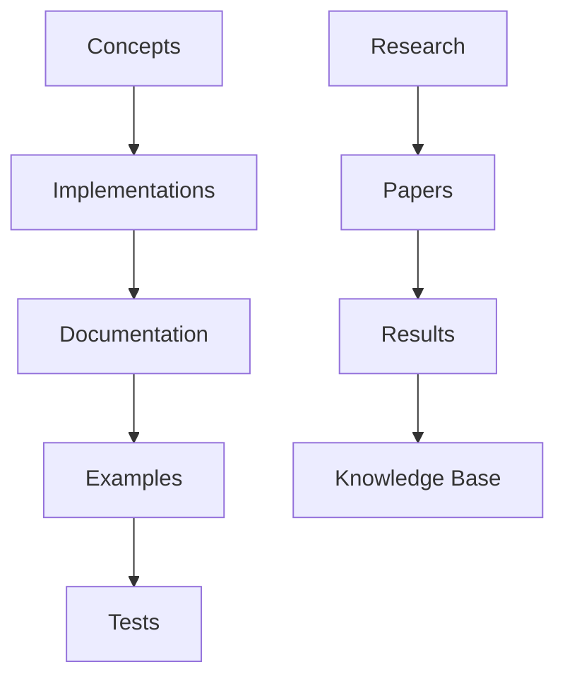
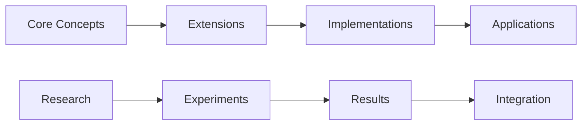

# Documentation Linking Analysis

---
title: Documentation Linking Analysis
type: guide
status: stable
created: 2024-02-06
tags:
  - linking
  - validation
  - analysis
  - documentation
semantic_relations:
  - type: implements
    links: [[obsidian_linking]]
  - type: extends
    links: [[ai_validation_framework]]
---

## Overview
This guide analyzes the current linking patterns and provides validation frameworks for maintaining high-quality documentation relationships.

## Link Pattern Analysis

### Core Link Types
```yaml
link_types:
  hierarchical:
    - parent_child:     # Concept hierarchies
        pattern: "[[parent]] -> [[child]]"
        validation: "bidirectional"
    - implementation:   # Concept to implementation
        pattern: "[[concept]] -> [[implementation]]"
        validation: "traceable"
    - documentation:    # Documentation relationships
        pattern: "[[guide]] -> [[reference]]"
        validation: "consistent"
  
  semantic:
    - prerequisite:     # Required knowledge
        pattern: "[[prereq]] -> [[concept]]"
        confidence: 0.8
    - related:         # Related concepts
        pattern: "[[concept_a]] <-> [[concept_b]]"
        similarity: 0.7
    - extends:         # Extension relationships
        pattern: "[[base]] -> [[extension]]"
        validation: "complete"
```

### Link Categories

#### Knowledge Organization
```python
# @knowledge_links
knowledge_structure = {
    "concepts": {
        "required": ["parent", "children", "implementations"],
        "optional": ["related", "examples", "references"]
    },
    "implementations": {
        "required": ["concept", "tests", "documentation"],
        "optional": ["examples", "extensions", "optimizations"]
    },
    "documentation": {
        "required": ["overview", "details", "references"],
        "optional": ["examples", "tutorials", "guides"]
    }
}
```

#### Research Integration
```python
# @research_links
research_structure = {
    "papers": {
        "required": ["methodology", "results", "references"],
        "optional": ["data", "code", "supplements"]
    },
    "experiments": {
        "required": ["protocol", "data", "analysis"],
        "optional": ["code", "results", "visualizations"]
    },
    "results": {
        "required": ["data", "analysis", "conclusions"],
        "optional": ["visualizations", "interpretations", "implications"]
    }
}
```

## Validation Framework

### Link Validation Rules
```python
# @link_validation
def validate_links(document):
    """
    Validate document links
    
    Validation steps:
    1. Check required links
    2. Verify bidirectional links
    3. Validate link types
    4. Check link consistency
    """
    required = check_required_links(document)
    bidirectional = verify_bidirectional(document)
    types = validate_link_types(document)
    consistency = check_consistency(document)
    
    return {
        "required_complete": required,
        "bidirectional_valid": bidirectional,
        "types_valid": types,
        "consistency_score": consistency
    }
```

### Quality Metrics
```python
# @quality_metrics
link_quality = {
    "completeness": {
        "required_links": 0.95,    # Required link coverage
        "optional_links": 0.75,    # Optional link coverage
        "bidirectional": 0.90      # Bidirectional link completion
    },
    "consistency": {
        "naming": 0.95,           # Consistent naming
        "structure": 0.90,        # Structural consistency
        "hierarchy": 0.85         # Hierarchical consistency
    },
    "validity": {
        "broken_links": 0.0,      # No broken links
        "circular_refs": 0.0,     # No circular references
        "orphaned_docs": 0.0      # No orphaned documents
    }
}
```

## Link Patterns

### Documentation Flow


### Knowledge Graph


## Improvement Framework

### Link Enhancement
```python
# @link_enhancement
def enhance_links(document):
    """
    Enhance document links
    
    Enhancement steps:
    1. Add missing required links
    2. Complete bidirectional links
    3. Add semantic annotations
    4. Update link metadata
    """
    pass
```

### Quality Monitoring
```python
# @quality_monitoring
def monitor_quality():
    """
    Monitor link quality
    
    Monitoring steps:
    1. Track quality metrics
    2. Identify issues
    3. Generate reports
    4. Suggest improvements
    """
    pass
```

## Best Practices

### 1. Link Organization
- Group related links logically
- Maintain consistent structure
- Use appropriate annotations
- Include validation blocks

### 2. Link Maintenance
- Regular link validation
- Update bidirectional links
- Remove obsolete links
- Add new relationships

### 3. Link Quality
- Clear relationship types
- Appropriate context
- Meaningful descriptions
- Proper categorization

## Related Documentation
- [[obsidian_linking]]
- [[ai_validation_framework]]
- [[documentation_standards]]
- [[knowledge_organization]]

## References
- [[linking_patterns]]
- [[validation_methods]]
- [[quality_assurance]]
- [[documentation_tools]] 