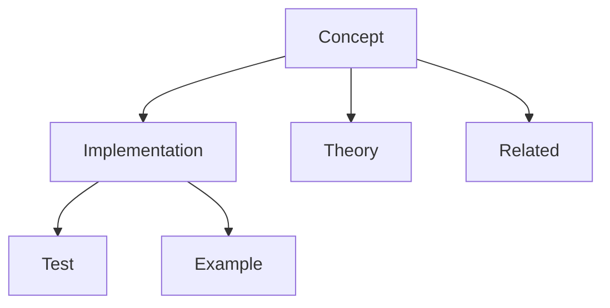
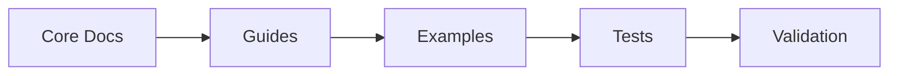

# Documentation Linking Completeness Guide

---
title: Documentation Linking Completeness
type: guide
status: stable
created: 2024-02-06
tags:
  - linking
  - completeness
  - validation
  - quality
semantic_relations:
  - type: implements
    links: [[ai_documentation_style]]
  - type: extends
    links: [[obsidian_linking]]
---

## Overview
This guide ensures comprehensive linking across the documentation system, integrating with existing style guides and templates.

## Link Types Analysis

### Core Documentation Links
```yaml
core_links:
  bidirectional:
    - type: concept_to_concept
      required: true
      validation: strict
    - type: concept_to_implementation
      required: true
      validation: strict
    - type: implementation_to_test
      required: true
      validation: strict
  
  hierarchical:
    - type: parent_child
      required: true
      validation: strict
    - type: dependency
      required: true
      validation: strict
    
  reference:
    - type: related_content
      required: false
      validation: flexible
    - type: external_reference
      required: false
      validation: flexible
```

### Template-Specific Links

#### Concept Templates
```yaml
concept_links:
  required:
    - theoretical_foundation: [[theory_docs]]
    - implementation: [[implementation_docs]]
    - validation: [[validation_docs]]
    - examples: [[example_docs]]
  
  optional:
    - related_research: [[research_docs]]
    - extensions: [[extension_docs]]
    - applications: [[application_docs]]
```

#### Implementation Templates
```yaml
implementation_links:
  required:
    - interface_spec: [[api_docs]]
    - test_suite: [[test_docs]]
    - validation: [[validation_docs]]
    - usage: [[usage_docs]]
  
  optional:
    - performance: [[performance_docs]]
    - optimization: [[optimization_docs]]
    - extensions: [[extension_docs]]
```

## Link Validation Rules

### 1. Structural Validation
```python
# @link_validation
def validate_link_structure(doc: Document) -> ValidationResult:
    """
    Validate link structure completeness
    
    Rules:
    1. All required links present
    2. Bidirectional links consistent
    3. Hierarchical links valid
    4. No broken links
    """
    pass
```

### 2. Semantic Validation
```python
# @semantic_validation
def validate_link_semantics(doc: Document) -> ValidationResult:
    """
    Validate link semantic relationships
    
    Rules:
    1. Correct relationship types
    2. Appropriate context
    3. Meaningful connections
    4. Proper categorization
    """
    pass
```

## Link Patterns

### 1. Knowledge Graph Patterns


### 2. Documentation Flow


## Completeness Checklist

### Required Links
- [ ] Concept-to-implementation links
- [ ] Implementation-to-test links
- [ ] Theory-to-application links
- [ ] Example-to-documentation links
- [ ] Guide-to-reference links

### Optional Links
- [ ] Related concepts
- [ ] Alternative implementations
- [ ] Extended examples
- [ ] External references
- [ ] Research connections

## Integration Points

### 1. Style Guide Integration
```yaml
style_guide_links:
  format: "[[document_name]]"
  alias: "[[document_name|display_text]]"
  section: "[[document_name#section]]"
  block: "[[document_name#^block-id]]"
```

### 2. Template Integration
```yaml
template_links:
  metadata:
    - related_documents
    - dependencies
    - implementations
  content:
    - references
    - examples
    - tests
```

## Validation Framework

### Link Quality Metrics
```python
# @link_metrics
link_quality = {
    "completeness": {
        "required_links": 1.0,
        "optional_links": 0.8,
        "bidirectional": 0.9
    },
    "validity": {
        "broken_links": 0.0,
        "semantic_accuracy": 0.95,
        "context_relevance": 0.9
    }
}
```

### Automated Checks
```python
# @link_checks
def check_link_quality(doc: Document) -> QualityReport:
    """
    Check link quality and completeness
    
    Checks:
    1. Required links present
    2. Links valid
    3. Context appropriate
    4. Relationships accurate
    """
    pass
```

## Best Practices

### 1. Link Management
- Maintain bidirectional links
- Validate link integrity
- Update related documents
- Check link relevance

### 2. Documentation Flow
- Establish clear hierarchies
- Define relationship types
- Maintain consistency
- Regular validation

### 3. Quality Assurance
- Automated link checking
- Regular completeness audits
- Semantic validation
- Context verification

## Related Documentation
- [[ai_documentation_style]]
- [[obsidian_linking]]
- [[knowledge_graph_structure]]
- [[validation_framework]]

## References
- [[linking_patterns]]
- [[documentation_standards]]
- [[quality_metrics]]
- [[validation_methods]] 