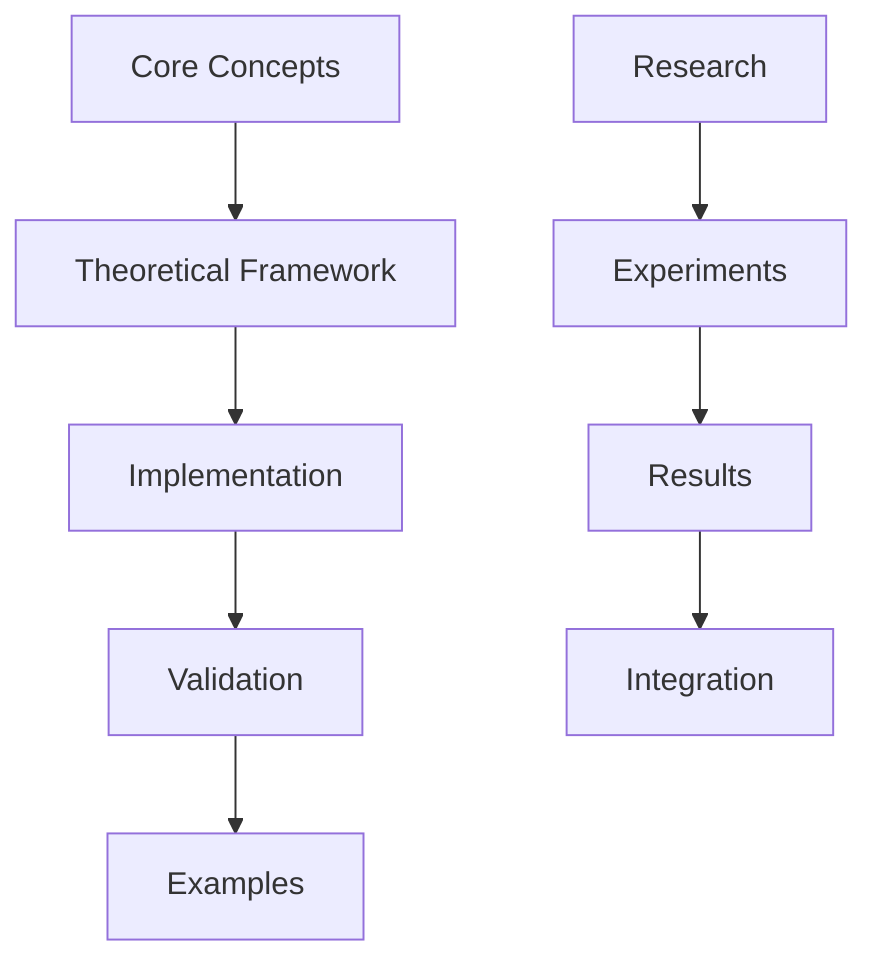
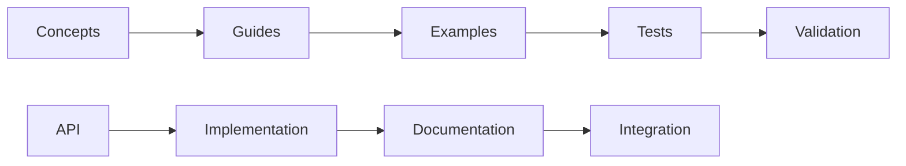

# Documentation Linking Validation Guide

---
title: Documentation Linking Validation
type: guide
status: stable
created: 2024-02-06
tags:
  - validation
  - linking
  - documentation
  - quality
semantic_relations:
  - type: implements
    links: 
      - [[linking_completeness]]
      - [[ai_validation_framework]]
  - type: extends
    links: [[obsidian_linking]]
---

## Overview
This guide establishes comprehensive validation rules and patterns for maintaining high-quality documentation linking across the cognitive modeling system.

## Validation Framework

### Core Link Types
```yaml
link_categories:
  theoretical:
    - type: concept_hierarchy
      required: true
      validation: strict
      pattern: "[[parent_concept]] -> [[child_concept]]"
    - type: implementation
      required: true
      validation: strict
      pattern: "[[concept]] -> [[implementation]]"
  
  research:
    - type: experimental
      required: true
      validation: flexible
      pattern: "[[theory]] -> [[experiment]] -> [[results]]"
    - type: literature
      required: false
      validation: flexible
      pattern: "[[paper]] -> [[findings]] -> [[integration]]"
  
  documentation:
    - type: guide_reference
      required: true
      validation: strict
      pattern: "[[guide]] -> [[reference]] -> [[example]]"
    - type: api_documentation
      required: true
      validation: strict
      pattern: "[[api]] -> [[implementation]] -> [[test]]"
```

### Validation Rules

#### 1. Structural Validation
```python
# @structural_validation
validation_rules = {
    "bidirectional": {
        "concept_links": True,      # Concepts must link both ways
        "implementation_links": True,# Implementations must reference concepts
        "test_links": True          # Tests must link to implementations
    },
    "hierarchical": {
        "max_depth": 5,            # Maximum hierarchy depth
        "required_levels": ["concept", "implementation", "test"],
        "optional_levels": ["example", "extension"]
    },
    "completeness": {
        "required_sections": 0.9,   # 90% of required sections must be present
        "optional_sections": 0.7,   # 70% of optional sections recommended
        "metadata_fields": 1.0      # All required metadata must be present
    }
}
```

#### 2. Semantic Validation
```python
# @semantic_validation
semantic_rules = {
    "relationship_types": {
        "implements": "Direct implementation of concept",
        "extends": "Extension or enhancement",
        "requires": "Dependency relationship",
        "relates": "Related but independent"
    },
    "context_validation": {
        "theoretical": ["concepts", "principles", "frameworks"],
        "practical": ["implementations", "examples", "tests"],
        "research": ["experiments", "results", "analysis"]
    }
}
```

## Link Patterns

### 1. Knowledge Organization


### 2. Documentation Flow


## Quality Metrics

### 1. Link Quality
```python
# @quality_metrics
quality_metrics = {
    "structural": {
        "completeness": "Percentage of required links present",
        "consistency": "Consistency of link patterns",
        "bidirectional": "Percentage of required bidirectional links"
    },
    "semantic": {
        "accuracy": "Correctness of relationship types",
        "relevance": "Relevance of linked content",
        "context": "Appropriate context maintenance"
    },
    "maintenance": {
        "freshness": "Recent validation/update",
        "stability": "Link stability over time",
        "coverage": "Documentation coverage"
    }
}
```

### 2. Validation Thresholds
```yaml
quality_thresholds:
  critical:
    structural_completeness: 0.95
    semantic_accuracy: 0.90
    bidirectional_completion: 0.85
  
  standard:
    structural_completeness: 0.85
    semantic_accuracy: 0.80
    bidirectional_completion: 0.75
  
  minimum:
    structural_completeness: 0.70
    semantic_accuracy: 0.65
    bidirectional_completion: 0.60
```

## Validation Process

### 1. Automated Checks
```python
# @validation_process
def validate_documentation():
    """
    Validation steps:
    1. Scan all documentation files
    2. Extract and validate links
    3. Check relationship types
    4. Verify bidirectional links
    5. Generate quality report
    """
    pass
```

### 2. Manual Review
- Regular link audits
- Content relevance review
- Context verification
- Quality assessment

## Integration Points

### 1. Documentation System
```yaml
integration_points:
  obsidian:
    - graph_visualization
    - backlink_tracking
    - relationship_mapping
  
  validation:
    - automated_checks
    - quality_metrics
    - report_generation
  
  maintenance:
    - link_updates
    - content_synchronization
    - version_control
```

### 2. Development Workflow
```yaml
workflow_integration:
  pre_commit:
    - link_validation
    - quality_check
    - report_generation
  
  continuous:
    - automated_monitoring
    - issue_detection
    - notification_system
  
  periodic:
    - comprehensive_audit
    - quality_assessment
    - improvement_planning
```

## Best Practices

### 1. Link Management
- Maintain clear hierarchies
- Use consistent patterns
- Update bidirectional links
- Regular validation

### 2. Quality Assurance
- Automated checking
- Regular audits
- Quality monitoring
- Issue resolution

### 3. Documentation Flow
- Clear structure
- Logical progression
- Proper categorization
- Context preservation

## Related Documentation
- [[linking_completeness]]
- [[ai_validation_framework]]
- [[obsidian_linking]]
- [[documentation_standards]]

## References
- [[validation_patterns]]
- [[quality_metrics]]
- [[documentation_tools]]
- [[maintenance_practices]] 