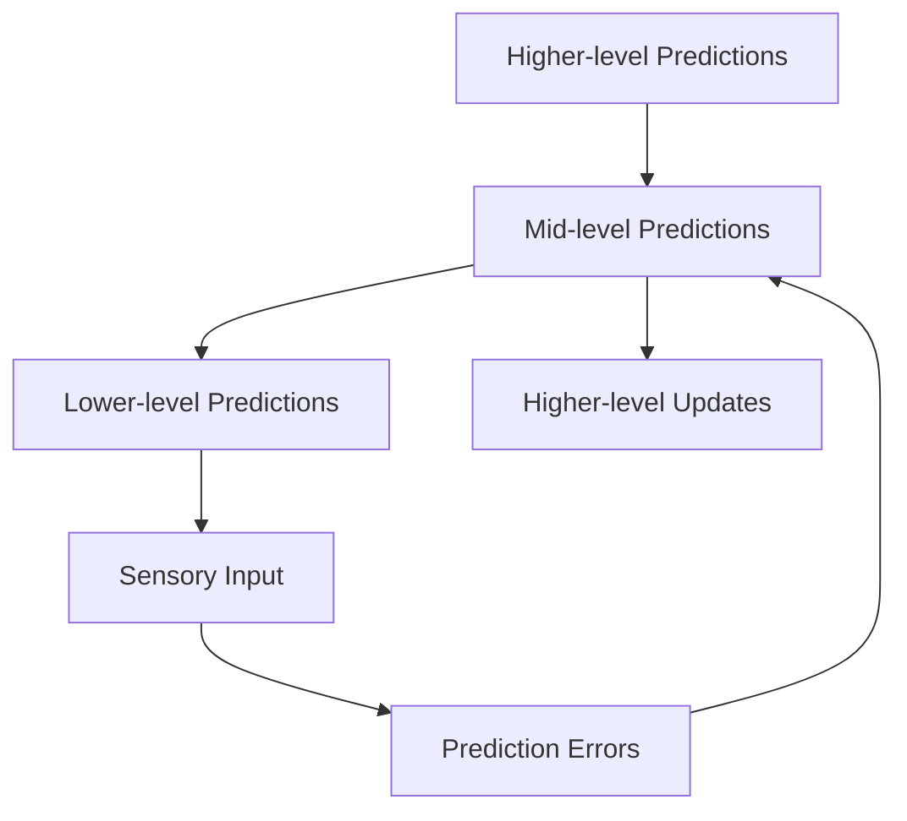

# Predictive Perception

---
title: Predictive Perception
type: cognitive_phenomenon
status: stable
created: 2024-02-06
tags:
  - perception
  - prediction
  - cognition
  - active_inference
semantic_relations:
  - type: implements
    links: 
      - [[knowledge_base/cognitive/predictive_processing|Predictive Processing]]
      - [[knowledge_base/cognitive/active_inference|Active Inference]]
  - type: uses
    links:
      - [[knowledge_base/mathematics/information_theory|Information Theory]]
      - [[knowledge_base/mathematics/variational_methods|Variational Methods]]
---

## Overview

Predictive perception is a fundamental cognitive process where the brain actively generates predictions about sensory inputs and updates these predictions based on prediction errors. This framework is central to [[knowledge_base/cognitive/predictive_processing|Predictive Processing]] and [[knowledge_base/cognitive/active_inference|Active Inference]].

## Core Principles

### 1. Hierarchical Prediction
```python
# Conceptual model of hierarchical prediction
class HierarchicalPerception:
    """
    Hierarchical perceptual processing.
    
    Theory:
        - [[knowledge_base/cognitive/predictive_processing|Predictive Processing]]
        - [[knowledge_base/cognitive/active_inference|Active Inference]]
    Mathematics:
        - [[knowledge_base/mathematics/information_theory|Information Theory]]
        - [[knowledge_base/mathematics/path_integral|Path Integrals]]
    """
    def __init__(self):
        self.layers = [
            PerceptualLayer(level=i) for i in range(hierarchy_depth)
        ]
```

### 2. Prediction Error
```python
# Prediction error computation
def compute_prediction_error(prediction: np.ndarray, 
                           observation: np.ndarray) -> np.ndarray:
    """
    Compute precision-weighted prediction error.
    
    Mathematics:
        - [[knowledge_base/mathematics/information_theory#kl-divergence|KL Divergence]]
        - [[knowledge_base/mathematics/variational_methods|Variational Methods]]
    """
    return precision * (observation - prediction)
```

## Neural Implementation

### 1. Message Passing
- Top-down predictions via feedback connections
- Bottom-up prediction errors via feedforward connections
- Precision weighting via neuromodulation

### 2. Hierarchical Processing


## Mathematical Framework

### Information Theory
- [[knowledge_base/mathematics/information_theory#entropy|Entropy]] - Uncertainty quantification
- [[knowledge_base/mathematics/information_theory#kl-divergence|KL Divergence]] - Prediction error measure
- [[knowledge_base/mathematics/information_theory#mutual-information|Mutual Information]] - Information gain

### Variational Methods
- [[knowledge_base/mathematics/variational_methods#variational-free-energy|Free Energy]] - Error minimization
- [[knowledge_base/mathematics/path_integral#action-computation|Action Computation]] - Trajectory optimization
- [[knowledge_base/mathematics/expected_free_energy|Expected Free Energy]] - Future prediction

## Applications

### 1. Visual Perception
```python
# Visual prediction model
class VisualPrediction:
    """
    Predictive visual processing.
    
    Implementation:
        - [[docs/guides/implementation_patterns#perception-implementation|Perception Pattern]]
        - [[docs/api/perception_api|Perception API]]
    """
    def process_visual_input(self, input_data: np.ndarray) -> Perception:
        predictions = self.generate_predictions()
        errors = self.compute_errors(predictions, input_data)
        updated = self.update_model(errors)
        return updated
```

### 2. Multimodal Integration
```python
# Multimodal integration
class MultimodalIntegration:
    """
    Integrate multiple sensory modalities.
    
    Theory:
        - [[knowledge_base/cognitive/active_inference#multimodal-integration|Multimodal Integration]]
        - [[knowledge_base/cognitive/predictive_processing#sensory-integration|Sensory Integration]]
    """
    def integrate_modalities(self, 
                           visual: np.ndarray,
                           auditory: np.ndarray) -> np.ndarray:
        return self._optimal_integration(visual, auditory)
```

## Advanced Implementations

### 1. Hierarchical Generative Model
```python
# @hierarchical_model
class HierarchicalGenerativeModel:
    """
    Hierarchical generative model for predictive perception.
    
    Theory:
        - [[knowledge_base/cognitive/predictive_processing|Predictive Processing]]
        - [[knowledge_base/cognitive/active_inference|Active Inference]]
    Mathematics:
        - [[knowledge_base/mathematics/variational_methods|Variational Methods]]
        - [[knowledge_base/mathematics/information_theory|Information Theory]]
    """
    def __init__(self, layer_sizes: List[int], precision_init: float = 1.0):
        self.layers = []
        self.precisions = []
        
        # Initialize hierarchical layers
        for i in range(len(layer_sizes) - 1):
            self.layers.append(
                Layer(
                    input_size=layer_sizes[i],
                    output_size=layer_sizes[i+1],
                    precision=precision_init
                )
            )
            self.precisions.append(
                PrecisionModule(size=layer_sizes[i])
            )
    
    def forward(self, observation: np.ndarray) -> List[np.ndarray]:
        """Forward pass through hierarchy."""
        predictions = []
        current = observation
        
        # Generate predictions at each level
        for layer in self.layers:
            prediction = layer.predict(current)
            predictions.append(prediction)
            current = prediction
        
        return predictions
    
    def backward(self, 
                observation: np.ndarray,
                predictions: List[np.ndarray]) -> List[np.ndarray]:
        """Backward pass with prediction errors."""
        errors = []
        current_error = observation - predictions[0]
        
        # Propagate prediction errors
        for i, layer in enumerate(self.layers[:-1]):
            weighted_error = self.precisions[i].weight_error(current_error)
            errors.append(weighted_error)
            current_error = layer.propagate_error(weighted_error)
        
        return errors
    
    def update(self, errors: List[np.ndarray], learning_rate: float):
        """Update model parameters using prediction errors."""
        for layer, error in zip(self.layers, errors):
            layer.update_weights(error, learning_rate)
```

### 2. Precision-Weighted Error Processing
```python
# @precision_module
class PrecisionModule:
    """
    Dynamic precision estimation and weighting.
    
    Mathematics:
        - [[knowledge_base/mathematics/information_theory#fisher-information|Fisher Information]]
        - [[knowledge_base/mathematics/variational_methods#precision|Precision]]
    """
    def __init__(self, size: int, init_precision: float = 1.0):
        self.precision = init_precision * np.ones(size)
        self.history = []
    
    def estimate_precision(self, errors: List[np.ndarray]):
        """Estimate optimal precision using error history."""
        # Compute empirical precision using Fisher information
        fisher = self._compute_fisher_information(errors)
        optimal = self._optimize_precision(fisher)
        self.precision = optimal
    
    def weight_error(self, error: np.ndarray) -> np.ndarray:
        """Apply precision weighting to prediction errors."""
        return self.precision * error
    
    def _compute_fisher_information(self, 
                                  errors: List[np.ndarray]) -> np.ndarray:
        """Compute Fisher information matrix from errors."""
        # Implementation using [[knowledge_base/mathematics/information_theory]]
        return np.cov(np.array(errors).T)
    
    def _optimize_precision(self, 
                          fisher: np.ndarray) -> np.ndarray:
        """Optimize precision using Fisher information."""
        # Implementation using [[knowledge_base/mathematics/variational_methods]]
        return np.linalg.inv(fisher)
```

### 3. Active Inference Integration
```python
# @active_inference_perception
class ActiveInferencePerception:
    """
    Perception with active inference.
    
    Theory:
        - [[knowledge_base/cognitive/active_inference|Active Inference]]
        - [[knowledge_base/cognitive/predictive_processing|Predictive Processing]]
    Mathematics:
        - [[knowledge_base/mathematics/expected_free_energy|Expected Free Energy]]
        - [[knowledge_base/mathematics/path_integral|Path Integrals]]
    """
    def __init__(self):
        self.generative_model = HierarchicalGenerativeModel([64, 32, 16, 8])
        self.action_model = ActionModel()
        self.policy_selector = PolicySelector()
    
    def process_observation(self, 
                          observation: np.ndarray,
                          goal: Optional[np.ndarray] = None) -> Tuple[np.ndarray, Action]:
        """Process observation and select action."""
        # Generate predictions
        predictions = self.generative_model.forward(observation)
        
        # Compute prediction errors
        errors = self.generative_model.backward(observation, predictions)
        
        # Update model
        self.generative_model.update(errors, learning_rate=0.01)
        
        # Select action if goal provided
        if goal is not None:
            action = self._select_action(predictions[-1], goal)
            return predictions[-1], action
        
        return predictions[-1], None
    
    def _select_action(self, 
                      current_state: np.ndarray,
                      goal: np.ndarray) -> Action:
        """Select action using active inference."""
        # Generate policies
        policies = self.action_model.generate_policies(current_state)
        
        # Evaluate expected free energy
        G = self.policy_selector.evaluate_policies(
            policies, current_state, goal
        )
        
        # Select optimal policy
        optimal_policy = self.policy_selector.select_policy(G)
        
        return optimal_policy.first_action
```

## Enhanced Clinical Applications

### 1. Perceptual Rehabilitation
```python
# @perceptual_rehabilitation
class PerceptualRehabilitation:
    """
    Perceptual rehabilitation system.
    
    Applications:
        - [[docs/examples/clinical/visual_rehabilitation|Visual Rehabilitation]]
        - [[docs/examples/clinical/auditory_training|Auditory Training]]
    Clinical:
        - [[docs/guides/clinical_applications#perceptual-disorders|Clinical Guide]]
    """
    def __init__(self, modality: str = "visual"):
        self.perception_model = ActiveInferencePerception()
        self.difficulty_controller = DifficultyController()
        self.progress_tracker = ProgressTracker()
        self.modality = modality
    
    def train_session(self, 
                     patient: Patient,
                     session_config: SessionConfig) -> SessionResults:
        """Run rehabilitation training session."""
        results = []
        
        for trial in range(session_config.n_trials):
            # Generate stimulus
            stimulus = self._generate_stimulus(
                self.difficulty_controller.current_level
            )
            
            # Process stimulus
            perception, action = self.perception_model.process_observation(
                stimulus, goal=session_config.target
            )
            
            # Get patient response
            response = self._get_patient_response(patient)
            
            # Update difficulty
            self.difficulty_controller.update(response.accuracy)
            
            # Track progress
            self.progress_tracker.add_trial(
                stimulus, response, self.difficulty_controller.current_level
            )
            
            results.append(response)
        
        return SessionResults(results)
    
    def generate_report(self) -> ClinicalReport:
        """Generate clinical progress report."""
        return self.progress_tracker.generate_report()
```

### 2. Diagnostic Tools
```python
# @perceptual_diagnostics
class PerceptualDiagnostics:
    """
    Diagnostic tools for perceptual disorders.
    
    Applications:
        - [[docs/examples/clinical/perceptual_assessment|Perceptual Assessment]]
        - [[docs/examples/clinical/disorder_classification|Disorder Classification]]
    """
    def __init__(self):
        self.assessment_battery = AssessmentBattery()
        self.classifier = DisorderClassifier()
        self.norm_database = NormativeDatabase()
    
    def run_assessment(self, 
                      patient: Patient,
                      test_battery: List[str]) -> AssessmentResults:
        """Run perceptual assessment battery."""
        results = {}
        
        for test in test_battery:
            # Run specific test
            test_result = self.assessment_battery.run_test(
                test, patient
            )
            
            # Compare to normative data
            normalized = self.norm_database.normalize(
                test_result, patient.demographics
            )
            
            # Classify abnormalities
            classification = self.classifier.classify(
                normalized, test
            )
            
            results[test] = {
                'raw': test_result,
                'normalized': normalized,
                'classification': classification
            }
        
        return AssessmentResults(results)
    
    def generate_diagnostic_report(self, 
                                 results: AssessmentResults) -> DiagnosticReport:
        """Generate comprehensive diagnostic report."""
        return DiagnosticReport(
            results=results,
            interpretation=self.classifier.interpret_results(results),
            recommendations=self.generate_recommendations(results)
        )
```

## Experimental Evidence

### 1. Behavioral Studies
- Visual illusions demonstrating top-down effects
- Context effects on perception
- Attention modulation of perception

### 2. Neural Evidence
- Predictive coding in visual cortex
- Hierarchical processing in sensory systems
- Precision-weighted prediction errors

## Clinical Applications

### 1. Perceptual Disorders
- Schizophrenia as prediction error dysfunction
- Autism as precision weighting abnormalities
- Visual processing disorders

### 2. Therapeutic Interventions
```python
# Perceptual training model
class PerceptualTraining:
    """
    Therapeutic perceptual training.
    
    Applications:
        - [[docs/examples/clinical/perceptual_training|Training Examples]]
        - [[docs/guides/clinical_applications|Clinical Guide]]
    """
    def train_perception(self, 
                        patient_data: PatientData,
                        training_protocol: Protocol) -> Results:
        return self._implement_training(patient_data, training_protocol)
```

## Research Directions

### Current Challenges
1. Precise neural mechanisms
2. Individual differences
3. Development trajectory
4. Clinical applications

### Future Developments
1. Computational models
2. Clinical interventions
3. Technological applications
4. Educational implications

## Related Phenomena
- [[attention_mechanisms]] - Attention and perception
- [[sensory_integration]] - Multimodal processing
- [[perceptual_learning]] - Learning and adaptation
- [[consciousness]] - Conscious perception

## References
- [[knowledge_base/cognitive/active_inference|Active Inference]]
- [[knowledge_base/cognitive/predictive_processing|Predictive Processing]]
- [[knowledge_base/mathematics/information_theory|Information Theory]]
- [[knowledge_base/mathematics/variational_methods|Variational Methods]] 