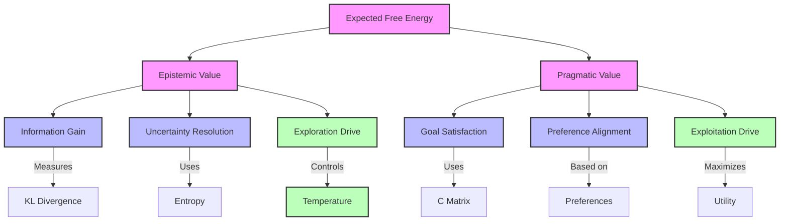
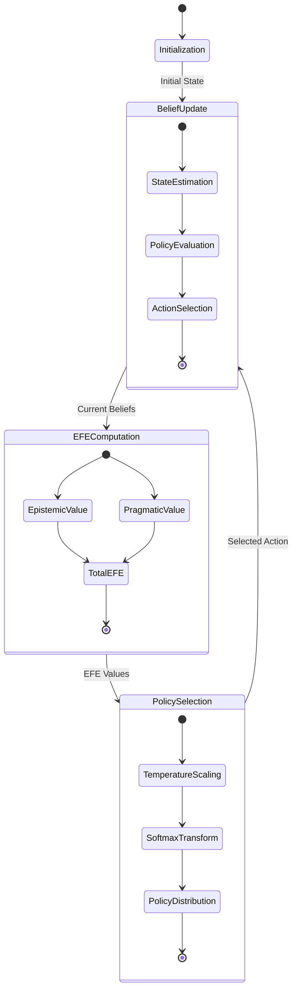
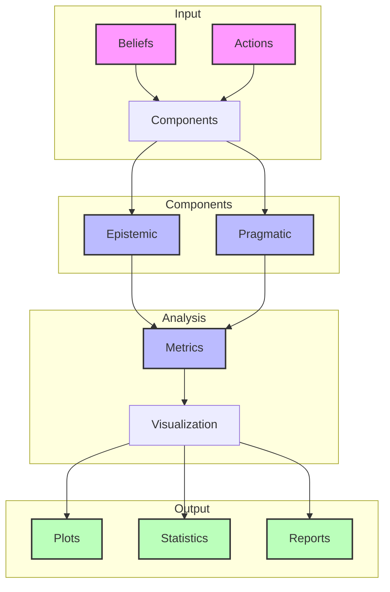

# Expected Free Energy Components

## Component Structure



## Mathematical Flow

```mermaid
graph LR
    B[B Matrix] --> |State Transition| QS[Q(s|π)]
    QS --> |Observation Model| A[A Matrix]
    A --> |Predicted Obs| QO[Q(o|π)]
    QO --> |Compare| C[C Matrix]
    
    QS --> |Entropy| H[H(s|π)]
    H --> |Information| EP[Epistemic Value]
    C --> |Preference| PR[Pragmatic Value]
    
    EP --> |Sum| EFE[Expected Free Energy]
    PR --> |Sum| EFE
    
    EFE --> |Temperature γ| SM[Softmax]
    SM --> |Policy| P[P(π)]
    
    classDef matrix fill:#f9f,stroke:#333,stroke-width:2px
    classDef dist fill:#bbf,stroke:#333,stroke-width:2px
    classDef value fill:#bfb,stroke:#333,stroke-width:2px
    
    class B,A,C matrix
    class QS,QO,P dist
    class EP,PR,EFE value
```

## Overview

The Expected Free Energy (EFE) comprises two main components for each policy at each timestep:
1. Epistemic Value (Information Gain)
2. Pragmatic Value (Utility/Preference Satisfaction)

Links to:
- [[expected_free_energy]] - Full EFE formulation
- [[active_inference_pomdp]] - POMDP framework
- [[policy_selection]] - Action selection using EFE

## Mathematical Formulation

$G(\pi) = \underbrace{-\mathbb{E}_{Q(\tilde{x},\tilde{y}|\pi)}[D_{KL}[Q(\tilde{x}|\tilde{y},\pi)\|Q(\tilde{x}|\pi)]]}_{\text{Epistemic Value}} - \underbrace{\mathbb{E}_{Q(\tilde{y}|\pi)}[\ln P(\tilde{y}|C)]}_{\text{Pragmatic Value}}$

Links to:
- [[kl_divergence]] - Divergence measure
- [[information_theory]] - Information theoretic foundation
- [[statistical_foundations]] - Mathematical basis

## Component Analysis

### Epistemic Value
- Measures expected information gain
- Drives exploration and uncertainty reduction
- Computed using KL divergence
- Links to:
  - [[information_gain]] - Information theoretic perspective
  - [[exploration_exploitation]] - Balance in decision making
  - [[uncertainty_resolution]] - Uncertainty reduction
  - [[belief_updating]] - State estimation

### Pragmatic Value
- Measures expected goal achievement
- Drives exploitation of preferences
- Uses log preferences from [[C_matrix]]
- Links to:
  - [[utility_theory]] - Preference encoding
  - [[goal_specification]] - Goal definition
  - [[reward_function]] - Reward structure
  - [[preference_learning]] - Learning preferences

## Implementation

```python
def compute_efe_components(
    A: np.ndarray,           # Observation model P(o|s)
    B: np.ndarray,           # Transition model P(s'|s,a)
    C: np.ndarray,           # Log preferences ln P(o)
    beliefs: np.ndarray,     # Current state beliefs Q(s)
    action: int             # Action to evaluate
) -> Tuple[float, float, float]:
    """Compute EFE components for an action.
    
    Args:
        A: Observation likelihood matrix [n_obs x n_states]
        B: State transition tensor [n_states x n_states x n_actions]
        C: Log preference vector [n_obs]
        beliefs: Current belief state [n_states]
        action: Action index to evaluate
        
    Returns:
        Tuple of (total_EFE, epistemic_value, pragmatic_value)
    """
    # Predicted next state distribution
    Qs_a = B[:, :, action] @ beliefs
    
    # Predicted observation distribution
    Qo_a = A @ Qs_a
    
    # Epistemic value (information gain)
    epistemic = compute_entropy(Qs_a)
    
    # Pragmatic value (preference satisfaction)
    pragmatic = -np.sum(Qo_a * C)  # Negative because C is log preferences
    
    # Total Expected Free Energy
    total_efe = epistemic + pragmatic
    
    return total_efe, epistemic, pragmatic
```

Links to:
- [[compute_efe]] - Full EFE computation
- [[matrix_operations]] - Matrix computations
- [[numerical_methods]] - Numerical implementation

## Visualization

### Component Plots
```python
def plot_efe_components(model, save: bool = True) -> plt.Figure:
    """Plot EFE components for each action."""
    fig, (ax1, ax2) = plt.subplots(1, 2, figsize=(12, 5))
    
    # Get components for each action
    actions = range(model.num_actions)
    epistemics = []
    pragmatics = []
    
    for a in actions:
        _, epist, prag = compute_efe_components(
            model.A, model.B, model.C, model.beliefs, a)
        epistemics.append(epist)
        pragmatics.append(prag)
    
    # Plot components
    ax1.bar(actions, epistemics, label='Epistemic')
    ax1.bar(actions, pragmatics, bottom=epistemics, label='Pragmatic')
    ax1.set_title('EFE Components by Action')
    ax1.legend()
    
    # Plot ratio
    ratios = np.array(epistemics) / (np.array(epistemics) + np.array(pragmatics))
    ax2.plot(actions, ratios, 'o-')
    ax2.set_title('Epistemic/Pragmatic Ratio')
    
    return fig
```

Links to:
- [[visualization_guide]] - Visualization standards
- [[plotting_utilities]] - Plotting tools
- [[matrix_plots]] - Matrix visualization

## Analysis Methods

### Component Balance
- Trade-off between exploration and exploitation
- Temperature parameter effects
- Learning dynamics
- Links to:
  - [[temperature_parameter]] - Control exploration
  - [[learning_dynamics]] - Learning behavior
  - [[optimization_theory]] - Optimization principles

### Temporal Evolution
- Component changes over time
- Policy adaptation
- Convergence properties
- Links to:
  - [[temporal_dynamics]] - Time evolution
  - [[convergence_analysis]] - Convergence study
  - [[policy_learning]] - Policy adaptation

## Related Concepts
- [[free_energy_principle]] - Theoretical foundation
- [[active_inference_theory]] - General framework
- [[variational_inference]] - Inference methods
- [[path_integral_free_energy]] - Path integral perspective
- [[action_selection]] - Selection mechanism
- [[belief_updating]] - State estimation

## References
- [[friston_2017]] - Active Inference
- [[da_costa_2020]] - Active Inference POMDP
- [[parr_2019]] - Generalizing Free Energy
- [[buckley_2017]] - Free Energy Tutorial

## Plot Descriptions

### 1. Total EFE Plot per Policy
- Shows overall Expected Free Energy for each policy over time
- Allows comparison of policy performance
- Highlights temporal dynamics of decision-making

### 2. Mean Components Plot
- Average epistemic and pragmatic values across policies
- Shows balance between exploration and exploitation
- Reveals general behavioral trends

### 3. Component Ratio Plot
- Epistemic/Pragmatic ratio for each policy
- Shows how policies balance information gain vs. goal achievement
- Reveals exploration/exploitation trade-offs

### 4. Policy Comparison Scatter
- Epistemic vs. Pragmatic values for each policy
- Color-coded by time to show temporal progression
- Reveals policy clustering and specialization

### 5. Policy Selection Probabilities
- Shows how likely each policy is to be selected
- Reveals decision-making dynamics
- Shows convergence to optimal policies

### 6. Component Heatmap
- Detailed view of components for all policies
- Useful for comparing policies at specific timesteps
- Shows relative contributions of epistemic and pragmatic values

## Analysis Methods

### Statistical Measures
1. **Global Statistics**
   - Mean EFE components per policy
   - Selection frequencies
   - Component ratios
   - Links to [[statistical_analysis]]

2. **Temporal Statistics**
   - Component autocorrelations
   - Local windowed statistics
   - Entropy evolution
   - Links to [[time_series_analysis]]

3. **Performance Metrics**
   - Selection probability
   - Component balance
   - Temporal stability
   - Links to [[optimization_metrics]]

### Temporal Patterns
- Early exploration phase (high epistemic)
- Late exploitation phase (high pragmatic)
- Policy specialization over time
- Links to [[learning_dynamics]]

### Policy Comparison
- Relative performance analysis
- Component balance analysis
- Selection probability dynamics
- Links to [[policy_evaluation]]

### Performance Analysis
1. **Component Distribution**
   - Statistical moments
   - Temporal correlations
   - Distribution shape
   - Links to [[distribution_analysis]]

2. **Selection Dynamics**
   - Entropy measures
   - Convergence rates
   - Stability metrics
   - Links to [[dynamical_systems]]

3. **Efficiency Metrics**
   - Information gain rate
   - Goal achievement rate
   - Resource utilization
   - Links to [[efficiency_analysis]]

## Related Visualizations
- [[belief_evolution]]
- [[policy_evaluation]]
- [[free_energy_landscape]]

## References
- [[friston_2017]] - Active Inference
- [[parr_2019]] - Exploration vs Exploitation
- [[da_costa_2020]] - Behavioral Analysis 

## Component Interactions



## Analysis Pipeline

