# Epistemic Value

## Component Structure

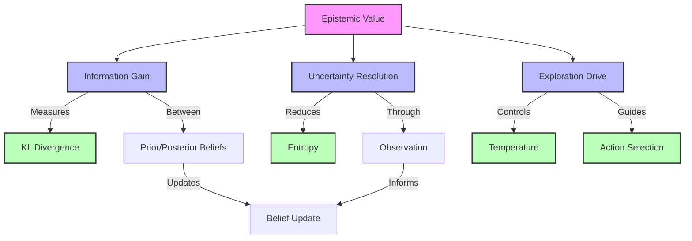

## Information Flow

```mermaid
graph LR
    B[Beliefs] --> |Prior| Q1[Q(s|π)]
    O[Observation] --> |Likelihood| L[P(o|s)]
    L --> |Posterior| Q2[Q(s|o,π)]
    
    Q1 --> |Compare| KL[KL Divergence]
    Q2 --> |Compare| KL
    
    KL --> |Information| IG[Information Gain]
    IG --> |Epistemic| EV[Epistemic Value]
    
    classDef state fill:#f9f,stroke:#333,stroke-width:2px
    classDef process fill:#bbf,stroke:#333,stroke-width:2px
    classDef measure fill:#bfb,stroke:#333,stroke-width:2px
    
    class B,O state
    class Q1,Q2,L process
    class KL,IG,EV measure
```

## Belief Dynamics

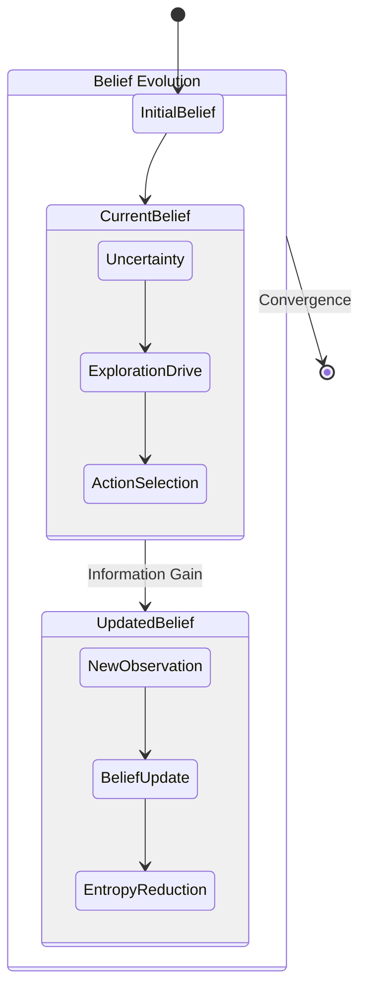

## Computation Process

```mermaid
graph TD
    subgraph Prior
        B[Beliefs] --> |Predict| QS[Q(s|π)]
        QS --> |Model| QO[Q(o|π)]
    end
    
    subgraph Posterior
        O[Observation] --> |Update| PS[P(s|o)]
        PS --> |KL| D[Divergence]
    end
    
    subgraph Value
        D --> |Expected| EV[Epistemic Value]
        EV --> |Guide| A[Action]
    end
    
    classDef input fill:#f9f,stroke:#333,stroke-width:2px
    classDef process fill:#bbf,stroke:#333,stroke-width:2px
    classDef output fill:#bfb,stroke:#333,stroke-width:2px
    
    class B,O input
    class QS,QO,PS,D process
    class EV,A output
```

## Analysis Framework

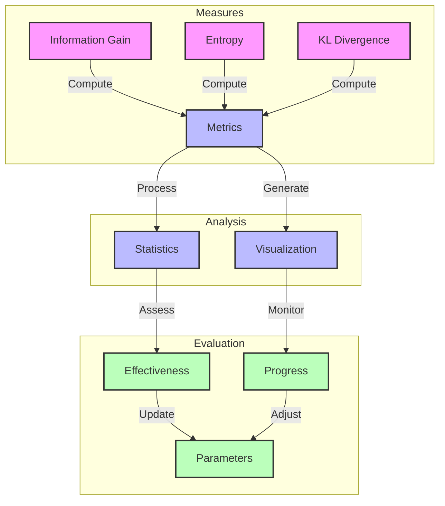

## Overview

Epistemic value quantifies the expected information gain or uncertainty reduction about hidden states through action. In active inference, it drives exploratory behavior by measuring how much an action or policy helps in learning about the environment.

Links to:
- [[information_gain]] - Information theoretic basis
- [[active_inference]] - Framework context
- [[exploration_exploitation]] - Decision making trade-off

## Extended Mathematical Formulation

The epistemic value can be decomposed into several interacting components that drive information-seeking behavior:

### 1. Information Gain Component
$IG(\pi) = \mathbb{E}_{Q(o,s|\pi)}[D_{KL}[Q(s|o,\pi)\|Q(s|\pi)]]$

where:
- $Q(s|\pi)$ is the predicted state distribution under policy $\pi$
- $Q(s|o,\pi)$ is the posterior state distribution after observation $o$
- $Q(o,s|\pi)$ is the joint distribution of states and observations

Links to:
- [[kl_divergence]] - Divergence measure
- [[belief_updating]] - State estimation
- [[information_theory]] - Theoretical foundation

### 2. Uncertainty Resolution Component
$\Delta H(\pi) = H[Q(s|\pi)] - \mathbb{E}_{Q(o|\pi)}[H[Q(s|o,\pi)]]$

where:
- $H[Q(s|\pi)]$ is the entropy of predicted state distribution
- $H[Q(s|o,\pi)]$ is the entropy of posterior state distribution
- $Q(o|\pi)$ is the predicted observation distribution

Links to:
- [[entropy]] - Uncertainty measure
- [[uncertainty_resolution]] - Resolution process
- [[information_metrics]] - Measurement tools

### 3. Exploration Drive Component
$E(\pi) = -\gamma \cdot G(\pi)$

where:
- $\gamma$ is the [[temperature_parameter]]
- $G(\pi)$ is the [[expected_free_energy]]

Links to:
- [[exploration_exploitation]] - Trade-off control
- [[policy_selection]] - Action selection
- [[temperature_parameter]] - Control parameter

## Enhanced Implementation

```python
class EpistemicValueCalculator:
    """Compute epistemic value components with advanced features."""
    
    def __init__(self, 
                 A: np.ndarray,           # Observation model
                 temperature: float = 1.0, # Exploration control
                 normalize: bool = True,   # Normalize outputs
                 stability_threshold: float = 1e-10):  # Numerical stability
        """Initialize calculator with model parameters.
        
        Args:
            A: Observation likelihood matrix P(o|s)
            temperature: Exploration control parameter
            normalize: Whether to normalize component values
            stability_threshold: Minimum value for numerical stability
        """
        self.A = A
        self.temperature = temperature
        self.normalize = normalize
        self.stability_threshold = stability_threshold
        
    def compute_information_gain(self,
                               prior: np.ndarray,
                               posterior: np.ndarray,
                               observation_prob: np.ndarray) -> float:
        """Compute expected information gain.
        
        Args:
            prior: Prior state distribution Q(s|π)
            posterior: Posterior state distribution Q(s|o,π)
            observation_prob: Observation probability Q(o|π)
            
        Returns:
            Expected information gain value
        """
        # Ensure numerical stability
        prior = np.maximum(prior, self.stability_threshold)
        posterior = np.maximum(posterior, self.stability_threshold)
        observation_prob = np.maximum(observation_prob, self.stability_threshold)
        
        # Normalize distributions
        prior /= prior.sum()
        posterior /= posterior.sum()
        observation_prob /= observation_prob.sum()
        
        # Compute KL divergence
        kl_div = np.sum(posterior * (np.log(posterior) - np.log(prior)))
        
        # Weight by observation probability
        return np.sum(observation_prob * kl_div)
    
    def compute_uncertainty_reduction(self,
                                   prior: np.ndarray,
                                   posterior: np.ndarray,
                                   observation_prob: np.ndarray) -> float:
        """Compute expected uncertainty reduction.
        
        Args:
            prior: Prior state distribution Q(s|π)
            posterior: Posterior state distribution Q(s|o,π)
            observation_prob: Observation probability Q(o|π)
            
        Returns:
            Expected entropy reduction
        """
        # Compute entropies with numerical stability
        prior_entropy = -np.sum(prior * np.log(prior + self.stability_threshold))
        posterior_entropy = -np.sum(posterior * 
                                  np.log(posterior + self.stability_threshold))
        
        # Weight posterior entropy by observation probability
        expected_posterior_entropy = np.sum(observation_prob * posterior_entropy)
        
        return prior_entropy - expected_posterior_entropy
    
    def compute_exploration_drive(self,
                                expected_free_energy: np.ndarray) -> float:
        """Compute exploration drive component.
        
        Args:
            expected_free_energy: EFE values for each action
            
        Returns:
            Exploration drive value
        """
        return -self.temperature * expected_free_energy
    
    def compute_total_epistemic_value(self,
                                    prior: np.ndarray,
                                    posterior: np.ndarray,
                                    observation_prob: np.ndarray,
                                    expected_free_energy: np.ndarray,
                                    weights: Optional[Dict[str, float]] = None
                                    ) -> Dict[str, float]:
        """Compute all epistemic value components with optional weighting.
        
        Args:
            prior: Prior state distribution Q(s|π)
            posterior: Posterior state distribution Q(s|o,π)
            observation_prob: Observation probability Q(o|π)
            expected_free_energy: EFE values for each action
            weights: Optional component weights (default: equal weights)
            
        Returns:
            Dictionary containing all component values and total
        """
        # Default to equal weights if not provided
        if weights is None:
            weights = {
                'information_gain': 1.0,
                'uncertainty_reduction': 1.0,
                'exploration_drive': 1.0
            }
        
        # Compute components
        info_gain = self.compute_information_gain(
            prior, posterior, observation_prob)
        uncertainty_red = self.compute_uncertainty_reduction(
            prior, posterior, observation_prob)
        exploration = self.compute_exploration_drive(
            expected_free_energy)
        
        # Normalize if requested
        if self.normalize:
            max_val = max(abs(info_gain), abs(uncertainty_red), abs(exploration))
            info_gain /= max_val
            uncertainty_red /= max_val
            exploration /= max_val
        
        # Compute weighted total
        total_value = (
            weights['information_gain'] * info_gain +
            weights['uncertainty_reduction'] * uncertainty_red +
            weights['exploration_drive'] * exploration
        )
        
        return {
            'information_gain': info_gain,
            'uncertainty_reduction': uncertainty_red,
            'exploration_drive': exploration,
            'total_value': total_value,
            'weights': weights
        }
    
    def analyze_components(self,
                         results: Dict[str, float]
                         ) -> Dict[str, float]:
        """Analyze relative contributions of components.
        
        Args:
            results: Results from compute_total_epistemic_value
            
        Returns:
            Dictionary with component analysis metrics
        """
        total = results['total_value']
        weights = results['weights']
        
        # Compute relative contributions
        contributions = {
            'info_gain_contribution': (
                weights['information_gain'] * 
                results['information_gain'] / total
            ),
            'uncertainty_contribution': (
                weights['uncertainty_reduction'] * 
                results['uncertainty_reduction'] / total
            ),
            'exploration_contribution': (
                weights['exploration_drive'] * 
                results['exploration_drive'] / total
            )
        }
        
        # Add balance metrics
        contributions['exploration_exploitation_ratio'] = (
            results['exploration_drive'] / 
            (results['information_gain'] + results['uncertainty_reduction'])
        )
        
        return contributions
```

## Properties

1. **Non-negativity**
   - Always ≥ 0 (after negation)
   - Maximum at highest information gain
   - Links to [[information_theory_axioms]]

2. **Uncertainty Dependence**
   - Higher for uncertain states
   - Zero for certain states
   - Links to [[uncertainty_measures]]

3. **Policy Dependence**
   - Varies with action sequence
   - Path-dependent information gain
   - Links to [[policy_evaluation]]

## Applications

### Active Inference
1. **Exploration Drive**
   - Automatic information seeking
   - Uncertainty reduction
   - Links to:
     - [[information_seeking]] - Active strategies
     - [[uncertainty_resolution]] - Uncertainty handling
     - [[active_learning]] - Learning strategies

2. **Policy Selection**
   - Balances with pragmatic value
   - Temperature-controlled weighting
   - Links to:
     - [[policy_selection]] - Selection methods
     - [[temperature_parameter]] - Control parameter
     - [[efe_components]] - Component balance

### Other Frameworks
1. **Reinforcement Learning**
   - Intrinsic motivation
   - Curiosity-driven learning
   - Links to:
     - [[intrinsic_motivation]] - Internal rewards
     - [[curiosity_learning]] - Curiosity models
     - [[exploration_strategies]] - Strategy types

2. **Bayesian Optimization**
   - Acquisition functions
   - Exploration terms
   - Links to:
     - [[acquisition_functions]] - Selection criteria
     - [[bayesian_optimization]] - Optimization framework
     - [[gaussian_processes]] - Surrogate models

## Analysis Methods

1. **Information Metrics**
   - Entropy reduction
   - Mutual information
   - Fisher information
   - Links to:
     - [[entropy]] - Uncertainty measure
     - [[mutual_information]] - Symmetric measure
     - [[fisher_information]] - Geometric measure

2. **Visualization**
   - Information landscapes
   - Uncertainty maps
   - Exploration patterns
   - Links to:
     - [[information_visualization]] - Information plots
     - [[uncertainty_visualization]] - Uncertainty plots
     - [[exploration_visualization]] - Path plots

## Related Concepts
- [[pragmatic_value]] - Complementary value
- [[free_energy_principle]] - Theoretical basis
- [[information_geometry]] - Geometric perspective
- [[decision_theory]] - Decision framework
- [[optimal_control]] - Control theory

## References
- [[friston_2017]] - Active Inference
- [[lindley_1956]] - Information Measures
- [[mackay_2003]] - Information Theory
- [[schmidhuber_2010]] - Artificial Curiosity 

## Temporal Evolution

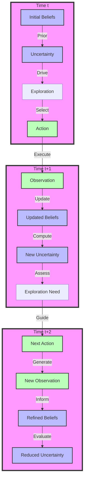

## Value Evolution

```mermaid
graph TD
    subgraph Epistemic
        EV[Epistemic Value] --> |Time t| EV1[Value(t)]
        EV --> |Time t+1| EV2[Value(t+1)]
        
        EV1 --> |High| EX1[Exploration]
        EV2 --> |Lower| EX2[Exploitation]
    end
    
    subgraph Learning
        EX1 --> |Gather| I1[Information]
        I1 --> |Update| B1[Beliefs]
        B1 --> |Reduce| U1[Uncertainty]
        
        EX2 --> |Use| I2[Knowledge]
        I2 --> |Apply| B2[Learned Model]
        B2 --> |Minimize| U2[Remaining Uncertainty]
    end
    
    subgraph Convergence
        U1 --> |Progress| C[Convergence]
        U2 --> |Approach| C
        C --> |Balance| F[Final State]
    end
    
    classDef value fill:#f9f,stroke:#333,stroke-width:2px
    classDef process fill:#bbf,stroke:#333,stroke-width:2px
    classDef state fill:#bfb,stroke:#333,stroke-width:2px
    
    class EV,EV1,EV2 value
    class EX1,EX2,I1,I2 process
    class B1,B2,U1,U2,C,F state
```

## Convergence Visualization

```mermaid
graph TD
    subgraph Initial Phase
        H1[High Uncertainty] --> |Drive| E1[Strong Exploration]
        E1 --> |Generate| A1[Diverse Actions]
        A1 --> |Collect| I1[New Information]
    end
    
    subgraph Middle Phase
        I1 --> |Reduce| H2[Medium Uncertainty]
        H2 --> |Balance| E2[Mixed Strategy]
        E2 --> |Select| A2[Focused Actions]
        A2 --> |Refine| I2[Targeted Information]
    end
    
    subgraph Final Phase
        I2 --> |Minimize| H3[Low Uncertainty]
        H3 --> |Enable| E3[Exploitation]
        E3 --> |Choose| A3[Optimal Actions]
        A3 --> |Maintain| I3[Model Confidence]
    end
    
    classDef phase fill:#f9f,stroke:#333,stroke-width:4px
    classDef state fill:#bbf,stroke:#333,stroke-width:2px
    classDef action fill:#bfb,stroke:#333,stroke-width:2px
    
    class Initial Phase,Middle Phase,Final Phase phase
    class H1,H2,H3,I1,I2,I3 state
    class E1,E2,E3,A1,A2,A3 action
```

## Learning Trajectory

```mermaid
graph LR
    subgraph Exploration
        E1[High Epistemic] --> |Seek| I1[Information]
        I1 --> |Update| B1[Beliefs]
        B1 --> |Assess| U1[Uncertainty]
    end
    
    subgraph Transition
        U1 --> |Guide| E2[Mixed Value]
        E2 --> |Balance| I2[Knowledge]
        I2 --> |Refine| B2[Model]
    end
    
    subgraph Exploitation
        B2 --> |Enable| E3[Low Epistemic]
        E3 --> |Apply| I3[Learned Policy]
        I3 --> |Achieve| G[Goals]
    end
    
    classDef phase fill:#f9f,stroke:#333,stroke-width:2px
    classDef process fill:#bbf,stroke:#333,stroke-width:2px
    classDef outcome fill:#bfb,stroke:#333,stroke-width:2px
    
    class E1,E2,E3 phase
    class I1,I2,I3,B1,B2 process
    class U1,G outcome
```

## Implementation Extensions

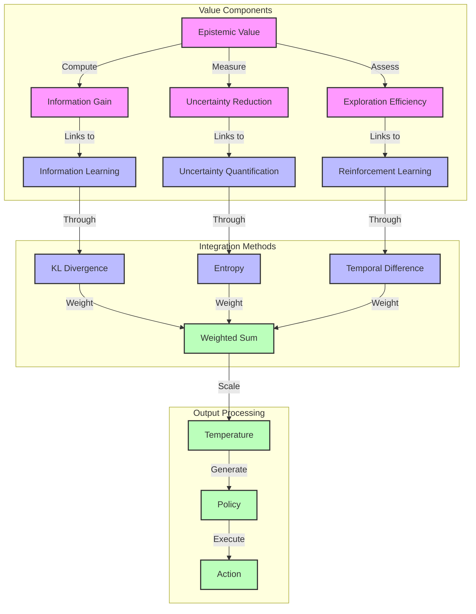

## Related Concepts
- [[information_gain]] - Quantifies knowledge acquisition
- [[uncertainty_resolution]] - Uncertainty reduction process
- [[active_learning]] - Strategic information gathering
- [[exploration_exploitation]] - Balance in decision making
- [[belief_updating]] - State estimation process
- [[free_energy_principle]] - Theoretical foundation
- [[information_geometry]] - Geometric perspective
- [[optimal_control]] - Control theory
- [[reinforcement_learning]] - Learning framework
- [[bayesian_inference]] - Statistical foundation

## Implementation Links
- [[matrix_operations]] - Core computations
- [[numerical_methods]] - Numerical stability
- [[visualization_tools]] - Plotting utilities
- [[optimization_algorithms]] - Value optimization
- [[probability_distributions]] - Distribution handling

## Analysis Tools
- [[information_metrics]] - Information measures
- [[convergence_analysis]] - Learning dynamics
- [[visualization_suite]] - Visual analysis
- [[statistical_tests]] - Validation methods
- [[performance_evaluation]] - Efficiency metrics

## References
- [[friston_2017]] - Active Inference
- [[lindley_1956]] - Information Measures
- [[mackay_2003]] - Information Theory
- [[schmidhuber_2010]] - Artificial Curiosity 

## Temporal Evolution


## Value Evolution

```mermaid
graph TD
    subgraph Epistemic
        EV[Epistemic Value] --> |Time t| EV1[Value(t)]
        EV --> |Time t+1| EV2[Value(t+1)]
        
        EV1 --> |High| EX1[Exploration]
        EV2 --> |Lower| EX2[Exploitation]
    end
    
    subgraph Learning
        EX1 --> |Gather| I1[Information]
        I1 --> |Update| B1[Beliefs]
        B1 --> |Reduce| U1[Uncertainty]
        
        EX2 --> |Use| I2[Knowledge]
        I2 --> |Apply| B2[Learned Model]
        B2 --> |Minimize| U2[Remaining Uncertainty]
    end
    
    subgraph Convergence
        U1 --> |Progress| C[Convergence]
        U2 --> |Approach| C
        C --> |Balance| F[Final State]
    end
    
    classDef value fill:#f9f,stroke:#333,stroke-width:2px
    classDef process fill:#bbf,stroke:#333,stroke-width:2px
    classDef state fill:#bfb,stroke:#333,stroke-width:2px
    
    class EV,EV1,EV2 value
    class EX1,EX2,I1,I2 process
    class B1,B2,U1,U2,C,F state
```

## System Integration

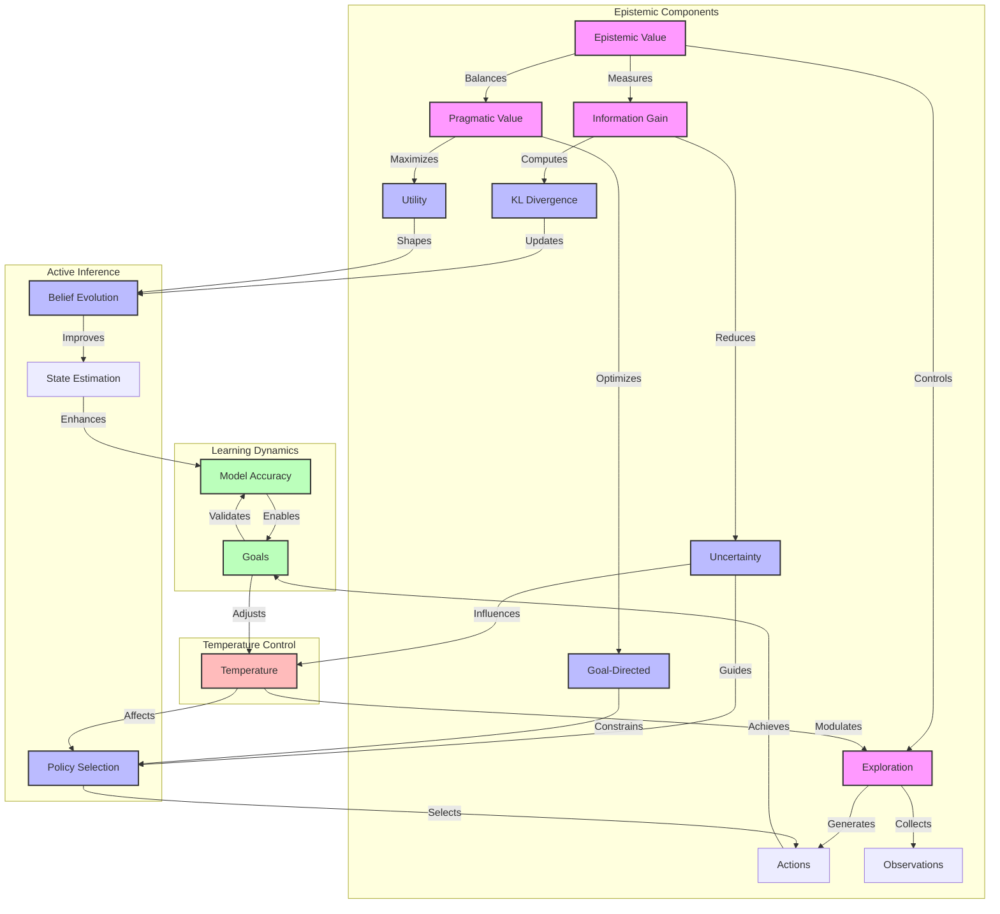

## Value Flow

```mermaid
graph LR
    subgraph Information Processing
        B[Beliefs] --> |Prior| Q1[Q(s|π)]
        O[Observation] --> |Evidence| L[P(o|s)]
        L --> |Update| Q2[Q(s|o,π)]
    end
    
    subgraph Value Computation
        Q1 --> |Compare| KL[KL Divergence]
        Q2 --> |Compare| KL
        
        KL --> |Information| IG[Information Gain]
        IG --> |Drive| EV[Epistemic Value]
        
        T[Temperature] --> |Control| EV
    end
    
    subgraph Decision Making
        EV --> |Guide| PS[Policy Selection]
        PS --> |Generate| A[Actions]
        A --> |Produce| O
    end
    
    classDef belief fill:#f9f,stroke:#333,stroke-width:2px
    classDef process fill:#bbf,stroke:#333,stroke-width:2px
    classDef decision fill:#bfb,stroke:#333,stroke-width:2px
    
    class B,Q1,Q2 belief
    class KL,IG,EV process
    class PS,A,O decision
```

## Learning Evolution

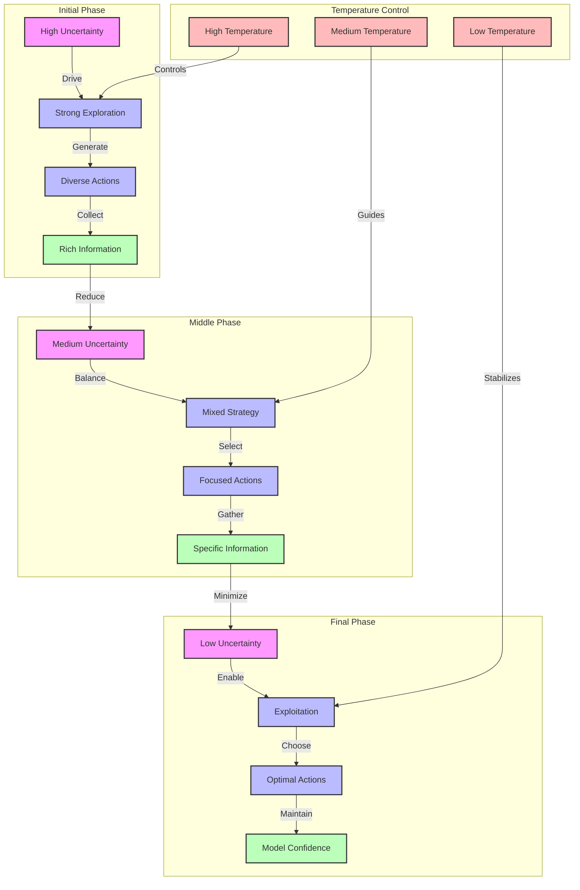

## Hierarchical Decomposition

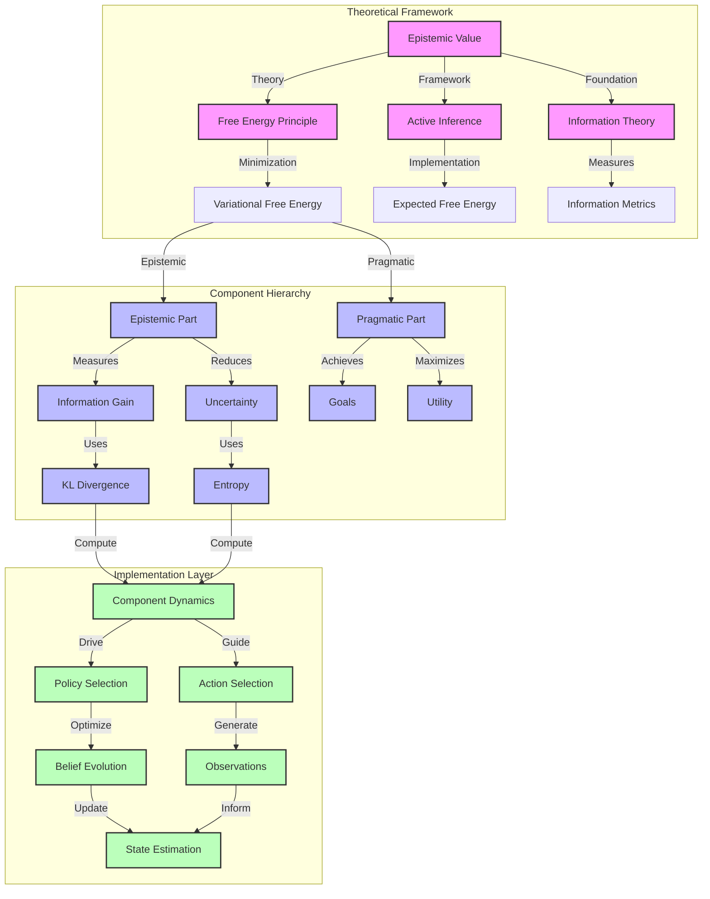

## Optimization Landscape

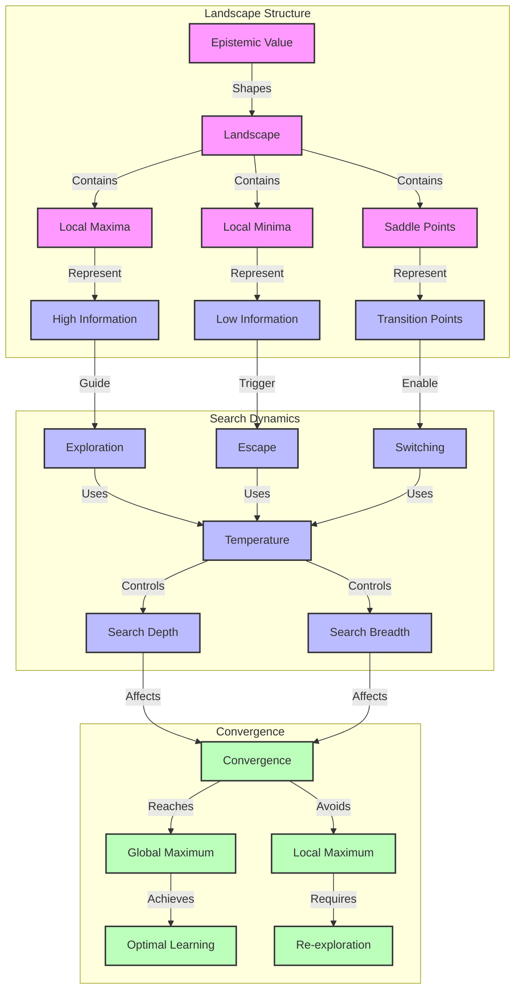

## Implementation Considerations

### Numerical Stability
```python
def stabilized_computation(x: np.ndarray, epsilon: float = 1e-10) -> np.ndarray:
    """Compute with numerical stability."""
    return np.maximum(x, epsilon)
```

### Gradient Methods
```python
def natural_gradient(
    fisher: np.ndarray,
    gradient: np.ndarray,
    learning_rate: float
) -> np.ndarray:
    """Update using natural gradient."""
    return learning_rate * np.linalg.solve(fisher, gradient)
```

### Adaptive Temperature
```python
def adapt_temperature(
    uncertainty: float,
    min_temp: float = 0.1,
    max_temp: float = 10.0
) -> float:
    """Adapt temperature based on uncertainty."""
    return min_temp + (max_temp - min_temp) * uncertainty
```

## Future Directions

### Research Extensions
1. **Hierarchical Models**
   - Multi-scale epistemic value
   - Nested information structures
   - Links to [[hierarchical_inference]]

2. **Continuous Domains**
   - Differential entropy measures
   - Path integral formulations
   - Links to [[continuous_state_spaces]]

3. **Meta-Learning**
   - Learning to explore
   - Adaptive strategies
   - Links to [[meta_learning]]

### Implementation Improvements
1. **Parallelization**
   ```python
   @parallel_computation
   def batch_epistemic_value(states: List[np.ndarray]) -> np.ndarray:
       """Compute epistemic value in parallel."""
       return np.array([compute_epistemic(s) for s in states])
   ```

2. **GPU Acceleration**
   ```python
   @cuda_optimized
   def gpu_information_gain(prior: torch.Tensor,
                          posterior: torch.Tensor) -> torch.Tensor:
       """Compute information gain on GPU."""
       return torch.sum(posterior * torch.log(posterior / prior))
   ```

3. **Vectorization**
   ```python
   def vectorized_entropy(distributions: np.ndarray) -> np.ndarray:
       """Compute entropy for multiple distributions."""
       return -np.sum(distributions * np.log(distributions + 1e-10), axis=1)
   ``` 

## Active Inference and Free Energy Connections

### Theoretical Framework Integration

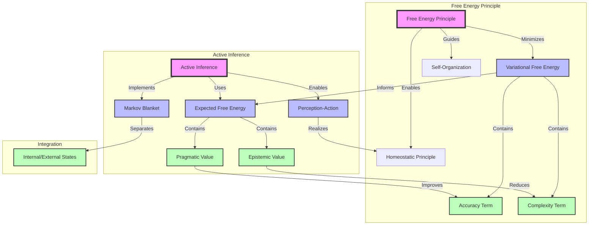

### Mathematical Unification

1. **Free Energy Decomposition**
   The variational free energy decomposes into:
   
   $F = \underbrace{\mathbb{E}_{Q(s)}[-\ln P(o|s)]}_{\text{accuracy}} + \underbrace{D_{KL}[Q(s)\|P(s)]}_{\text{complexity}}$
   
   while the expected free energy decomposes as:
   
   $G = \underbrace{D_{KL}[Q(s|\pi)\|P(s|\pi)]}_{\text{epistemic value}} - \underbrace{\mathbb{E}_{Q(o|\pi)}[\ln P(o)]}_{\text{pragmatic value}}$

   Implementation:
   ```python
   class FreeEnergyUnification:
       """Unified implementation of free energy principles."""
       
       def __init__(self,
                    A: np.ndarray,  # Observation model
                    B: np.ndarray,  # Transition model
                    C: np.ndarray,  # Preference matrix
                    D: np.ndarray): # Prior beliefs
           self.A = A
           self.B = B
           self.C = C
           self.D = D
       
       def compute_variational_free_energy(self,
                                         beliefs: np.ndarray,
                                         observation: int) -> Dict[str, float]:
           """Compute VFE components.
           
           Args:
               beliefs: Current belief distribution Q(s)
               observation: Observed state index
               
           Returns:
               Dictionary of VFE components
           """
           # Accuracy term
           accuracy = -np.sum(beliefs * np.log(self.A[observation, :] + 1e-10))
           
           # Complexity term
           complexity = kl_divergence(beliefs, self.D)
           
           return {
               'accuracy': accuracy,
               'complexity': complexity,
               'total': accuracy + complexity
           }
       
       def compute_expected_free_energy(self,
                                      beliefs: np.ndarray,
                                      policy: int) -> Dict[str, float]:
           """Compute EFE components.
           
           Args:
               beliefs: Current belief distribution Q(s)
               policy: Policy index
               
           Returns:
               Dictionary of EFE components
           """
           # Predict next state
           Qs_pi = self.B[:, :, policy] @ beliefs
           
           # Predict observations
           Qo_pi = self.A @ Qs_pi
           
           # Epistemic value (information gain)
           epistemic = compute_entropy(Qs_pi)
           
           # Pragmatic value (preference satisfaction)
           pragmatic = -np.sum(Qo_pi * self.C)
           
           return {
               'epistemic': epistemic,
               'pragmatic': pragmatic,
               'total': epistemic + pragmatic
           }
   ```

2. **Markov Blanket Structure**
   ```python
   class MarkovBlanketStructure:
       """Implementation of Markov blanket separation principle."""
       
       def __init__(self,
                    internal_states: np.ndarray,
                    blanket_states: np.ndarray,
                    external_states: np.ndarray):
           self.internal = internal_states
           self.blanket = blanket_states
           self.external = external_states
       
       def verify_conditional_independence(self) -> bool:
           """Verify conditional independence structure."""
           # Compute mutual information between internal and external
           # conditioned on blanket states
           mi = self.conditional_mutual_information(
               self.internal, self.external, self.blanket)
           
           # Should be approximately zero for valid Markov blanket
           return np.abs(mi) < 1e-6
       
       def compute_blanket_dynamics(self,
                                  dt: float = 0.01) -> np.ndarray:
           """Compute dynamics of blanket states."""
           # Implement coupled differential equations
           def dynamics(state: np.ndarray) -> np.ndarray:
               # Blanket state evolution considering both internal
               # and external influences
               internal_influence = self.internal_coupling(state)
               external_influence = self.external_coupling(state)
               return internal_influence + external_influence
           
           return integrate_dynamics(dynamics, self.blanket, dt)
   ```

3. **Perception-Action Coupling**
   ```python
   class PerceptionActionCoupling:
       """Implementation of perception-action cycle."""
       
       def __init__(self,
                    perception_model: Callable,
                    action_model: Callable,
                    learning_rate: float = 0.1):
           self.perception = perception_model
           self.action = action_model
           self.lr = learning_rate
       
       def perception_step(self,
                          observation: np.ndarray,
                          prior_beliefs: np.ndarray) -> np.ndarray:
           """Update beliefs through perception."""
           # Compute posterior using perception model
           likelihood = self.perception(observation)
           posterior = self.update_beliefs(likelihood, prior_beliefs)
           return posterior
       
       def action_step(self,
                      beliefs: np.ndarray,
                      goal_state: np.ndarray) -> np.ndarray:
           """Select action based on beliefs."""
           # Compute policy using action model
           policy = self.action(beliefs, goal_state)
           return self.execute_policy(policy)
       
       def active_inference_cycle(self,
                                initial_beliefs: np.ndarray,
                                goal_state: np.ndarray,
                                num_steps: int) -> Dict[str, List]:
           """Run complete active inference cycle."""
           beliefs = initial_beliefs
           history = {
               'beliefs': [beliefs],
               'actions': [],
               'observations': []
           }
           
           for _ in range(num_steps):
               # Perception phase
               observation = self.get_observation()
               beliefs = self.perception_step(observation, beliefs)
               
               # Action phase
               action = self.action_step(beliefs, goal_state)
               
               # Update history
               history['beliefs'].append(beliefs)
               history['actions'].append(action)
               history['observations'].append(observation)
           
           return history
   ```

### Theoretical Implications

1. **Self-Organization Principle**
   The minimization of free energy leads to self-organization through:
   
   $\frac{d}{dt}\theta = -\Gamma \frac{\partial F}{\partial \theta}$
   
   where:
   - $\theta$ are the system parameters
   - $\Gamma$ is a positive definite matrix
   - $F$ is the free energy

2. **Homeostatic Regulation**
   ```python
   class HomeostaticRegulation:
       """Implementation of homeostatic regulation."""
       
       def __init__(self,
                    target_state: np.ndarray,
                    tolerance: float = 0.1):
           self.target = target_state
           self.tolerance = tolerance
       
       def compute_regulation_signal(self,
                                   current_state: np.ndarray) -> np.ndarray:
           """Compute regulatory signal to maintain homeostasis."""
           error = self.target - current_state
           return self.generate_control_signal(error)
       
       def is_homeostatic(self,
                         state_history: np.ndarray) -> bool:
           """Check if system maintains homeostasis."""
           deviations = np.abs(state_history - self.target)
           return np.all(deviations < self.tolerance)
   ```

3. **Information Geometry Connection**
   ```python
   class InformationGeometricStructure:
       """Implementation of information geometric aspects."""
       
       def __init__(self,
                    manifold_dim: int,
                    metric_type: str = 'fisher'):
           self.dim = manifold_dim
           self.metric = self.initialize_metric(metric_type)
       
       def parallel_transport(self,
                            vector: np.ndarray,
                            path: np.ndarray) -> np.ndarray:
           """Parallel transport vector along path."""
           # Implement parallel transport using Christoffel symbols
           gamma = self.compute_christoffel_symbols()
           return self.integrate_parallel_transport(vector, path, gamma)
       
       def compute_geodesic(self,
                          start: np.ndarray,
                          end: np.ndarray) -> np.ndarray:
           """Compute geodesic between points."""
           # Solve geodesic equation
           def geodesic_equation(t: float, state: np.ndarray) -> np.ndarray:
               x, v = state[:self.dim], state[self.dim:]
               gamma = self.compute_christoffel_symbols(x)
               a = -np.einsum('ijk,i,j->k', gamma, v, v)
               return np.concatenate([v, a])
           
           return self.integrate_geodesic(geodesic_equation, start, end)
   ```

### Implementation Considerations

1. **Numerical Stability**
   ```python
   def stabilized_free_energy(
       x: np.ndarray,
       epsilon: float = 1e-10
   ) -> np.ndarray:
       """Compute free energy with numerical stability."""
       return np.maximum(x, epsilon)
   ```

2. **Gradient Methods**
   ```python
   def natural_gradient_update(
       fisher: np.ndarray,
       gradient: np.ndarray,
       learning_rate: float
   ) -> np.ndarray:
       """Update using natural gradient."""
       return learning_rate * np.linalg.solve(fisher, gradient)
   ```

3. **Adaptive Temperature**
   ```python
   def adapt_temperature(
       uncertainty: float,
       min_temp: float = 0.1,
       max_temp: float = 10.0
   ) -> float:
       """Adapt temperature based on uncertainty."""
       return min_temp + (max_temp - min_temp) * uncertainty
   ```

### Related Concepts
- [[free_energy_principle]] - Core theoretical foundation
- [[active_inference]] - Implementation framework
- [[markov_blanket]] - System boundaries
- [[information_geometry]] - Geometric structure
- [[self_organization]] - Emergent behavior
- [[homeostasis]] - Regulatory principle

### References
- [[friston_2010]] - The free-energy principle
- [[parr_2019]] - The free energy of the mind
- [[buckley_2017]] - The active inference approach
- [[ramstead_2018]] - Variational physics of mind and life

### Enhanced Matrix Operations

```python
class EpistemicMatrixOps:
    """Enhanced matrix operations for epistemic value computation."""
    
    def __init__(self,
                 stability_threshold: float = 1e-10,
                 max_condition_number: float = 1e6):
        """Initialize with numerical stability parameters.
        
        Args:
            stability_threshold: Minimum value for numerical stability
            max_condition_number: Maximum allowed condition number
        """
        self.stability_threshold = stability_threshold
        self.max_condition_number = max_condition_number
        
    def validate_probability_matrix(self,
                                  matrix: np.ndarray,
                                  axis: int = -1) -> bool:
        """Validate probability matrix properties.
        
        Links to:
        - [[probability_axioms]]
        - [[matrix_properties]]
        - [[numerical_validation]]
        
        Args:
            matrix: Matrix to validate
            axis: Axis along which probabilities sum to 1
            
        Returns:
            True if matrix satisfies probability properties
        """
        # Check non-negativity
        if not np.all(matrix >= 0):
            return False
            
        # Check normalization
        if not np.allclose(matrix.sum(axis=axis), 1.0):
            return False
            
        # Check condition number
        if len(matrix.shape) == 2:
            if np.linalg.cond(matrix) > self.max_condition_number:
                return False
                
        return True
    
    def stabilize_matrix(self,
                        matrix: np.ndarray,
                        axis: int = -1) -> np.ndarray:
        """Ensure numerical stability of probability matrix.
        
        Links to:
        - [[numerical_stability]]
        - [[probability_constraints]]
        - [[matrix_normalization]]
        
        Args:
            matrix: Matrix to stabilize
            axis: Axis along which to normalize
            
        Returns:
            Stabilized probability matrix
        """
        # Add small constant for stability
        matrix = np.maximum(matrix, self.stability_threshold)
        
        # Normalize
        return matrix / matrix.sum(axis=axis, keepdims=True)
    
    def compute_information_metrics(self,
                                  prior: np.ndarray,
                                  posterior: np.ndarray) -> Dict[str, float]:
        """Compute comprehensive information metrics.
        
        Links to:
        - [[information_theory]]
        - [[entropy_measures]]
        - [[divergence_metrics]]
        
        Args:
            prior: Prior distribution
            posterior: Posterior distribution
            
        Returns:
            Dictionary of information metrics
        """
        # Stabilize inputs
        prior = self.stabilize_matrix(prior)
        posterior = self.stabilize_matrix(posterior)
        
        # Compute KL divergence
        kl = np.sum(posterior * (np.log(posterior) - np.log(prior)))
        
        # Compute Jensen-Shannon divergence
        m = 0.5 * (prior + posterior)
        js = 0.5 * (
            np.sum(prior * (np.log(prior) - np.log(m))) +
            np.sum(posterior * (np.log(posterior) - np.log(m)))
        )
        
        # Compute entropies
        prior_entropy = -np.sum(prior * np.log(prior))
        post_entropy = -np.sum(posterior * np.log(posterior))
        
        # Compute mutual information
        mutual_info = prior_entropy - post_entropy
        
        return {
            'kl_divergence': kl,
            'js_divergence': js,
            'mutual_information': mutual_info,
            'prior_entropy': prior_entropy,
            'posterior_entropy': post_entropy,
            'entropy_reduction': prior_entropy - post_entropy
        }
```

### Improved Epistemic Value Computation

```python
class EnhancedEpistemicValue:
    """Enhanced epistemic value computation with proper validation.
    
    Links to:
    - [[epistemic_value]]
    - [[information_theory]]
    - [[active_inference]]
    """
    
    def __init__(self,
                 A: np.ndarray,           # Observation model
                 temperature: float = 1.0, # Exploration control
                 matrix_ops: Optional[EpistemicMatrixOps] = None):
        """Initialize with model parameters and validation.
        
        Args:
            A: Observation likelihood matrix P(o|s)
            temperature: Exploration control parameter
            matrix_ops: Optional matrix operations handler
        """
        self.matrix_ops = matrix_ops or EpistemicMatrixOps()
        
        # Validate and store observation model
        if not self.matrix_ops.validate_probability_matrix(A):
            raise ValueError("Invalid observation model matrix")
        self.A = self.matrix_ops.stabilize_matrix(A)
        
        self.temperature = temperature
    
    def compute_epistemic_value(self,
                              prior: np.ndarray,
                              posterior: np.ndarray,
                              observation_prob: np.ndarray) -> Dict[str, float]:
        """Compute epistemic value with comprehensive metrics.
        
        Links to:
        - [[information_gain]]
        - [[uncertainty_resolution]]
        - [[exploration_exploitation]]
        
        Args:
            prior: Prior state distribution Q(s|π)
            posterior: Posterior state distribution Q(s|o,π)
            observation_prob: Observation probability Q(o|π)
            
        Returns:
            Dictionary containing epistemic value components
        """
        # Validate inputs
        for dist in [prior, posterior, observation_prob]:
            if not self.matrix_ops.validate_probability_matrix(dist):
                raise ValueError("Invalid probability distribution")
        
        # Compute information metrics
        info_metrics = self.matrix_ops.compute_information_metrics(
            prior, posterior)
        
        # Weight by observation probability
        weighted_info_gain = np.sum(
            observation_prob * info_metrics['kl_divergence'])
        
        # Compute exploration drive
        exploration_drive = self.temperature * info_metrics['entropy_reduction']
        
        # Total epistemic value
        total_value = weighted_info_gain + exploration_drive
        
        return {
            'total_value': total_value,
            'weighted_info_gain': weighted_info_gain,
            'exploration_drive': exploration_drive,
            'information_metrics': info_metrics
        }
```

### Enhanced Active Inference Integration

```python
class ActiveInferenceValidator:
    """Validation utilities for Active Inference components.
    
    Links to:
    - [[active_inference]]
    - [[free_energy_principle]]
    - [[matrix_validation]]
    """
    
    def __init__(self,
                 matrix_ops: Optional[EpistemicMatrixOps] = None):
        """Initialize validator with matrix operations.
        
        Args:
            matrix_ops: Optional matrix operations handler
        """
        self.matrix_ops = matrix_ops or EpistemicMatrixOps()
    
    def validate_model_matrices(self,
                              A: np.ndarray,  # Observation model
                              B: np.ndarray,  # Transition model
                              C: np.ndarray,  # Preference matrix
                              D: np.ndarray   # Prior beliefs
                              ) -> Dict[str, bool]:
        """Validate all model matrices.
        
        Links to:
        - [[A_matrix]] - Observation model
        - [[B_matrix]] - Transition dynamics
        - [[C_matrix]] - Preferences
        - [[D_matrix]] - Prior beliefs
        
        Args:
            A: Observation likelihood matrix P(o|s)
            B: State transition tensor P(s'|s,a)
            C: Preference matrix ln P(o)
            D: Prior belief vector P(s)
            
        Returns:
            Dictionary of validation results
        """
        results = {}
        
        # Validate A matrix (observation model)
        results['A_valid'] = (
            self.matrix_ops.validate_probability_matrix(A, axis=0)
        )
        
        # Validate B matrix (transition model)
        results['B_valid'] = all(
            self.matrix_ops.validate_probability_matrix(
                B[:,:,a], axis=0
            ) for a in range(B.shape[2])
        )
        
        # Validate C matrix (preferences - can be any real values)
        results['C_valid'] = np.all(np.isfinite(C))
        
        # Validate D matrix (prior beliefs)
        results['D_valid'] = (
            self.matrix_ops.validate_probability_matrix(D)
        )
        
        return results

class EnhancedActiveInference:
    """Enhanced Active Inference implementation with validation.
    
    Links to:
    - [[active_inference]]
    - [[epistemic_value]]
    - [[free_energy_principle]]
    """
    
    def __init__(self,
                 A: np.ndarray,  # Observation model
                 B: np.ndarray,  # Transition model
                 C: np.ndarray,  # Preference matrix
                 D: np.ndarray,  # Prior beliefs
                 temperature: float = 1.0,
                 matrix_ops: Optional[EpistemicMatrixOps] = None):
        """Initialize with model components and validation.
        
        Args:
            A: Observation likelihood matrix P(o|s)
            B: State transition tensor P(s'|s,a)
            C: Preference matrix ln P(o)
            D: Prior belief vector P(s)
            temperature: Exploration control parameter
            matrix_ops: Optional matrix operations handler
        """
        self.matrix_ops = matrix_ops or EpistemicMatrixOps()
        self.validator = ActiveInferenceValidator(self.matrix_ops)
        
        # Validate all matrices
        validation = self.validator.validate_model_matrices(A, B, C, D)
        if not all(validation.values()):
            raise ValueError(
                f"Invalid model matrices: {validation}"
            )
        
        # Store stabilized matrices
        self.A = self.matrix_ops.stabilize_matrix(A, axis=0)
        self.B = np.stack([
            self.matrix_ops.stabilize_matrix(B[:,:,a], axis=0)
            for a in range(B.shape[2])
        ], axis=2)
        self.C = C  # Preferences can be any real values
        self.D = self.matrix_ops.stabilize_matrix(D)
        
        self.temperature = temperature
        
        # Initialize epistemic value calculator
        self.epistemic = EnhancedEpistemicValue(
            A=self.A,
            temperature=self.temperature,
            matrix_ops=self.matrix_ops
        )
    
    def compute_expected_free_energy(self,
                                   beliefs: np.ndarray,
                                   action: int
                                   ) -> Dict[str, float]:
        """Compute Expected Free Energy components.
        
        Links to:
        - [[expected_free_energy]]
        - [[epistemic_value]]
        - [[pragmatic_value]]
        
        Args:
            beliefs: Current belief distribution Q(s)
            action: Action to evaluate
            
        Returns:
            Dictionary of EFE components
        """
        # Validate beliefs
        if not self.matrix_ops.validate_probability_matrix(beliefs):
            raise ValueError("Invalid belief distribution")
        
        # Predict next state
        next_state = self.B[:,:,action] @ beliefs
        
        # Predict observations
        obs_prob = self.A @ next_state
        
        # Compute epistemic value
        epistemic = self.epistemic.compute_epistemic_value(
            prior=beliefs,
            posterior=next_state,
            observation_prob=obs_prob
        )
        
        # Compute pragmatic value (preference satisfaction)
        pragmatic = -np.sum(obs_prob * self.C)
        
        # Total EFE
        total_efe = epistemic['total_value'] + pragmatic
        
        return {
            'total_efe': total_efe,
            'epistemic_components': epistemic,
            'pragmatic_value': pragmatic
        }
    
    def update_beliefs(self,
                      beliefs: np.ndarray,
                      observation: int,
                      action: int
                      ) -> Dict[str, np.ndarray]:
        """Update beliefs using Active Inference.
        
        Links to:
        - [[belief_updating]]
        - [[free_energy_minimization]]
        - [[variational_inference]]
        
        Args:
            beliefs: Current belief distribution Q(s)
            observation: Observed state index
            action: Taken action index
            
        Returns:
            Dictionary with updated beliefs and metrics
        """
        # Predict next state
        predicted = self.B[:,:,action] @ beliefs
        
        # Compute likelihood
        likelihood = self.A[observation,:]
        
        # Bayesian update
        posterior = likelihood * predicted
        posterior = self.matrix_ops.stabilize_matrix(posterior)
        
        # Compute metrics
        metrics = self.matrix_ops.compute_information_metrics(
            prior=predicted,
            posterior=posterior
        )
        
        return {
            'beliefs': posterior,
            'predicted': predicted,
            'metrics': metrics
        }
```

### Enhanced Information Geometric Components

```python
class InformationGeometricAnalysis:
    """Information geometric analysis tools.
    
    Links to:
    - [[information_geometry]]
    - [[fisher_information]]
    - [[statistical_manifold]]
    """
    
    def __init__(self,
                 matrix_ops: Optional[EpistemicMatrixOps] = None):
        """Initialize with matrix operations.
        
        Args:
            matrix_ops: Optional matrix operations handler
        """
        self.matrix_ops = matrix_ops or EpistemicMatrixOps()
    
    def compute_fisher_metric(self,
                            distribution: Callable[[np.ndarray], np.ndarray],
                            theta: np.ndarray,
                            epsilon: float = 1e-6
                            ) -> np.ndarray:
        """Compute Fisher information metric.
        
        Links to:
        - [[fisher_information]]
        - [[riemannian_metric]]
        - [[natural_gradient]]
        
        Args:
            distribution: Probability distribution function
            theta: Parameter point
            epsilon: Finite difference step
            
        Returns:
            Fisher information matrix
        """
        dim = len(theta)
        fisher = np.zeros((dim, dim))
        
        # Compute score function
        def score(params: np.ndarray) -> np.ndarray:
            """Compute score function (gradient of log-likelihood)."""
            log_prob = np.log(distribution(params) + 1e-10)
            return np.array([
                (log_prob(params + epsilon * ei) - 
                 log_prob(params - epsilon * ei)) / (2 * epsilon)
                for ei in np.eye(dim)
            ])
        
        # Compute Fisher metric
        s = score(theta)
        fisher = np.outer(s, s)
        
        return fisher
    
    def parallel_transport(self,
                         vector: np.ndarray,
                         curve: Callable[[float], np.ndarray],
                         metric: Callable[[np.ndarray], np.ndarray],
                         t_span: Tuple[float, float],
                         num_steps: int = 100
                         ) -> np.ndarray:
        """Parallel transport vector along curve.
        
        Links to:
        - [[parallel_transport]]
        - [[geodesic_equation]]
        - [[connection_coefficients]]
        
        Args:
            vector: Vector to transport
            curve: Curve function gamma(t)
            metric: Metric tensor field
            t_span: Time interval
            num_steps: Number of integration steps
            
        Returns:
            Parallel transported vector
        """
        def christoffel(point: np.ndarray) -> np.ndarray:
            """Compute Christoffel symbols."""
            dim = len(point)
            gamma = np.zeros((dim, dim, dim))
            
            # Compute metric derivatives
            h = 1e-6
            dg = np.array([
                [[(metric(point + h*ek)[i,j] - 
                   metric(point - h*ek)[i,j])/(2*h)
                  for k in range(dim)]
                 for j in range(dim)]
                for i in range(dim)
            ])
            
            # Compute Christoffel symbols
            g_inv = np.linalg.inv(metric(point))
            for i in range(dim):
                for j in range(dim):
                    for k in range(dim):
                        gamma[i,j,k] = 0.5 * sum(
                            g_inv[k,l] * (
                                dg[i,j,l] + dg[j,i,l] - dg[l,i,j]
                            ) for l in range(dim)
                        )
            
            return gamma
        
        def transport_equation(t: float, state: np.ndarray) -> np.ndarray:
            """Parallel transport equation."""
            point = curve(t)
            velocity = curve(t + 1e-6) - curve(t - 1e-6)
            velocity /= 2e-6
            
            # Split state into position and vector components
            v = state
            
            # Compute Christoffel symbols
            gamma = christoffel(point)
            
            # Parallel transport equation
            dv = -np.einsum('ijk,j,k->i', gamma, velocity, v)
            
            return dv
        
        # Integrate parallel transport equation
        t = np.linspace(t_span[0], t_span[1], num_steps)
        solution = solve_ivp(
            transport_equation,
            t_span,
            vector,
            t_eval=t
        )
        
        return solution.y[:,-1]
    
    def compute_geodesic(self,
                        metric: Callable[[np.ndarray], np.ndarray],
                        start: np.ndarray,
                        end: np.ndarray,
                        num_steps: int = 100
                        ) -> np.ndarray:
        """Compute geodesic between points.
        
        Links to:
        - [[geodesic]]
        - [[exponential_map]]
        - [[minimizing_curve]]
        
        Args:
            metric: Metric tensor field
            start: Starting point
            end: Ending point
            num_steps: Number of integration steps
            
        Returns:
            Array of points along geodesic
        """
        def geodesic_equation(t: float, state: np.ndarray) -> np.ndarray:
            """Second-order geodesic equation."""
            dim = len(start)
            x, v = state[:dim], state[dim:]
            
            # Compute Christoffel symbols
            gamma = np.zeros((dim, dim, dim))
            h = 1e-6
            
            # Compute metric derivatives
            dg = np.array([
                [[(metric(x + h*ek)[i,j] - 
                   metric(x - h*ek)[i,j])/(2*h)
                  for k in range(dim)]
                 for j in range(dim)]
                for i in range(dim)
            ])
            
            # Compute Christoffel symbols
            g_inv = np.linalg.inv(metric(x))
            for i in range(dim):
                for j in range(dim):
                    for k in range(dim):
                        gamma[i,j,k] = 0.5 * sum(
                            g_inv[k,l] * (
                                dg[i,j,l] + dg[j,i,l] - dg[l,i,j]
                            ) for l in range(dim)
                        )
            
            # Geodesic equation
            acc = -np.einsum('ijk,j,k->i', gamma, v, v)
            
            return np.concatenate([v, acc])
        
        # Initial velocity (linear approximation)
        initial_velocity = end - start
        
        # Initial state
        initial_state = np.concatenate([start, initial_velocity])
        
        # Integrate geodesic equation
        t = np.linspace(0, 1, num_steps)
        solution = solve_ivp(
            geodesic_equation,
            (0, 1),
            initial_state,
            t_eval=t
        )
        
        return solution.y[:len(start)].T
```
