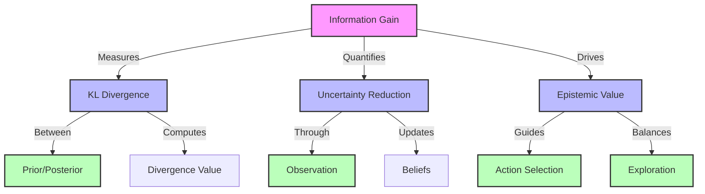
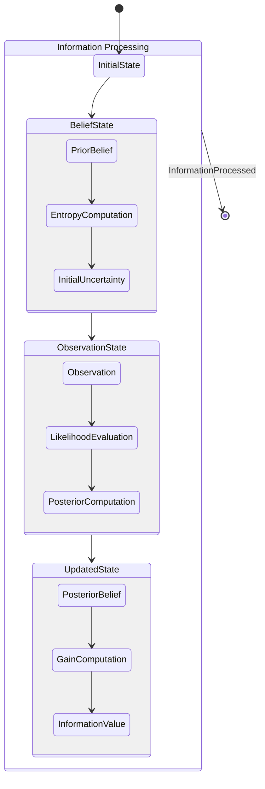
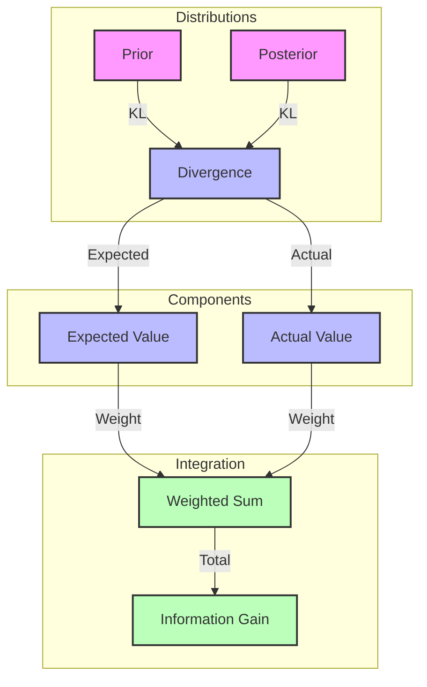
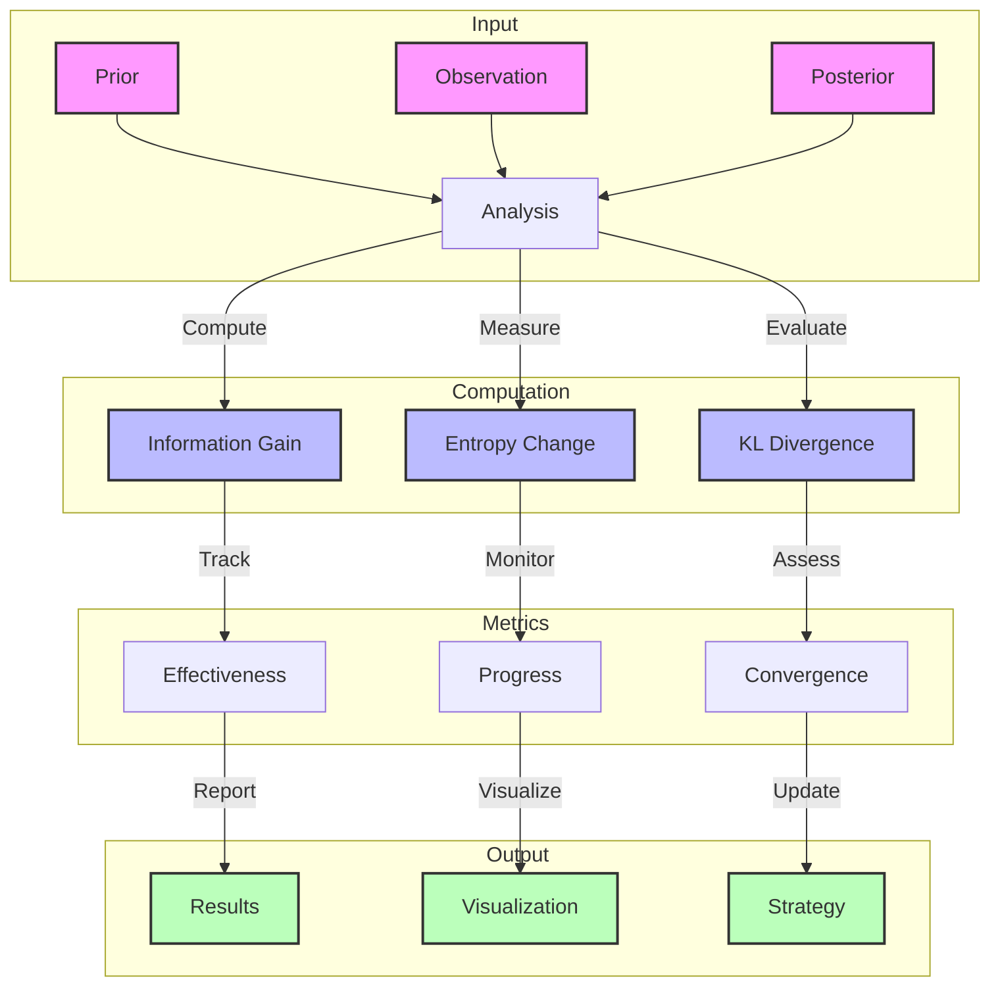

# Information Gain

## Information Structure



## Belief Update Flow

```mermaid
graph LR
    subgraph Prior Knowledge
        P[Prior P(s)] --> |Initial| H1[H(s)]
        H1 --> |Uncertainty| U1[Prior Uncertainty]
    end
    
    subgraph Observation
        O[Observation o] --> |Evidence| L[Likelihood P(o|s)]
        L --> |Bayes| Po[Posterior P(s|o)]
    end
    
    subgraph Information
        Po --> |Updated| H2[H(s|o)]
        H2 --> |Reduction| U2[Posterior Uncertainty]
        
        U1 --> |Difference| IG[Information Gain]
        U2 --> |Difference| IG
    end
    
    classDef state fill:#f9f,stroke:#333,stroke-width:2px
    classDef process fill:#bbf,stroke:#333,stroke-width:2px
    classDef measure fill:#bfb,stroke:#333,stroke-width:2px
    
    class P,O,Po state
    class L,H1,H2 process
    class U1,U2,IG measure
```

## Computation Dynamics



## Value Computation



## Analysis Methods



## Mathematical Formulation

Information gain is defined as the KL divergence between posterior and prior distributions:

$IG(s;o) = D_{KL}[P(s|o)\|P(s)] = \mathbb{E}_{P(s|o)}[\ln P(s|o) - \ln P(s)]$

Links to:
- [[kl_divergence]] - Divergence measure
- [[bayesian_inference]] - Posterior computation
- [[entropy]] - Uncertainty measure

## Implementation

```python
def compute_information_gain(
    prior: np.ndarray,      # Prior distribution P(s)
    posterior: np.ndarray,  # Posterior distribution P(s|o)
    method: str = 'kl'     # Computation method
) -> float:
    """Compute information gain between distributions.
    
    Args:
        prior: Prior probability distribution
        posterior: Posterior probability distribution
        method: Method to use ('kl' or 'entropy')
        
    Returns:
        Information gain value
    """
    if method == 'kl':
        return np.sum(posterior * (np.log(posterior + 1e-10) - 
                                 np.log(prior + 1e-10)))
    elif method == 'entropy':
        prior_entropy = -np.sum(prior * np.log(prior + 1e-10))
        post_entropy = -np.sum(posterior * np.log(posterior + 1e-10))
        return prior_entropy - post_entropy
    else:
        raise ValueError(f"Unknown method: {method}")
```

Links to:
- [[numerical_methods]] - Implementation details
- [[probability_distributions]] - Distribution handling
- [[numerical_stability]] - Stability considerations

## Applications

### Active Inference
- Drives exploration in [[epistemic_value]]
- Guides [[action_selection]]
- Measures [[belief_updating]] effectiveness
- Links to:
  - [[exploration_exploitation]] - Balance
  - [[policy_selection]] - Action choice
  - [[efe_components]] - Value components

### Information Theory
- Quantifies [[mutual_information]]
- Measures [[entropy]] reduction
- Evaluates [[channel_capacity]]
- Links to:
  - [[information_theory_axioms]] - Foundations
  - [[information_geometry]] - Geometric view
  - [[information_flow]] - Dynamic aspects

## Properties

1. **Non-negativity**
   - Always ≥ 0 by [[jensen_inequality]]
   - = 0 iff distributions identical
   - Links to [[information_bounds]]

2. **Asymmetry**
   - Not symmetric in arguments
   - Order matters (posterior vs prior)
   - Links to [[divergence_measures]]

3. **Additivity**
   - Chain rule decomposition
   - Sequential information gains
   - Links to [[chain_rule_probability]]

## Related Concepts
- [[uncertainty_resolution]] - Resolution process
- [[active_learning]] - Learning strategy
- [[optimal_experiment_design]] - Design theory
- [[information_theory]] - Theoretical basis
- [[bayesian_inference]] - Statistical framework

## References
- [[cover_thomas_2006]] - Information Theory
- [[mackay_2003]] - Information Theory
- [[friston_2017]] - Active Inference
- [[lindley_1956]] - Information Measures 