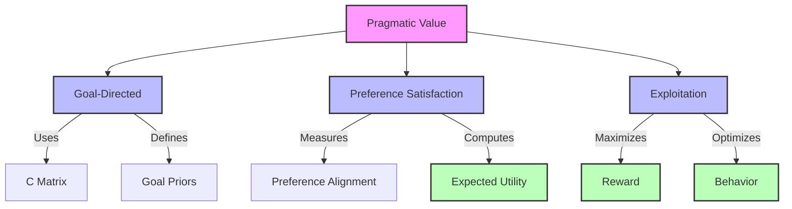
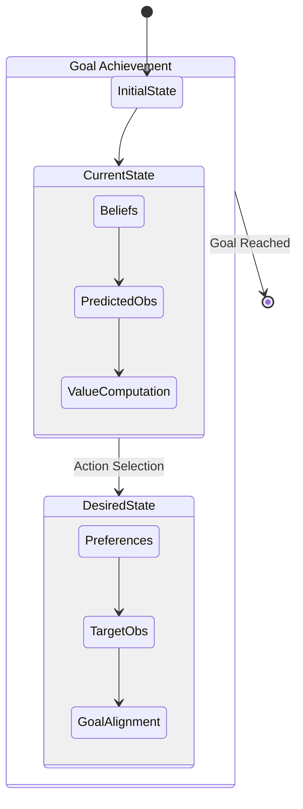
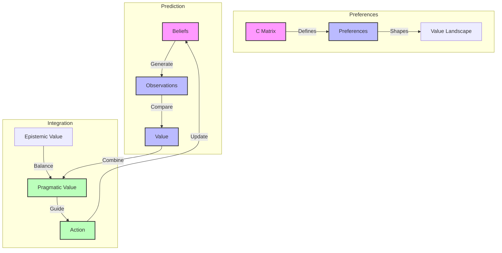
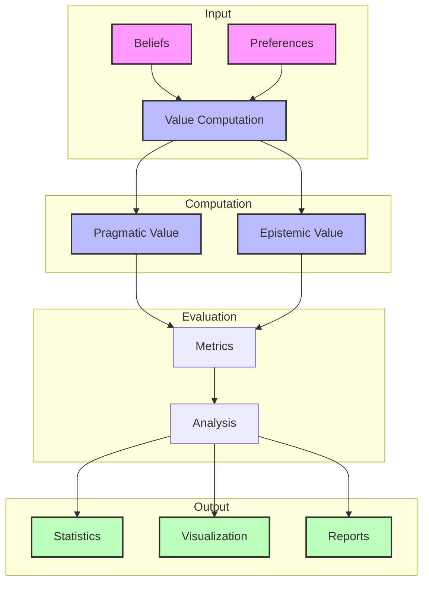

# Pragmatic Value

## Component Structure



## Computation Flow

```mermaid
graph LR
    B[Beliefs] --> |State Prediction| QS[Q(s|π)]
    QS --> |Observation Model| A[A Matrix]
    A --> |Predicted Obs| QO[Q(o|π)]
    
    C[C Matrix] --> |Log Preferences| LP[ln P(o)]
    QO --> |Expected Value| EV[E[ln P(o)]]
    LP --> EV
    
    EV --> |Negative| PV[Pragmatic Value]
    
    classDef input fill:#f9f,stroke:#333,stroke-width:2px
    classDef process fill:#bbf,stroke:#333,stroke-width:2px
    classDef output fill:#bfb,stroke:#333,stroke-width:2px
    
    class B,C input
    class QS,QO,LP process
    class PV output
```

## Overview

Pragmatic value quantifies the expected goal achievement or preference satisfaction in active inference. It drives exploitative behavior by measuring how well actions align with desired outcomes encoded in preferences.

Links to:
- [[utility_theory]] - Theoretical foundation
- [[active_inference]] - Framework context
- [[exploration_exploitation]] - Decision making trade-off

## Mathematical Formulation

The pragmatic value for a policy $\pi$ is defined as:

$PV(\pi) = -\mathbb{E}_{Q(o|\pi)}[\ln P(o)]$

where:
- $Q(o|\pi)$ is the predicted observation distribution
- $P(o)$ is the preferred observation distribution (from [[C_matrix]])
- Links to [[expected_free_energy]] for full context

## Implementation

```python
def compute_pragmatic_value(
    A: np.ndarray,           # Observation model P(o|s)
    C: np.ndarray,           # Log preferences ln P(o)
    Qs_pi: np.ndarray,       # Predicted state dist Q(s|π)
    normalize: bool = True   # Whether to normalize result
) -> float:
    """Compute pragmatic value for predicted state distribution.
    
    Args:
        A: Observation likelihood matrix [n_obs x n_states]
        C: Log preference vector [n_obs]
        Qs_pi: Predicted state distribution [n_states]
        normalize: Whether to normalize result
        
    Returns:
        Pragmatic value
    """
    # Compute predicted observation distribution
    Qo_pi = A @ Qs_pi
    
    # Compute pragmatic value (negative because C is log preferences)
    pragmatic = -np.sum(Qo_pi * C)
    
    if normalize:
        # Normalize by maximum possible preference
        pragmatic /= np.max(np.abs(C))
        
    return pragmatic
```

Links to:
- [[numerical_methods]] - Implementation details
- [[probability_distributions]] - Distribution handling
- [[numerical_stability]] - Stability considerations

## Properties

1. **Preference Dependence**
   - Scales with preference magnitude
   - Sign indicates goal alignment
   - Links to [[preference_learning]]

2. **State Dependence**
   - Depends on predicted observations
   - Affected by state uncertainty
   - Links to [[state_estimation]]

3. **Policy Dependence**
   - Varies with action sequence
   - Path-dependent utility
   - Links to [[policy_evaluation]]

## Applications

### Active Inference
1. **Goal-Directed Behavior**
   - Drives exploitation
   - Preference satisfaction
   - Links to:
     - [[goal_specification]] - Goal definition
     - [[preference_encoding]] - Preference representation
     - [[utility_maximization]] - Value optimization

2. **Policy Selection**
   - Balances with epistemic value
   - Temperature-controlled weighting
   - Links to:
     - [[policy_selection]] - Selection methods
     - [[temperature_parameter]] - Control parameter
     - [[efe_components]] - Component balance

### Other Frameworks
1. **Reinforcement Learning**
   - Reward function
   - Value estimation
   - Links to:
     - [[reward_function]] - Reward definition
     - [[value_function]] - Value estimation
     - [[policy_gradient]] - Policy optimization

2. **Control Theory**
   - Cost functions
   - Optimal control
   - Links to:
     - [[cost_function]] - Objective definition
     - [[optimal_control]] - Control theory
     - [[model_predictive_control]] - Planning

## Analysis Methods

1. **Value Metrics**
   - Expected utility
   - Preference satisfaction
   - Goal achievement
   - Links to:
     - [[utility_metrics]] - Value measures
     - [[goal_metrics]] - Achievement measures
     - [[performance_metrics]] - System evaluation

2. **Visualization**
   - Value landscapes
   - Preference alignment
   - Goal progress
   - Links to:
     - [[value_visualization]] - Value plots
     - [[preference_visualization]] - Preference plots
     - [[goal_visualization]] - Achievement plots

## Related Concepts
- [[epistemic_value]] - Complementary value
- [[free_energy_principle]] - Theoretical basis
- [[decision_theory]] - Decision framework
- [[utility_theory]] - Value theory
- [[optimal_control]] - Control theory

## References
- [[friston_2017]] - Active Inference
- [[von_neumann_1944]] - Utility Theory
- [[sutton_barto_2018]] - Reinforcement Learning
- [[bertsekas_2005]] - Dynamic Programming 

## Goal-Directed Behavior



## Value Integration



## Analysis Framework

