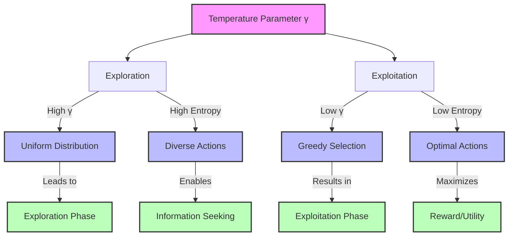
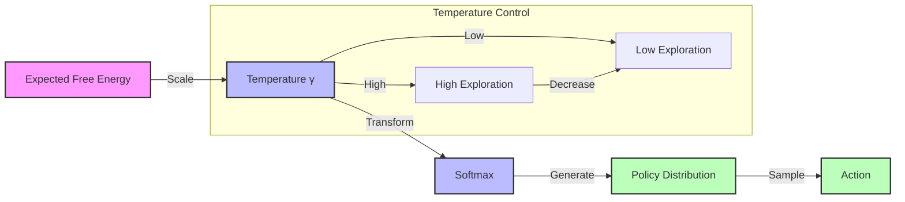
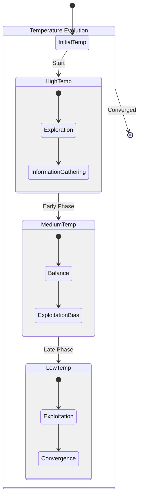
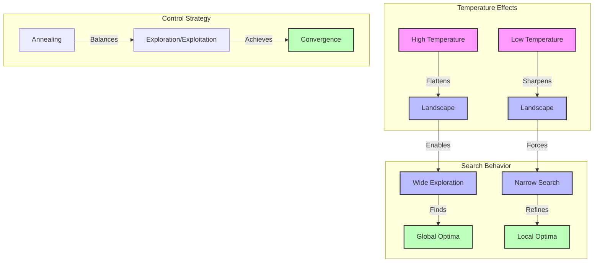
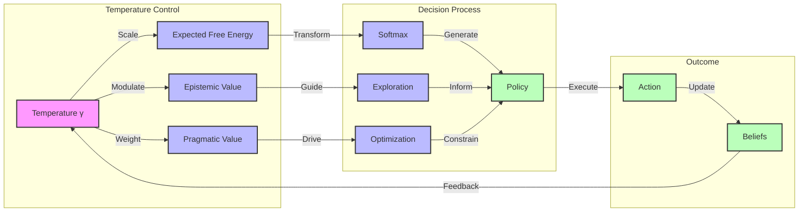

# Temperature Parameter

## Overview

The temperature parameter (often denoted as $\gamma$ or $\beta=1/T$) controls the balance between exploration and exploitation in decision making. In active inference, it acts as a precision parameter that modulates the relative weighting of different policies.

Links to:
- [[exploration_exploitation]] - Trade-off control
- [[policy_selection]] - Action selection
- [[precision_parameter]] - Active inference perspective

## Mathematical Formulation

The temperature appears in the softmax transformation for policy selection:

$P(\pi) = \sigma(-\gamma G(\pi)) = \frac{\exp(-\gamma G(\pi))}{\sum_{\pi'} \exp(-\gamma G(\pi'))}$

where:
- $\gamma$ is the inverse temperature (precision)
- $G(\pi)$ is the [[expected_free_energy]]
- $\sigma$ is the [[softmax_function]]

## Implementation

```python
def compute_policy_probabilities(
    expected_free_energy: np.ndarray,
    temperature: float = 1.0,
    min_prob: float = 1e-10
) -> np.ndarray:
    """Compute policy probabilities using softmax with temperature.
    
    Args:
        expected_free_energy: EFE values for each policy
        temperature: Temperature parameter (inverse)
        min_prob: Minimum probability for numerical stability
        
    Returns:
        Policy probability distribution
    """
    # Scale EFE by temperature
    scaled_efe = -temperature * expected_free_energy
    
    # Compute softmax with numerical stability
    logits = scaled_efe - np.max(scaled_efe)
    probabilities = np.exp(logits)
    probabilities = np.maximum(probabilities, min_prob)
    probabilities /= np.sum(probabilities)
    
    return probabilities
```

Links to:
- [[numerical_methods]] - Implementation details
- [[probability_distributions]] - Distribution handling
- [[numerical_stability]] - Stability considerations

## Properties

1. **Exploration Control**
   - High temperature → More uniform (exploration)
   - Low temperature → More deterministic (exploitation)
   - Links to [[exploration_strategies]]

2. **Scale Dependence**
   - Interacts with EFE magnitude
   - Requires careful scaling
   - Links to [[parameter_scaling]]

3. **Dynamic Behavior**
   - Can be adapted over time
   - Affects learning dynamics
   - Links to [[annealing_schedules]]

## Applications

### Active Inference
1. **Policy Selection**
   - Controls decision determinism
   - Balances exploration/exploitation
   - Links to:
     - [[policy_selection]] - Selection methods
     - [[efe_components]] - Value components
     - [[decision_making]] - Choice behavior

2. **Learning Control**
   - Adapts to uncertainty
   - Guides exploration
   - Links to:
     - [[learning_rate]] - Learning control
     - [[uncertainty_estimation]] - Uncertainty measures
     - [[adaptive_control]] - Control methods

### Optimization Methods
1. **Simulated Annealing**
   - Temperature schedules
   - Convergence control
   - Links to:
     - [[annealing_schedules]] - Schedule types
     - [[convergence_control]] - Control methods
     - [[optimization_strategies]] - Strategy types

2. **Stochastic Search**
   - Random exploration
   - Local/global balance
   - Links to:
     - [[stochastic_optimization]] - Methods
     - [[search_strategies]] - Search types
     - [[exploration_methods]] - Exploration types

## Analysis Methods

1. **Parameter Tuning**
   - Schedule design
   - Adaptation rules
   - Performance impact
   - Links to:
     - [[parameter_tuning]] - Tuning methods
     - [[hyperparameter_optimization]] - Optimization
     - [[sensitivity_analysis]] - Impact analysis

2. **Visualization**
   - Decision landscapes
   - Exploration patterns
   - Learning curves
   - Links to:
     - [[decision_visualization]] - Choice plots
     - [[exploration_visualization]] - Path plots
     - [[learning_visualization]] - Learning plots

## Related Concepts
- [[softmax_function]] - Probability transformation
- [[precision_parameter]] - Active inference precision
- [[exploration_control]] - Exploration management
- [[optimization_parameters]] - Parameter control
- [[learning_dynamics]] - Learning behavior

## References
- [[friston_2017]] - Active Inference
- [[kirkpatrick_1983]] - Simulated Annealing
- [[sutton_barto_2018]] - Reinforcement Learning
- [[mackay_2003]] - Information Theory 

## Parameter Relationships



## Control Flow



## Annealing Schedule



## Optimization Landscape



## Convergence Analysis

```mermaid
graph TD
    subgraph Temperature Evolution
        T1[High Temperature] --> |Initial Phase| E1[Maximum Exploration]
        E1 --> |Gather Information| I1[High Information Gain]
        I1 --> |Reduce| U1[Initial Uncertainty]
        
        U1 --> |Guide| T2[Medium Temperature]
        T2 --> |Balance| E2[Mixed Strategy]
        E2 --> |Refine| I2[Targeted Information]
        
        I2 --> |Lead to| T3[Low Temperature]
        T3 --> |Focus| E3[Exploitation]
        E3 --> |Achieve| G[Goal State]
    end
    
    classDef temp fill:#f9f,stroke:#333,stroke-width:4px
    classDef state fill:#bbf,stroke:#333,stroke-width:2px
    classDef outcome fill:#bfb,stroke:#333,stroke-width:2px
    
    class T1,T2,T3 temp
    class E1,E2,E3,I1,I2 state
    class U1,G outcome
```



## Value Integration



## Enhanced Relationships

### Core Dependencies
- [[expected_free_energy]] - Scaled by temperature
- [[epistemic_value]] - Exploration component
- [[pragmatic_value]] - Exploitation component
- [[policy_selection]] - Action choice mechanism
- [[belief_updating]] - State estimation process

### Control Mechanisms
- [[annealing_schedules]] - Temperature dynamics
- [[adaptive_control]] - Dynamic adjustment
- [[optimization_parameters]] - Parameter tuning
- [[exploration_strategies]] - Search methods
- [[convergence_control]] - Learning stability

### Analysis Tools
- [[parameter_sensitivity]] - Impact analysis
- [[convergence_metrics]] - Learning progress
- [[exploration_metrics]] - Search efficiency
- [[performance_evaluation]] - System assessment
- [[visualization_methods]] - Visual analysis

### Implementation Aspects
- [[numerical_stability]] - Computation robustness
- [[gradient_methods]] - Optimization techniques
- [[sampling_strategies]] - Action selection
- [[probability_distributions]] - Distribution handling
- [[computational_efficiency]] - Performance considerations

## Theoretical Foundations
- [[statistical_mechanics]] - Physical analogy
- [[information_theory]] - Entropy perspective
- [[decision_theory]] - Choice framework
- [[optimization_theory]] - Search principles
- [[learning_dynamics]] - System behavior 