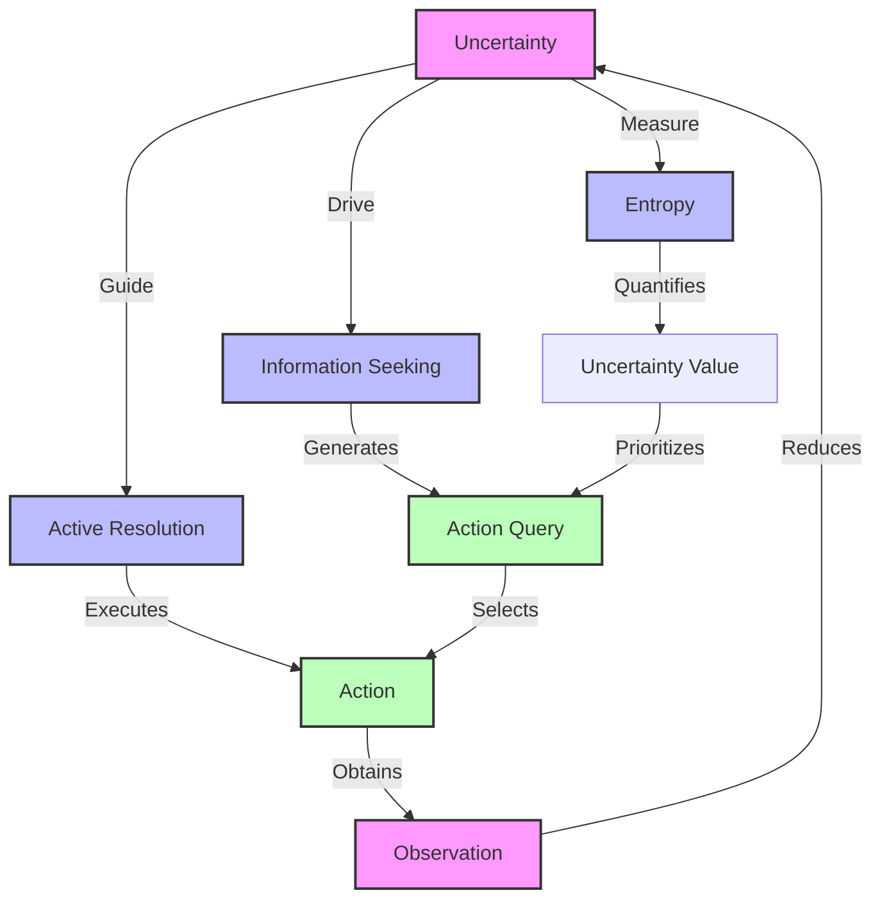
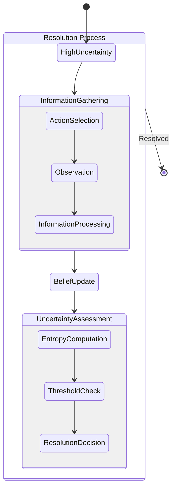
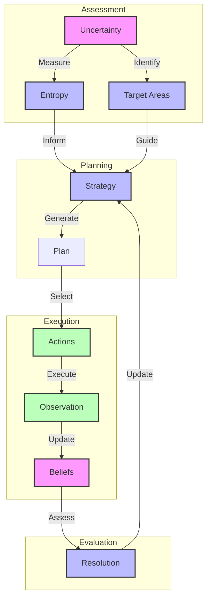
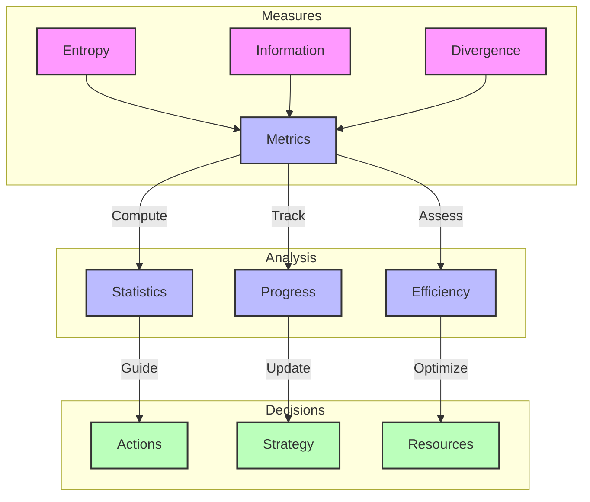
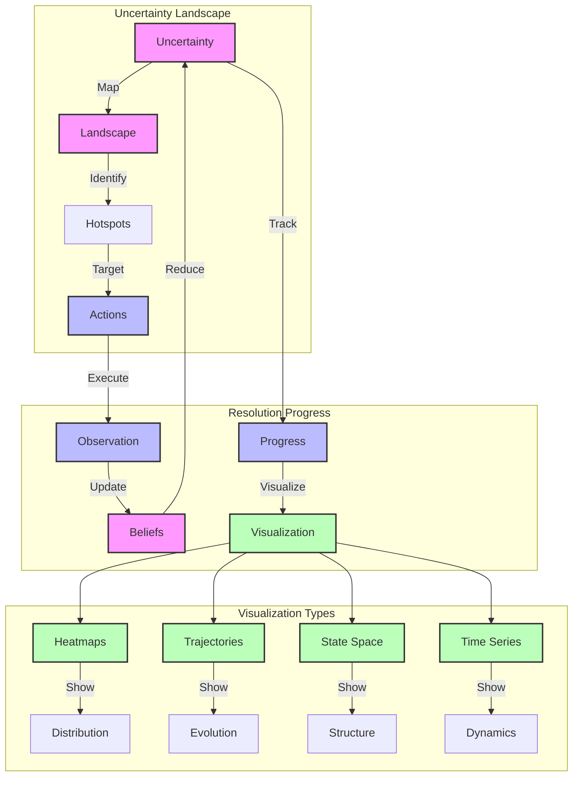
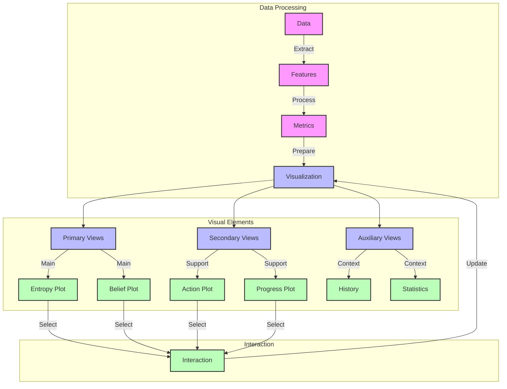
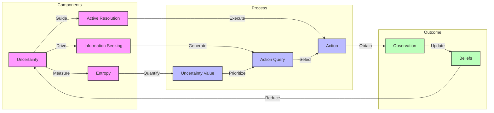

# Uncertainty Resolution

## Resolution Process



## Information Flow

```mermaid
graph LR
    subgraph Prior
        B[Beliefs] --> |Entropy| H1[H(s)]
    end
    
    subgraph Posterior
        O[Observation] --> |Update| BP[Beliefs|Obs]
        BP --> |Entropy| H2[H(s|o)]
    end
    
    subgraph Reduction
        H1 --> |Difference| IG[Information Gain]
        H2 --> |Difference| IG
        IG --> |Measures| UR[Uncertainty Resolution]
    end
    
    classDef state fill:#f9f,stroke:#333,stroke-width:2px
    classDef measure fill:#bbf,stroke:#333,stroke-width:2px
    classDef outcome fill:#bfb,stroke:#333,stroke-width:2px
    
    class B,O,BP state
    class H1,H2,IG measure
    class UR outcome
```

## Resolution Dynamics



## Active Resolution Strategy



## Resolution Metrics



## Mathematical Formulation

The uncertainty resolution can be quantified through various measures:

1. **Entropy Reduction**
   $\Delta H = H(s) - H(s|o)$
   - Initial entropy: $H(s) = -\sum_s P(s)\ln P(s)$
   - Conditional entropy: $H(s|o) = -\sum_{s,o} P(s,o)\ln P(s|o)$

2. **Information Gain**
   $IG = D_{KL}[P(s|o)\|P(s)]$

Links to:
- [[entropy]] - Uncertainty measure
- [[kl_divergence]] - Divergence measure
- [[mutual_information]] - Information measure

## Implementation

```python
def compute_uncertainty_resolution(
    prior: np.ndarray,        # Prior distribution P(s)
    posterior: np.ndarray,    # Posterior distribution P(s|o)
    method: str = 'entropy'   # Method to use
) -> float:
    """Compute uncertainty resolution.
    
    Args:
        prior: Prior probability distribution
        posterior: Posterior probability distribution
        method: Method to use ('entropy' or 'kl')
        
    Returns:
        Amount of uncertainty resolved
    """
    if method == 'entropy':
        prior_entropy = compute_entropy(prior)
        post_entropy = compute_entropy(posterior)
        return prior_entropy - post_entropy
    elif method == 'kl':
        return compute_kl_divergence(posterior, prior)
    else:
        raise ValueError(f"Unknown method: {method}")
```

## Properties

1. **Non-negativity**
   - Always reduces uncertainty
   - Zero for no information gain
   - Links to [[information_theory_axioms]]

2. **Bounded Reduction**
   - Limited by initial uncertainty
   - Asymptotic behavior
   - Links to [[information_bounds]]

3. **Active Nature**
   - Requires strategic action selection
   - Path-dependent resolution
   - Links to [[active_learning]]

## Related Concepts
- [[active_inference]] - Framework
- [[information_seeking]] - Strategy
- [[optimal_experiment_design]] - Design
- [[uncertainty_quantification]] - Measurement
- [[information_geometry]] - Geometry

## References
- [[friston_2017]] - Active Inference
- [[mackay_2003]] - Information Theory
- [[lindley_1956]] - Information Measures
- [[chaloner_1995]] - Optimal Design 

## Visualization Methods



## Visualization Components



## Implementation Example

```python
class UncertaintyVisualizer:
    """Visualize uncertainty resolution process."""
    
    def __init__(self, resolution_data: Dict[str, np.ndarray]):
        self.data = resolution_data
        self.fig = plt.figure(figsize=(15, 10))
        self.gs = self.fig.add_gridspec(3, 2)
        
    def plot_entropy_evolution(self, ax=None):
        """Plot entropy reduction over time."""
        if ax is None:
            ax = self.fig.add_subplot(self.gs[0, 0])
        
        time = np.arange(len(self.data['entropy']))
        ax.plot(time, self.data['entropy'], 'b-', label='Entropy')
        ax.set_title('Uncertainty Evolution')
        ax.set_xlabel('Time Step')
        ax.set_ylabel('Entropy')
        ax.grid(True)
        
    def plot_belief_landscape(self, ax=None):
        """Plot belief landscape with uncertainty."""
        if ax is None:
            ax = self.fig.add_subplot(self.gs[0, 1])
            
        belief_grid = self.data['belief_landscape']
        im = ax.imshow(belief_grid, cmap='viridis')
        ax.set_title('Belief Landscape')
        plt.colorbar(im, ax=ax)
        
    def plot_resolution_progress(self, ax=None):
        """Plot resolution progress metrics."""
        if ax is None:
            ax = self.fig.add_subplot(self.gs[1, :])
            
        metrics = self.data['resolution_metrics']
        time = np.arange(len(metrics))
        ax.plot(time, metrics, 'r-', label='Resolution')
        ax.set_title('Resolution Progress')
        ax.set_xlabel('Time Step')
        ax.set_ylabel('Resolution Metric')
        ax.grid(True)
        
    def plot_all(self):
        """Generate complete visualization suite."""
        self.plot_entropy_evolution()
        self.plot_belief_landscape()
        self.plot_resolution_progress()
        plt.tight_layout()
        return self.fig
```

Links to:
- [[visualization_guide]] - Visualization standards
- [[plotting_utilities]] - Plotting tools
- [[interactive_visualization]] - Interactive features

## Visualization Types

1. **Uncertainty Maps**
   - Heatmaps of belief distribution
   - Entropy landscapes
   - Information gain fields
   - Links to [[spatial_visualization]]

2. **Temporal Evolution**
   - Resolution trajectories
   - Convergence plots
   - Learning curves
   - Links to [[temporal_visualization]]

3. **State Space Views**
   - Belief manifolds
   - Value landscapes
   - Action trajectories
   - Links to [[state_space_visualization]]

4. **Interactive Elements**
   - Selection tools
   - Filtering options
   - Dynamic updates
   - Links to [[interactive_tools]] 

## Learning Dynamics

```mermaid
graph TD
    subgraph Resolution Phases
        P1[Initial Phase] --> |High Uncertainty| L1[Active Learning]
        L1 --> |Information Gain| U1[Uncertainty Reduction]
        U1 --> |Progress| P2[Middle Phase]
        
        P2 --> |Refined Search| L2[Targeted Learning]
        L2 --> |Specific Information| U2[Focused Resolution]
        U2 --> |Convergence| P3[Final Phase]
        
        P3 --> |Low Uncertainty| L3[Model Application]
        L3 --> |Validation| U3[Stability Check]
        U3 --> |Maintenance| P4[Steady State]
    end
    
    classDef phase fill:#f9f,stroke:#333,stroke-width:4px
    classDef learning fill:#bbf,stroke:#333,stroke-width:2px
    classDef state fill:#bfb,stroke:#333,stroke-width:2px
    
    class P1,P2,P3,P4 phase
    class L1,L2,L3 learning
    class U1,U2,U3 state
```



## Resolution Framework



## Enhanced Relationships

### Core Components
- [[information_theory]] - Theoretical foundation
- [[active_inference]] - Framework context
- [[belief_updating]] - State estimation
- [[action_selection]] - Decision making
- [[entropy]] - Uncertainty measure

### Resolution Methods
- [[information_gain]] - Knowledge acquisition
- [[active_learning]] - Strategic learning
- [[optimal_experiment_design]] - Query design
- [[exploration_strategies]] - Search methods
- [[convergence_control]] - Learning stability

### Analysis Tools
- [[information_metrics]] - Measurement tools
- [[convergence_analysis]] - Learning progress
- [[visualization_methods]] - Visual analysis
- [[performance_evaluation]] - System assessment
- [[statistical_tests]] - Validation methods

### Implementation Aspects
- [[numerical_methods]] - Computation tools
- [[optimization_algorithms]] - Search techniques
- [[probability_distributions]] - Distribution handling
- [[computational_efficiency]] - Performance
- [[numerical_stability]] - Robustness

## Theoretical Foundations
- [[information_geometry]] - Geometric view
- [[statistical_inference]] - Learning framework
- [[decision_theory]] - Choice framework
- [[optimization_theory]] - Search principles
- [[learning_dynamics]] - System behavior 